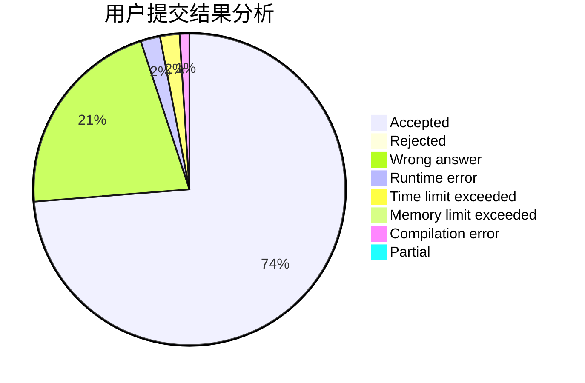
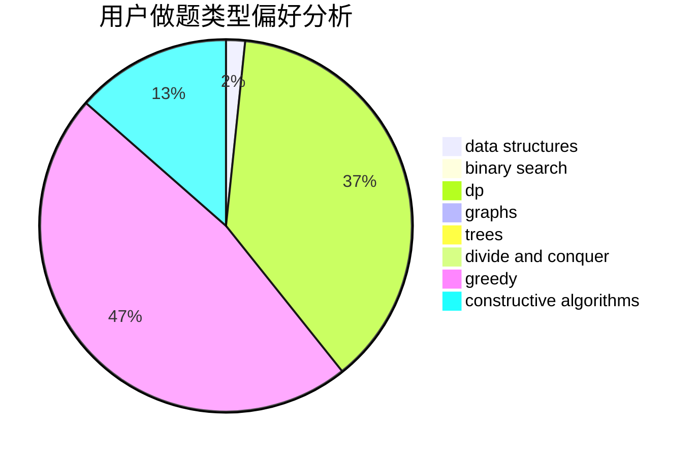
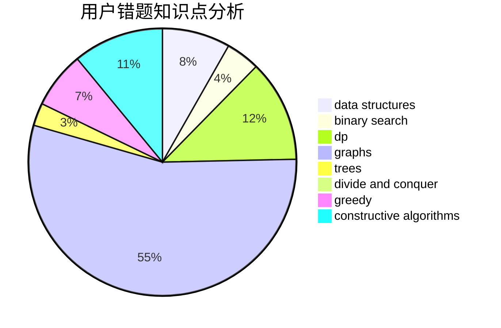

# 0x3F

<!-- tabs:start -->

#### **用户提交结果分析**

#### **用户做题类型偏好分析**

#### **用户错题知识点分析**

<!-- tabs:end -->
# 推荐题目
[1064F](https://codeforces.com/contest/1064/problem/F)		dsu,graphs,sortings,trees		  
[1063F](https://codeforces.com/contest/1063/problem/F)		data structures,
                        dp,
                        string suffix structures		  
[1065C](https://codeforces.com/contest/1065/problem/C)		greedy		  
[1064E](https://codeforces.com/contest/1064/problem/E)		dsu,graphs,sortings,trees		  
[1065B](https://codeforces.com/contest/1065/problem/B)		constructive algorithms,
                        graphs		  
[1066C](https://codeforces.com/contest/1066/problem/C)		implementation		  
[1064C](https://codeforces.com/contest/1064/problem/C)		dsu,graphs,sortings,trees		  
[1059A](https://codeforces.com/contest/1059/problem/A)		implementation		  
[1065F](https://codeforces.com/contest/1065/problem/F)		dfs and similar,
                        dp,
                        trees		  
[1063E](https://codeforces.com/contest/1063/problem/E)		constructive algorithms,
                        math		  
