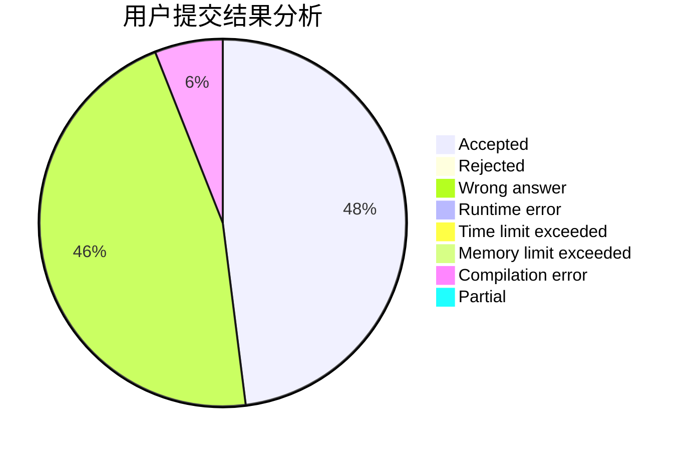
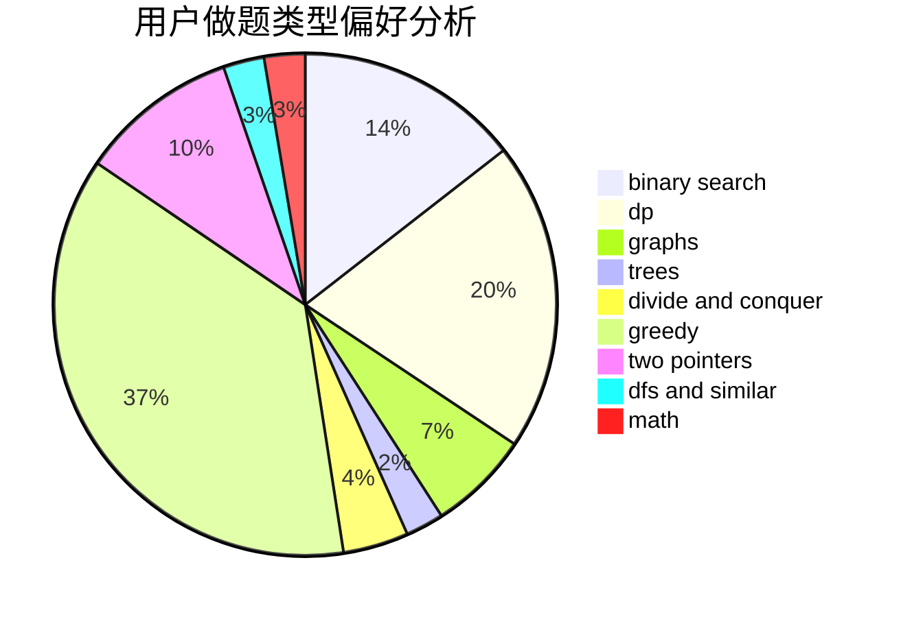

# 99_wood

<!-- tabs:start -->

#### **用户提交结果分析**

#### **用户做题类型偏好分析**

<!-- tabs:end -->
# 推荐题目
[1461A](https://codeforces.com/contest/1461/problem/A)
[1462B](https://codeforces.com/contest/1462/problem/B)
[1461D](https://codeforces.com/contest/1461/problem/D)
[1444B](https://codeforces.com/contest/1444/problem/B)
[1463E](https://codeforces.com/contest/1463/problem/E)
[145A](https://codeforces.com/contest/145/problem/A)
[1459E](https://codeforces.com/contest/1459/problem/E)
[1459F](https://codeforces.com/contest/1459/problem/F)
[145C](https://codeforces.com/contest/145/problem/C)
[1108B](https://codeforces.com/contest/1108/problem/B)
