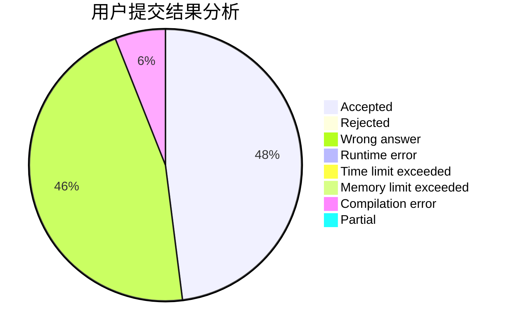
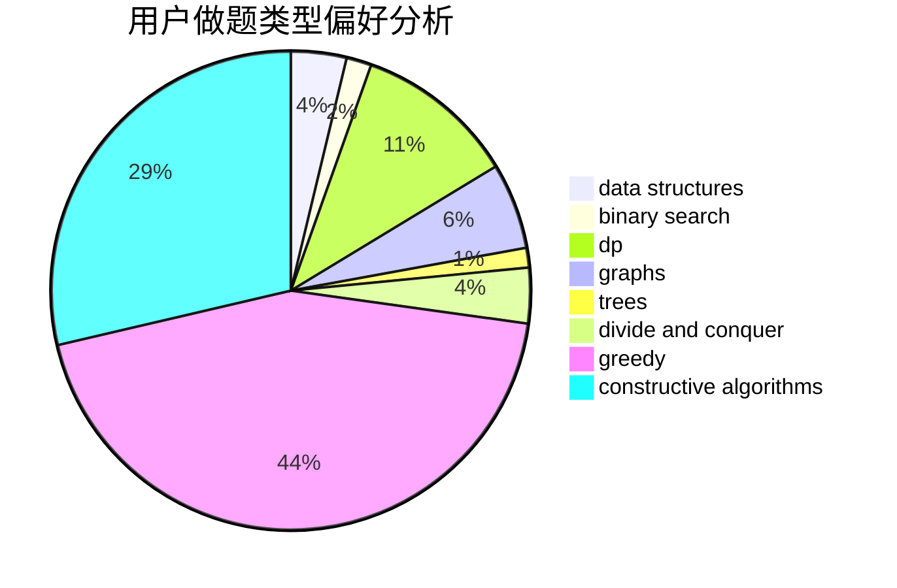
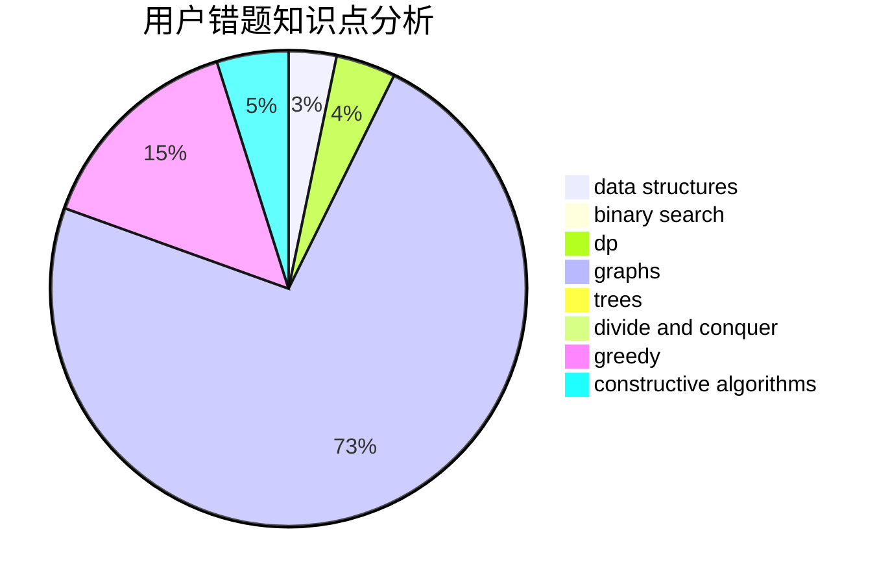

# 99_wood

<!-- tabs:start -->

#### **用户提交结果分析**

#### **用户做题类型偏好分析**

#### **用户错题知识点分析**

<!-- tabs:end -->
# 推荐题目
[1461A](https://codeforces.com/contest/1461/problem/A)		constructive algorithms,
                        greedy		  
[1462B](https://codeforces.com/contest/1462/problem/B)		dp,
                        implementation,
                        strings		  
[1461D](https://codeforces.com/contest/1461/problem/D)		binary search,
                        brute force,
                        data structures,
                        divide and conquer,
                        implementation,
                        sortings		  
[1444B](https://codeforces.com/contest/1444/problem/B)		combinatorics,
                        math,
                        sortings		  
[1463E](https://codeforces.com/contest/1463/problem/E)		constructive algorithms,
                        dfs and similar,
                        dsu,
                        graphs,
                        implementation,
                        sortings,
                        trees		  
[145A](https://codeforces.com/contest/145/problem/A)		greedy,
                        implementation		  
[1459E](https://codeforces.com/contest/1459/problem/E)		dsu,graphs,sortings,trees		  
[1459F](https://codeforces.com/contest/1459/problem/F)		dsu,graphs,sortings,trees		  
[145C](https://codeforces.com/contest/145/problem/C)		combinatorics,
                        dp,
                        math		  
[1108B](https://codeforces.com/contest/1108/problem/B)		brute force,
                        greedy,
                        math,
                        number theory		  
