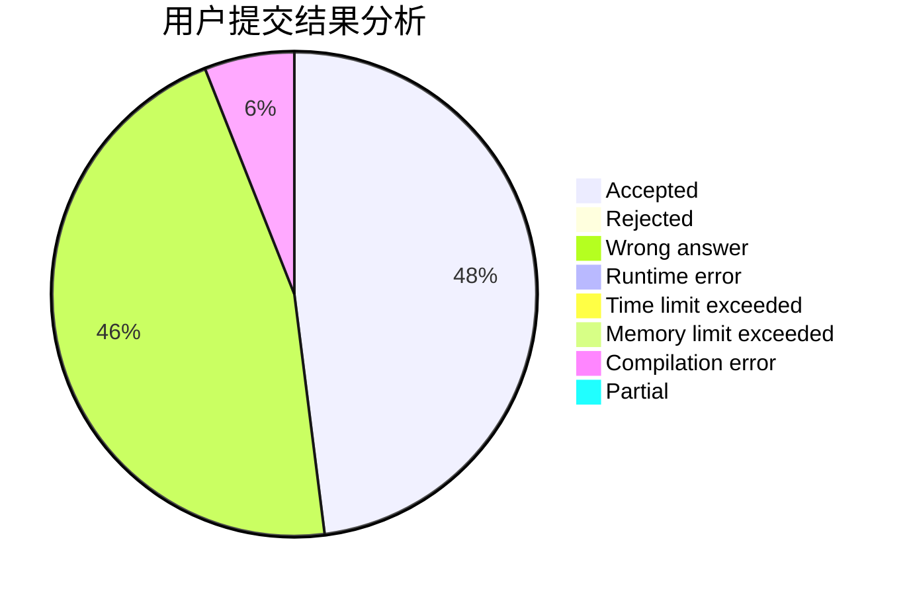
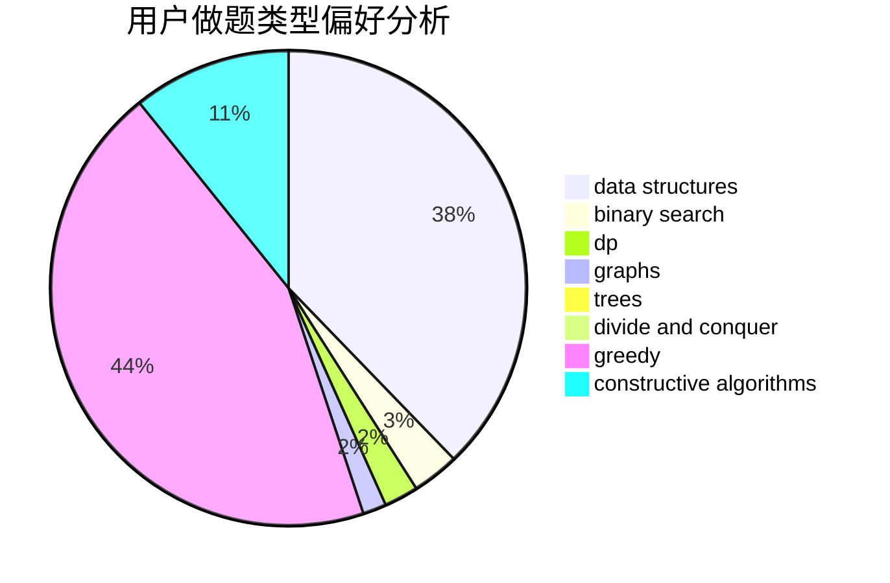
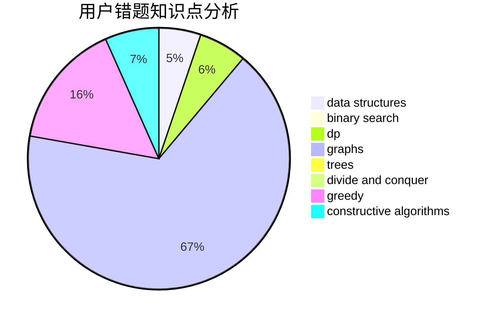

# 99_wood

<!-- tabs:start -->

#### **用户提交结果分析**

#### **用户做题类型偏好分析**

#### **用户错题知识点分析**

<!-- tabs:end -->
# 推荐题目
[1451E1](https://codeforces.com/contest/1451E/problem/1)		bitmasks,
                        constructive algorithms,
                        interactive,
                        math		  
[1452G](https://codeforces.com/contest/1452/problem/G)		data structures,
                        dfs and similar,
                        greedy,
                        trees		  
[1452A](https://codeforces.com/contest/1452/problem/A)		math		  
[1434B](https://codeforces.com/contest/1434/problem/B)		dsu,graphs,sortings,trees		  
[1454B](https://codeforces.com/contest/1454/problem/B)		implementation		  
[1451A](https://codeforces.com/contest/1451/problem/A)		greedy,
                        math		  
[1450H1](https://codeforces.com/contest/1450H/problem/1)		combinatorics,
                        fft,
                        math		  
[1450H2](https://codeforces.com/contest/1450H/problem/2)		combinatorics,
                        implementation,
                        math		  
[1451C](https://codeforces.com/contest/1451/problem/C)		dp,
                        greedy,
                        hashing,
                        implementation,
                        strings		  
[1108A](https://codeforces.com/contest/1108/problem/A)		implementation		  
