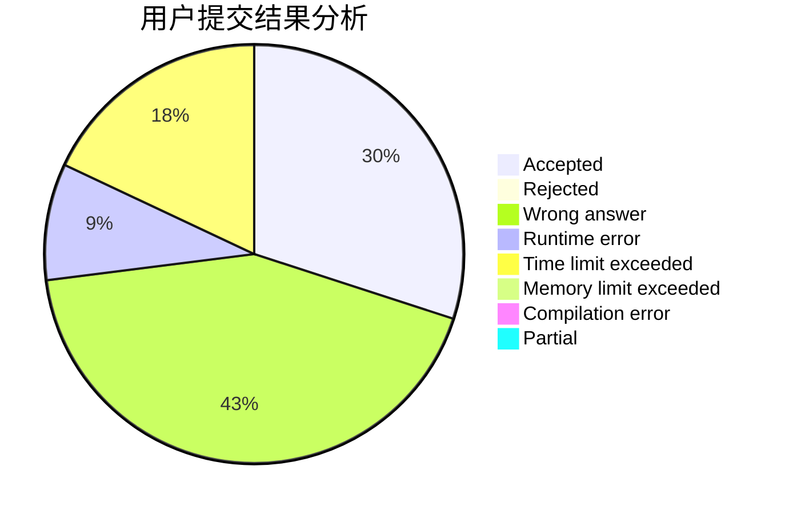
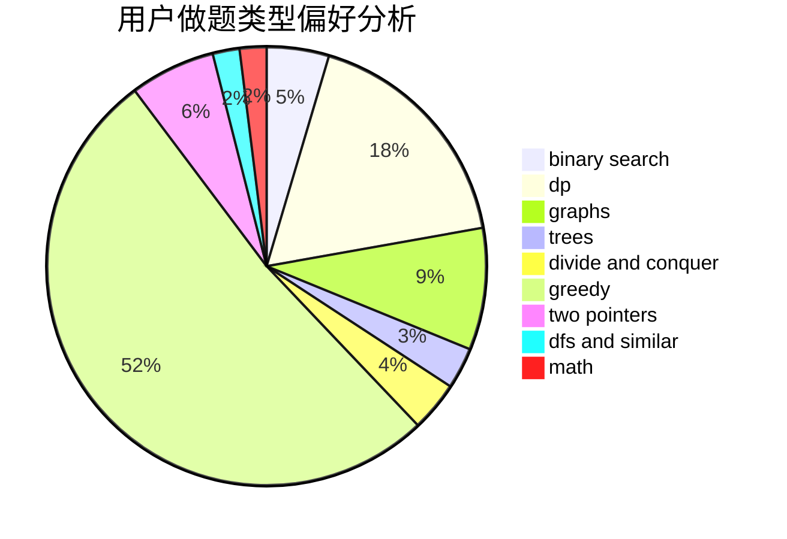

# NeuraXmy

<!-- tabs:start -->

#### **用户提交结果分析**

#### **用户做题类型偏好分析**

<!-- tabs:end -->
# 推荐题目
[1287C](https://codeforces.com/contest/1287/problem/C)
[1452C](https://codeforces.com/contest/1452/problem/C)
[1303F](https://codeforces.com/contest/1303/problem/F)
[872A](https://codeforces.com/contest/872/problem/A)
[703E](https://codeforces.com/contest/703/problem/E)
[11411](https://codeforces.com/contest/1141/problem/1)
[1399F](https://codeforces.com/contest/1399/problem/F)
[1102E](https://codeforces.com/contest/1102/problem/E)
[963B](https://codeforces.com/contest/963/problem/B)
[1346E](https://codeforces.com/contest/1346/problem/E)
