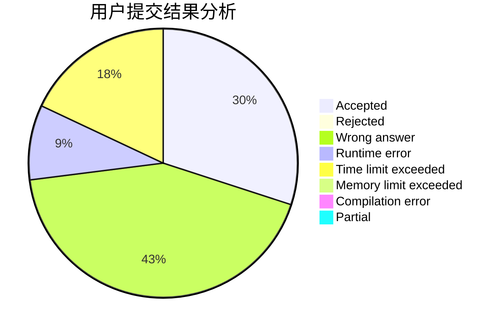
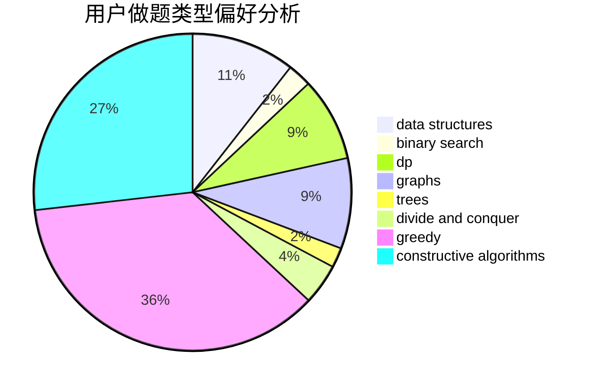
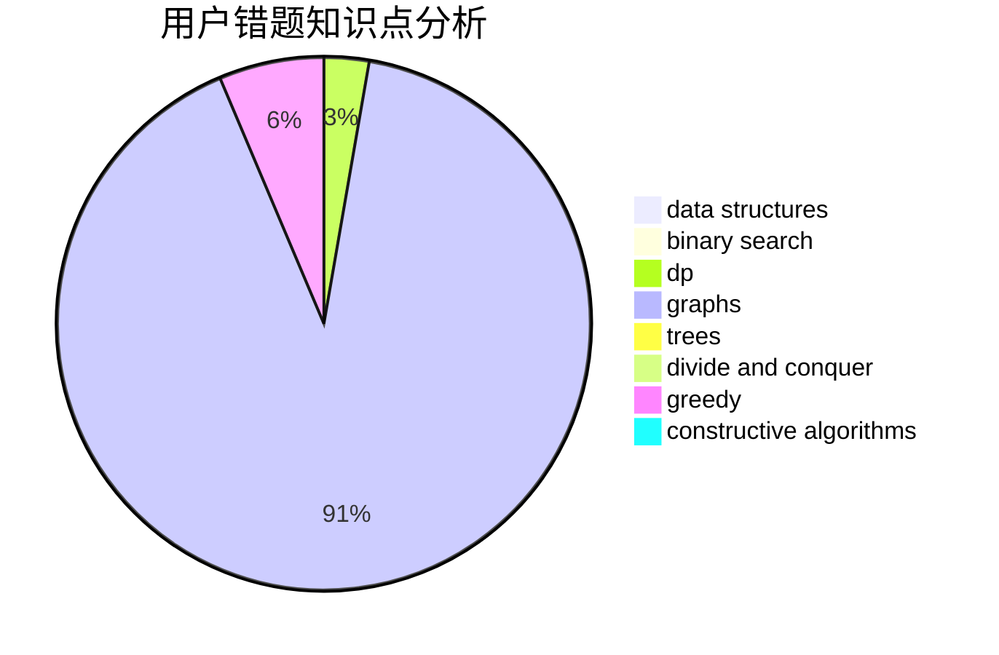

# NeuraXmy

<!-- tabs:start -->

#### **用户提交结果分析**

#### **用户做题类型偏好分析**

#### **用户错题知识点分析**

<!-- tabs:end -->
# 推荐题目
[1287C](https://codeforces.com/contest/1287/problem/C)		dsu,graphs,sortings,trees		  
[1452C](https://codeforces.com/contest/1452/problem/C)		greedy		  
[1303F](https://codeforces.com/contest/1303/problem/F)		dsu,
                        implementation		  
[872A](https://codeforces.com/contest/872/problem/A)		dsu,graphs,sortings,trees		  
[703E](https://codeforces.com/contest/703/problem/E)		dp,
                        number theory		  
[11411](https://codeforces.com/contest/1141/problem/1)		dsu,graphs,sortings,trees		  
[1399F](https://codeforces.com/contest/1399/problem/F)		data structures,
                        dp,
                        graphs,
                        sortings		  
[1102E](https://codeforces.com/contest/1102/problem/E)		combinatorics,
                        sortings		  
[963B](https://codeforces.com/contest/963/problem/B)		constructive algorithms,
                        dfs and similar,
                        dp,
                        greedy,
                        trees		  
[1346E](https://codeforces.com/contest/1346/problem/E)		*special problem,
                        dp,
                        graphs		  
