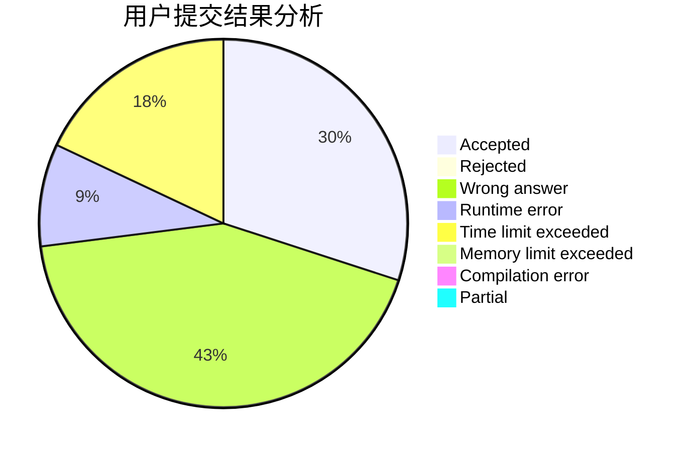
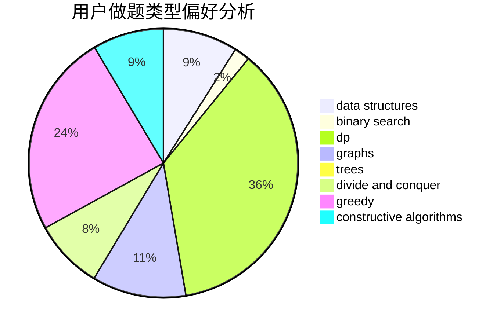
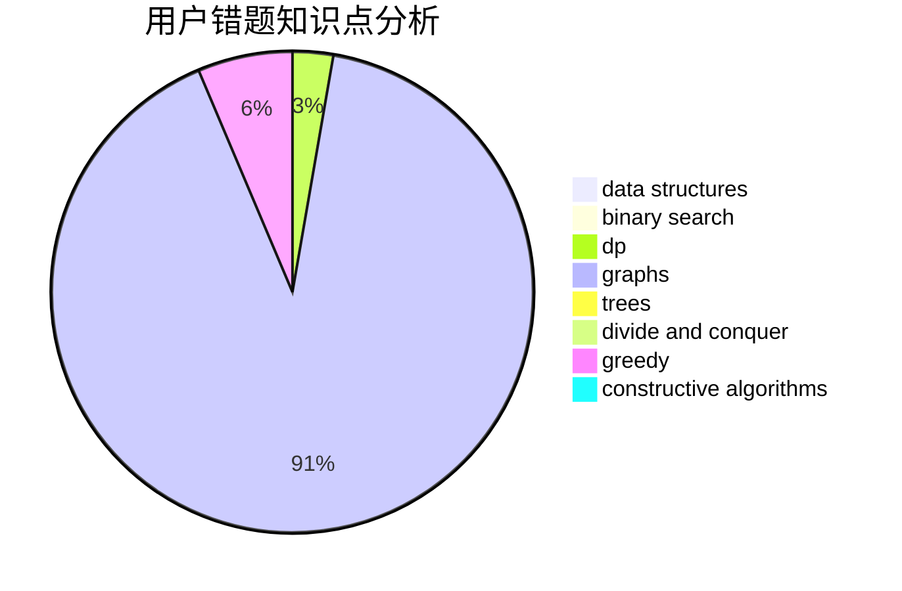

# NeuraXmy

<!-- tabs:start -->

#### **用户提交结果分析**

#### **用户做题类型偏好分析**

#### **用户错题知识点分析**

<!-- tabs:end -->
# 推荐题目
[1281C](https://codeforces.com/contest/1281/problem/C)		dsu,graphs,sortings,trees		  
[1442D](https://codeforces.com/contest/1442/problem/D)		data structures,
                        divide and conquer,
                        dp,
                        greedy		  
[1296D](https://codeforces.com/contest/1296/problem/D)		greedy,
                        sortings		  
[853D](https://codeforces.com/contest/853/problem/D)		binary search,
                        dp,
                        greedy		  
[67B](https://codeforces.com/contest/67/problem/B)		greedy		  
[1139D](https://codeforces.com/contest/1139/problem/D)		dp,
                        math,
                        number theory,
                        probabilities		  
[1391B](https://codeforces.com/contest/1391/problem/B)		brute force,
                        greedy,
                        implementation		  
[1102B](https://codeforces.com/contest/1102/problem/B)		greedy,
                        sortings		  
[946E](https://codeforces.com/contest/946/problem/E)		greedy,
                        implementation		  
[1339E](https://codeforces.com/contest/1339/problem/E)		dsu,graphs,sortings,trees		  
