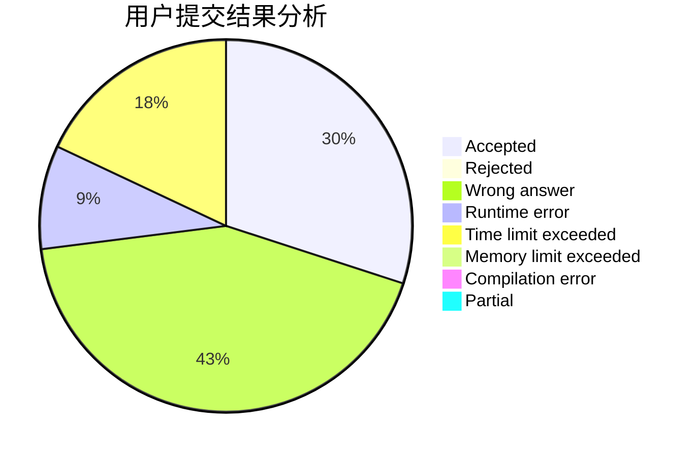
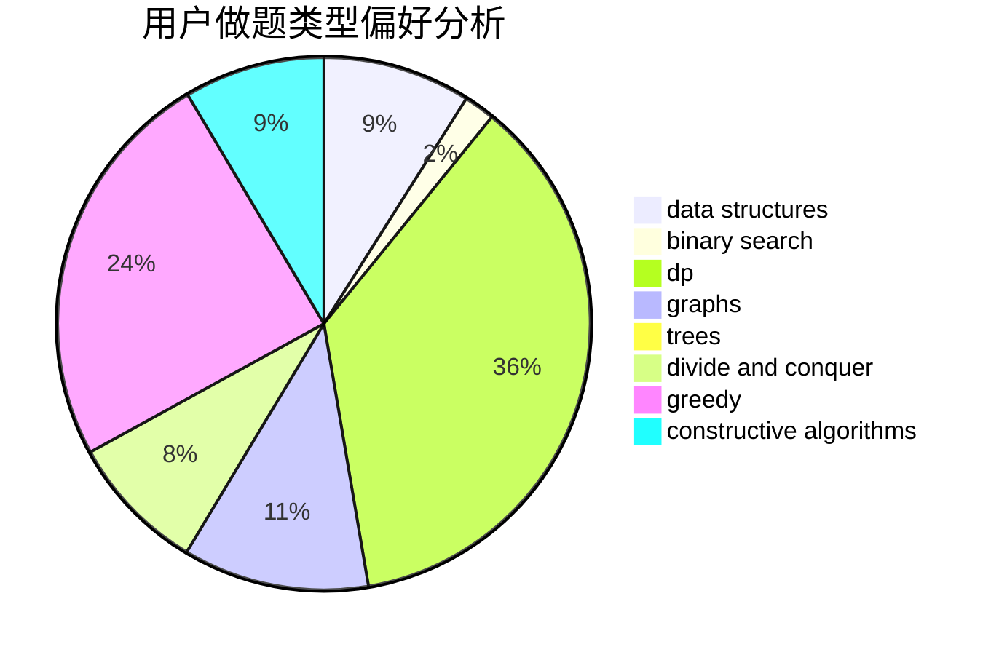
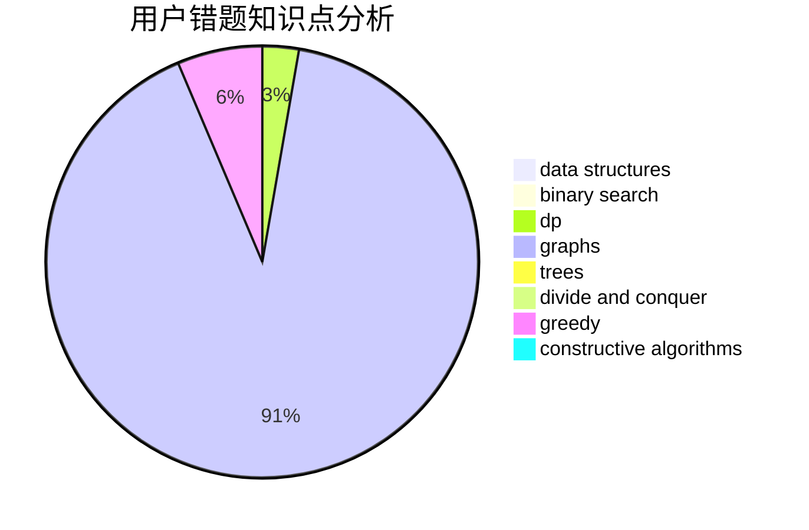

# NeuraXmy
<!-- tabs:start -->
#### **用户提交结果分析**

#### **用户做题类型偏好分析**

#### **用户错题知识点分析**

<!-- tabs:end -->
# 推荐题目
[Fix You](http://codeforces.com/problemset/problem/1391/B)		brute force,
                        greedy,
                        implementation		  
[Persistent Bookcase](http://codeforces.com/problemset/problem/707/D)		bitmasks,
                        data structures,
                        dfs and similar,
                        implementation		  
[Two Shuffled Sequences](http://codeforces.com/problemset/problem/1144/C)		constructive algorithms,
                        sortings		  
[Vanya and Fence](http://codeforces.com/problemset/problem/677/A)		implementation		  
[Array K-Coloring](http://codeforces.com/problemset/problem/1102/B)		greedy,
                        sortings		  
[Drazil and Park](https://codeforces.com/contest/516/problem/C)		data structures		  
[Andryusha and Socks](https://codeforces.com/contest/782/problem/A)		implementation		  
[Nagini](http://codeforces.com/problemset/problem/855/F)		binary search,
                        data structures		  
[Largest Beautiful Number](http://codeforces.com/problemset/problem/946/E)		greedy,
                        implementation		  
[Restoration of the Permutation](http://codeforces.com/problemset/problem/67/B)		greedy		  
<!-- tabs:start -->
#### **data structures**
[Fix You](http://codeforces.com/problemset/problem/707/D)		bitmasks,
                        data structures,
                        dfs and similar,
                        implementation		  
[Persistent Bookcase](https://codeforces.com/contest/516/problem/C)		data structures		  
[Two Shuffled Sequences](http://codeforces.com/problemset/problem/855/F)		binary search,
                        data structures		  
[Vanya and Fence](http://codeforces.com/problemset/problem/796/C)		constructive algorithms,
                        data structures,
                        dp,
                        trees		  
[Array K-Coloring](http://codeforces.com/problemset/problem/452/F)		data structures,
                        divide and conquer,
                        hashing		  
[Drazil and Park](http://codeforces.com/problemset/problem/280/B)		data structures,
                        implementation,
                        two pointers		  
[Andryusha and Socks](http://codeforces.com/problemset/problem/1209/F)		data structures,
                        dfs and similar,
                        graphs,
                        shortest paths,
                        strings,
                        trees		  
[Nagini](http://codeforces.com/problemset/problem/788/E)		data structures		  
[Largest Beautiful Number](http://codeforces.com/problemset/problem/1442/D)		data structures,
                        divide and conquer,
                        dp,
                        greedy		  
[Restoration of the Permutation](http://codeforces.com/problemset/problem/1492/C)		binary search,
                        data structures,
                        dp,
                        greedy,
                        two pointers		  
#### **binary search**
[Fix You](http://codeforces.com/problemset/problem/855/F)		binary search,
                        data structures		  
[Persistent Bookcase](http://codeforces.com/problemset/problem/853/D)		binary search,
                        dp,
                        greedy		  
[Two Shuffled Sequences](https://codeforces.com/contest/967/problem/D)		binary search,
                        implementation,
                        sortings		  
[Vanya and Fence](http://codeforces.com/problemset/problem/1029/F)		binary search,
                        brute force,
                        math,
                        number theory		  
[Array K-Coloring](http://codeforces.com/problemset/problem/1436/D)		binary search,
                        dfs and similar,
                        graphs,
                        greedy,
                        trees		  
[Drazil and Park](http://codeforces.com/problemset/problem/1492/C)		binary search,
                        data structures,
                        dp,
                        greedy,
                        two pointers		  
[Andryusha and Socks](http://codeforces.com/problemset/problem/1463/D)		binary search,
                        constructive algorithms,
                        greedy,
                        two pointers		  
[Nagini](http://codeforces.com/problemset/problem/1490/G)		binary search,
                        data structures,
                        math		  
[Largest Beautiful Number](http://codeforces.com/problemset/problem/1479/D)		binary search,
                        bitmasks,
                        brute force,
                        data structures,
                        probabilities,
                        trees		  
[Restoration of the Permutation](http://codeforces.com/problemset/problem/1436/E)		binary search,
                        data structures,
                        two pointers		  
#### **dp**
[Fix You](http://codeforces.com/problemset/problem/853/D)		binary search,
                        dp,
                        greedy		  
[Persistent Bookcase](http://codeforces.com/problemset/problem/1139/D)		dp,
                        math,
                        number theory,
                        probabilities		  
[Two Shuffled Sequences](http://codeforces.com/problemset/problem/796/C)		constructive algorithms,
                        data structures,
                        dp,
                        trees		  
[Vanya and Fence](http://codeforces.com/problemset/problem/1363/F)		dp,
                        strings		  
[Array K-Coloring](http://codeforces.com/problemset/problem/1389/G)		dfs and similar,
                        dp,
                        graphs,
                        trees		  
[Drazil and Park](http://codeforces.com/problemset/problem/1398/D)		dp,
                        greedy,
                        sortings		  
[Andryusha and Socks](http://codeforces.com/problemset/problem/1096/G)		divide and conquer,
                        dp,
                        fft		  
[Nagini](http://codeforces.com/problemset/problem/1153/F)		combinatorics,
                        dp,
                        math,
                        probabilities		  
[Largest Beautiful Number](http://codeforces.com/problemset/problem/1442/D)		data structures,
                        divide and conquer,
                        dp,
                        greedy		  
[Restoration of the Permutation](http://codeforces.com/problemset/problem/1455/D)		dp,
                        greedy,
                        sortings		  
#### **graph**
[Fix You](http://codeforces.com/problemset/problem/1389/G)		dfs and similar,
                        dp,
                        graphs,
                        trees		  
[Persistent Bookcase](http://codeforces.com/problemset/problem/1209/F)		data structures,
                        dfs and similar,
                        graphs,
                        shortest paths,
                        strings,
                        trees		  
[Two Shuffled Sequences](http://codeforces.com/problemset/problem/41/E)		constructive algorithms,
                        graphs,
                        greedy		  
[Vanya and Fence](http://codeforces.com/problemset/problem/1436/D)		binary search,
                        dfs and similar,
                        graphs,
                        greedy,
                        trees		  
[Array K-Coloring](http://codeforces.com/problemset/problem/1487/C)		brute force,
                        constructive algorithms,
                        dfs and similar,
                        graphs,
                        greedy,
                        implementation,
                        math		  
[Drazil and Park](http://codeforces.com/problemset/problem/1437/C)		dp,
                        flows,
                        graph matchings,
                        greedy,
                        math,
                        sortings		  
[Andryusha and Socks](http://codeforces.com/problemset/problem/1470/D)		constructive algorithms,
                        dfs and similar,
                        graph matchings,
                        graphs,
                        greedy		  
[Nagini](http://codeforces.com/problemset/problem/1476/C)		dp,
                        graphs,
                        greedy		  
[Largest Beautiful Number](http://codeforces.com/problemset/problem/1304/D)		constructive algorithms,
                        graphs,
                        greedy,
                        two pointers		  
[Restoration of the Permutation](http://codeforces.com/problemset/problem/1475/C)		combinatorics,
                        graphs,
                        math		  
#### **trees**
[Fix You](http://codeforces.com/problemset/problem/796/C)		constructive algorithms,
                        data structures,
                        dp,
                        trees		  
[Persistent Bookcase](http://codeforces.com/problemset/problem/1389/G)		dfs and similar,
                        dp,
                        graphs,
                        trees		  
[Two Shuffled Sequences](http://codeforces.com/problemset/problem/1209/F)		data structures,
                        dfs and similar,
                        graphs,
                        shortest paths,
                        strings,
                        trees		  
[Vanya and Fence](http://codeforces.com/problemset/problem/1436/D)		binary search,
                        dfs and similar,
                        graphs,
                        greedy,
                        trees		  
[Array K-Coloring](http://codeforces.com/problemset/problem/1479/D)		binary search,
                        bitmasks,
                        brute force,
                        data structures,
                        probabilities,
                        trees		  
[Drazil and Park](http://codeforces.com/problemset/problem/1511/C)		brute force,
                        data structures,
                        implementation,
                        trees		  
[Andryusha and Socks](http://codeforces.com/problemset/problem/1499/F)		combinatorics,
                        dfs and similar,
                        dp,
                        trees		  
[Nagini](http://codeforces.com/problemset/problem/1491/E)		brute force,
                        dfs and similar,
                        divide and conquer,
                        number theory,
                        trees		  
[Largest Beautiful Number](http://codeforces.com/problemset/problem/1466/D)		data structures,
                        greedy,
                        sortings,
                        trees		  
[Restoration of the Permutation](http://codeforces.com/problemset/problem/1495/D)		combinatorics,
                        dfs and similar,
                        graphs,
                        math,
                        shortest paths,
                        trees		  
#### **divide and conquer**
[Fix You](https://codeforces.com/contest/1339/problem/E)		bitmasks,
                        brute force,
                        constructive algorithms,
                        divide and conquer,
                        math		  
[Persistent Bookcase](http://codeforces.com/problemset/problem/452/F)		data structures,
                        divide and conquer,
                        hashing		  
[Two Shuffled Sequences](http://codeforces.com/problemset/problem/1096/G)		divide and conquer,
                        dp,
                        fft		  
[Vanya and Fence](http://codeforces.com/problemset/problem/1442/D)		data structures,
                        divide and conquer,
                        dp,
                        greedy		  
[Array K-Coloring](http://codeforces.com/problemset/problem/1461/D)		binary search,
                        brute force,
                        data structures,
                        divide and conquer,
                        implementation,
                        sortings		  
[Drazil and Park](http://codeforces.com/problemset/problem/1466/G)		combinatorics,
                        divide and conquer,
                        hashing,
                        math,
                        string suffix structures,
                        strings		  
[Andryusha and Socks](http://codeforces.com/problemset/problem/1490/D)		dfs and similar,
                        divide and conquer,
                        implementation		  
[Nagini](https://codeforces.com/contest/1483/problem/C)		data structures,
                        divide and conquer,
                        dp		  
[Largest Beautiful Number](http://codeforces.com/problemset/problem/1491/E)		brute force,
                        dfs and similar,
                        divide and conquer,
                        number theory,
                        trees		  
[Restoration of the Permutation](http://codeforces.com/problemset/problem/1303/G)		data structures,
                        divide and conquer,
                        geometry,
                        trees		  
#### **greedy**
[Fix You](http://codeforces.com/problemset/problem/1391/B)		brute force,
                        greedy,
                        implementation		  
[Persistent Bookcase](http://codeforces.com/problemset/problem/1102/B)		greedy,
                        sortings		  
[Two Shuffled Sequences](http://codeforces.com/problemset/problem/946/E)		greedy,
                        implementation		  
[Vanya and Fence](http://codeforces.com/problemset/problem/67/B)		greedy		  
[Array K-Coloring](http://codeforces.com/problemset/problem/853/D)		binary search,
                        dp,
                        greedy		  
[Drazil and Park](http://codeforces.com/problemset/problem/333/B)		greedy		  
[Andryusha and Socks](http://codeforces.com/problemset/problem/1398/D)		dp,
                        greedy,
                        sortings		  
[Nagini](http://codeforces.com/problemset/problem/1296/D)		greedy,
                        sortings		  
[Largest Beautiful Number](http://codeforces.com/problemset/problem/1110/B)		greedy,
                        sortings		  
[Restoration of the Permutation](http://codeforces.com/problemset/problem/41/E)		constructive algorithms,
                        graphs,
                        greedy		  
#### **constructive algorithms**
[Fix You](http://codeforces.com/problemset/problem/1144/C)		constructive algorithms,
                        sortings		  
[Persistent Bookcase](https://codeforces.com/contest/1339/problem/E)		bitmasks,
                        brute force,
                        constructive algorithms,
                        divide and conquer,
                        math		  
[Two Shuffled Sequences](http://codeforces.com/problemset/problem/796/C)		constructive algorithms,
                        data structures,
                        dp,
                        trees		  
[Vanya and Fence](http://codeforces.com/problemset/problem/1081/B)		constructive algorithms,
                        implementation		  
[Array K-Coloring](http://codeforces.com/problemset/problem/10/E)		constructive algorithms		  
[Drazil and Park](http://codeforces.com/problemset/problem/41/E)		constructive algorithms,
                        graphs,
                        greedy		  
[Andryusha and Socks](http://codeforces.com/problemset/problem/1493/A)		constructive algorithms,
                        greedy		  
[Nagini](http://codeforces.com/problemset/problem/1463/D)		binary search,
                        constructive algorithms,
                        greedy,
                        two pointers		  
[Largest Beautiful Number](https://codeforces.com/contest/1456/problem/B)		bitmasks,
                        brute force,
                        constructive algorithms		  
[Restoration of the Permutation](http://codeforces.com/problemset/problem/1492/D)		bitmasks,
                        constructive algorithms,
                        greedy,
                        math		  
#### **sortings**
[Fix You](http://codeforces.com/problemset/problem/1144/C)		constructive algorithms,
                        sortings		  
[Persistent Bookcase](http://codeforces.com/problemset/problem/1102/B)		greedy,
                        sortings		  
[Two Shuffled Sequences](https://codeforces.com/contest/967/problem/D)		binary search,
                        implementation,
                        sortings		  
[Vanya and Fence](http://codeforces.com/problemset/problem/1398/D)		dp,
                        greedy,
                        sortings		  
[Array K-Coloring](https://codeforces.com/contest/1138/problem/C)		implementation,
                        sortings		  
[Drazil and Park](http://codeforces.com/problemset/problem/1296/D)		greedy,
                        sortings		  
[Andryusha and Socks](http://codeforces.com/problemset/problem/1110/B)		greedy,
                        sortings		  
[Nagini](http://codeforces.com/problemset/problem/1455/D)		dp,
                        greedy,
                        sortings		  
[Largest Beautiful Number](https://codeforces.com/contest/1496/problem/C)		geometry,
                        greedy,
                        math,
                        sortings		  
[Restoration of the Permutation](http://codeforces.com/problemset/problem/1495/A)		geometry,
                        greedy,
                        math,
                        sortings		  
<!-- tabs:end -->
