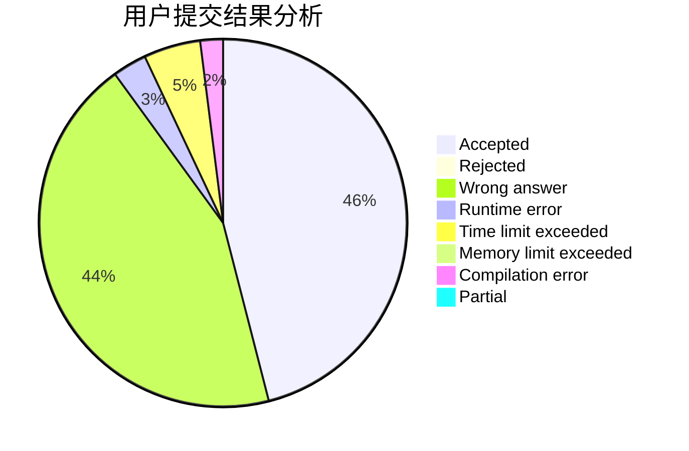
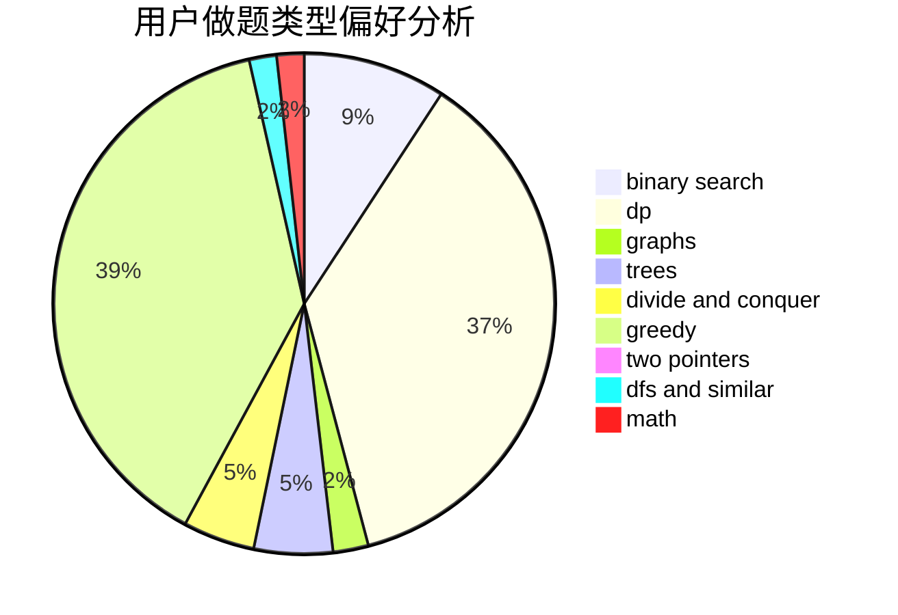

# Newbie_Rainbow_sjy

<!-- tabs:start -->

#### **用户提交结果分析**

#### **用户做题类型偏好分析**

<!-- tabs:end -->
# 推荐题目
[1344A](https://codeforces.com/contest/1344/problem/A)
[1413D](https://codeforces.com/contest/1413/problem/D)
[976F](https://codeforces.com/contest/976/problem/F)
[963B](https://codeforces.com/contest/963/problem/B)
[710E](https://codeforces.com/contest/710/problem/E)
[1325B](https://codeforces.com/contest/1325/problem/B)
[1368F](https://codeforces.com/contest/1368/problem/F)
[1186C](https://codeforces.com/contest/1186/problem/C)
[44G](https://codeforces.com/contest/44/problem/G)
[113B](https://codeforces.com/contest/113/problem/B)
