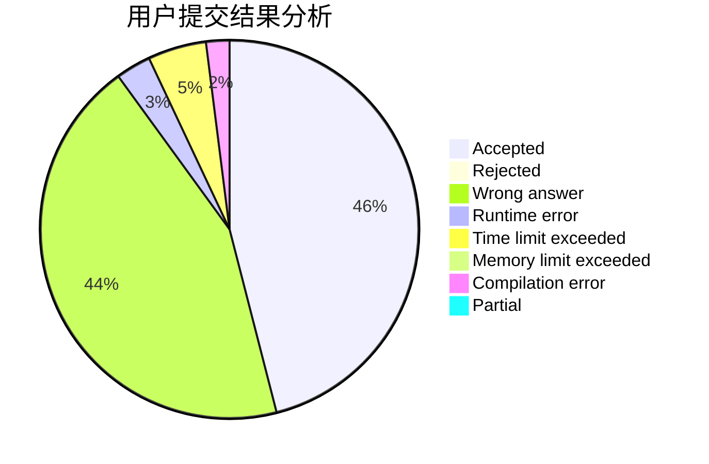
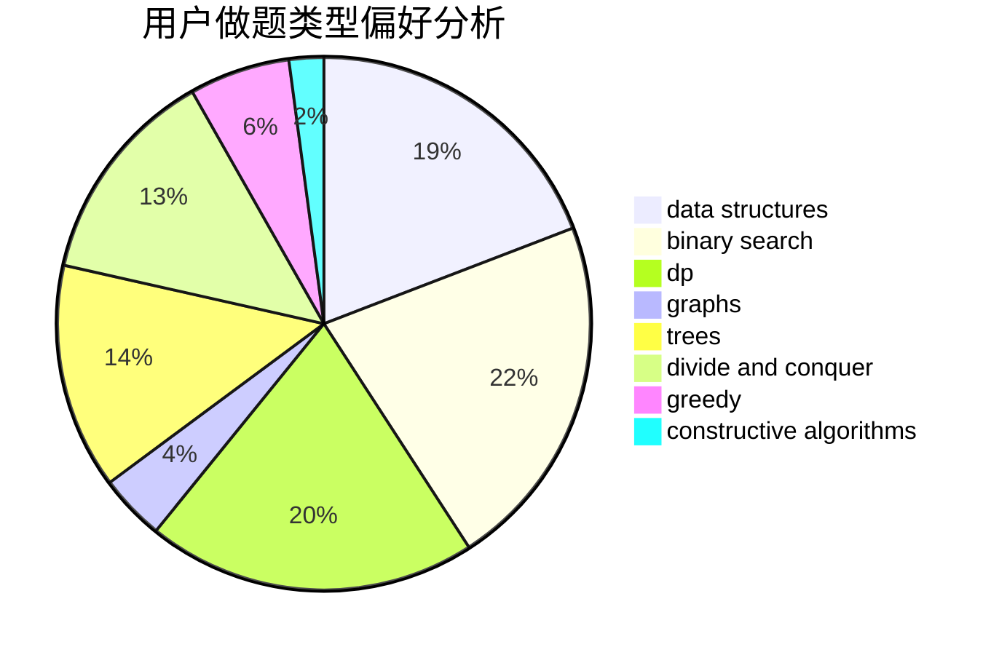
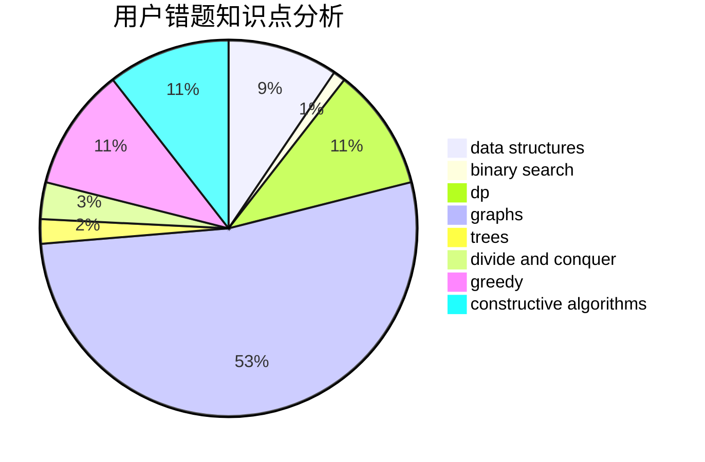

# Newbie_Rainbow_sjy

<!-- tabs:start -->

#### **用户提交结果分析**

#### **用户做题类型偏好分析**

#### **用户错题知识点分析**

<!-- tabs:end -->
# 推荐题目
[1344A](https://codeforces.com/contest/1344/problem/A)		math,
                        number theory,
                        sortings		  
[1413D](https://codeforces.com/contest/1413/problem/D)		data structures,
                        greedy,
                        implementation		  
[976F](https://codeforces.com/contest/976/problem/F)		flows,
                        graphs		  
[963B](https://codeforces.com/contest/963/problem/B)		constructive algorithms,
                        dfs and similar,
                        dp,
                        greedy,
                        trees		  
[710E](https://codeforces.com/contest/710/problem/E)		dfs and similar,
                        dp		  
[1325B](https://codeforces.com/contest/1325/problem/B)		greedy,
                        implementation		  
[1368F](https://codeforces.com/contest/1368/problem/F)		games,
                        implementation,
                        interactive,
                        math		  
[1186C](https://codeforces.com/contest/1186/problem/C)		implementation,
                        math		  
[44G](https://codeforces.com/contest/44/problem/G)		data structures,
                        implementation		  
[113B](https://codeforces.com/contest/113/problem/B)		brute force,
                        data structures,
                        hashing,
                        strings		  
