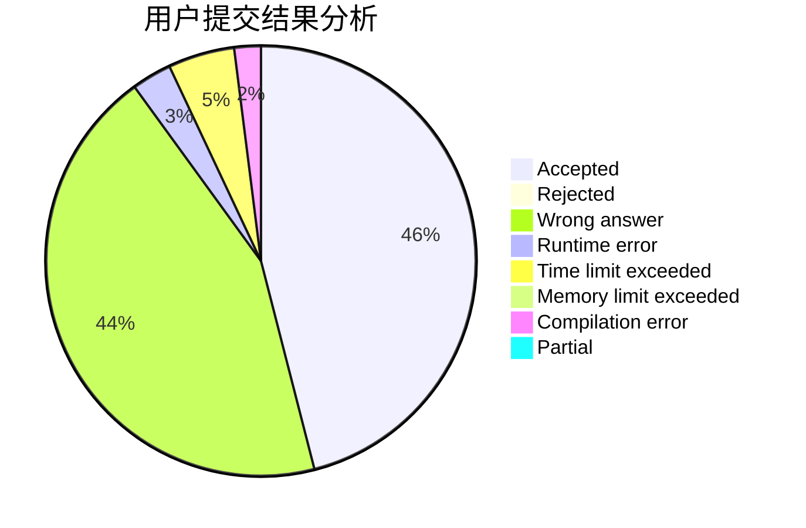
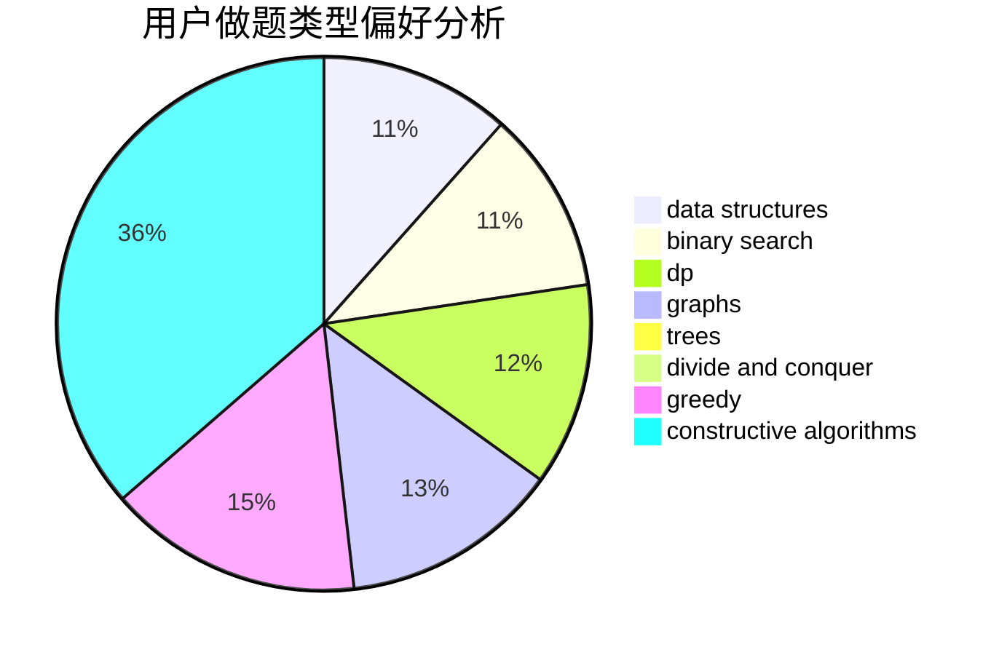
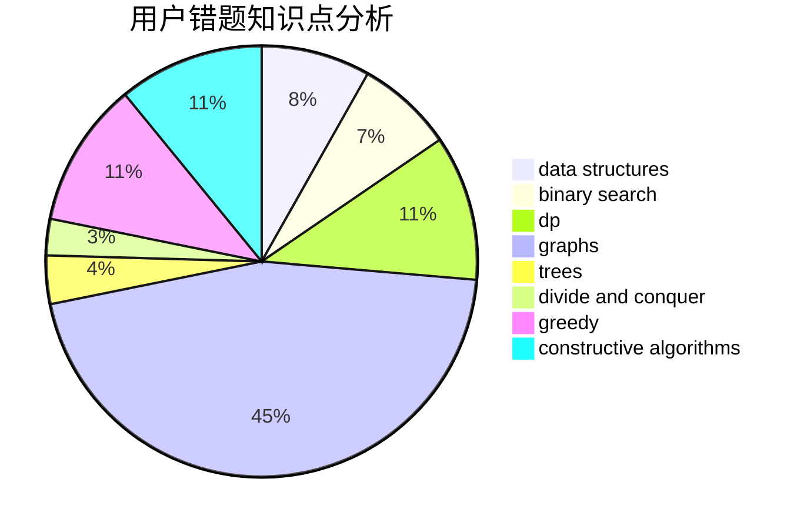

# Newbie_Rainbow_sjy
<!-- tabs:start -->
#### **用户提交结果分析**

#### **用户做题类型偏好分析**

#### **用户错题知识点分析**

<!-- tabs:end -->
# 推荐题目
[Roads](http://codeforces.com/problemset/problem/1402/B)		*special problem,
                        geometry,
                        sortings		  
[Chiori and Doll Picking (hard version)](http://codeforces.com/problemset/problem/1336/E2)		bitmasks,
                        brute force,
                        combinatorics,
                        math		  
[Largest Beautiful Number](http://codeforces.com/problemset/problem/946/E)		greedy,
                        implementation		  
[Subsequences (easy version)](http://codeforces.com/problemset/problem/1183/E)		dp,
                        graphs,
                        implementation,
                        shortest paths		  
[Yet Another String Matching Problem](http://codeforces.com/problemset/problem/954/I)		fft,
                        math		  
[123-sequence](http://codeforces.com/problemset/problem/52/A)		implementation		  
[Working out](http://codeforces.com/problemset/problem/429/B)		dp		  
[Segments Removal](http://codeforces.com/problemset/problem/899/E)		data structures,
                        dsu,
                        flows,
                        implementation,
                        two pointers		  
[Restoring Permutation](http://codeforces.com/problemset/problem/1315/C)		greedy		  
[Fashion in Berland](http://codeforces.com/problemset/problem/691/A)		implementation		  
<!-- tabs:start -->
#### **data structures**
[Roads](http://codeforces.com/problemset/problem/899/E)		data structures,
                        dsu,
                        flows,
                        implementation,
                        two pointers		  
[Chiori and Doll Picking (hard version)](http://codeforces.com/problemset/problem/1137/F)		data structures,
                        trees		  
[Largest Beautiful Number](http://codeforces.com/problemset/problem/1500/D)		data structures,
                        sortings,
                        two pointers		  
[Subsequences (easy version)](http://codeforces.com/problemset/problem/1413/D)		data structures,
                        greedy,
                        implementation		  
[Yet Another String Matching Problem](http://codeforces.com/problemset/problem/566/D)		data structures,
                        dsu		  
[123-sequence](http://codeforces.com/problemset/problem/821/C)		data structures,
                        greedy,
                        trees		  
[Working out](https://codeforces.com/contest/1483/problem/F)		data structures,
                        string suffix structures,
                        trees		  
[Segments Removal](http://codeforces.com/problemset/problem/1492/C)		binary search,
                        data structures,
                        dp,
                        greedy,
                        two pointers		  
[Restoring Permutation](http://codeforces.com/problemset/problem/1490/G)		binary search,
                        data structures,
                        math		  
[Fashion in Berland](http://codeforces.com/problemset/problem/1479/D)		binary search,
                        bitmasks,
                        brute force,
                        data structures,
                        probabilities,
                        trees		  
#### **binary search**
[Roads](http://codeforces.com/problemset/problem/444/D)		binary search,
                        hashing,
                        strings,
                        two pointers		  
[Chiori and Doll Picking (hard version)](http://codeforces.com/problemset/problem/1492/C)		binary search,
                        data structures,
                        dp,
                        greedy,
                        two pointers		  
[Largest Beautiful Number](http://codeforces.com/problemset/problem/1463/D)		binary search,
                        constructive algorithms,
                        greedy,
                        two pointers		  
[Subsequences (easy version)](http://codeforces.com/problemset/problem/1490/G)		binary search,
                        data structures,
                        math		  
[Yet Another String Matching Problem](http://codeforces.com/problemset/problem/1479/D)		binary search,
                        bitmasks,
                        brute force,
                        data structures,
                        probabilities,
                        trees		  
[123-sequence](http://codeforces.com/problemset/problem/1436/E)		binary search,
                        data structures,
                        two pointers		  
[Working out](http://codeforces.com/problemset/problem/1461/D)		binary search,
                        brute force,
                        data structures,
                        divide and conquer,
                        implementation,
                        sortings		  
[Segments Removal](http://codeforces.com/problemset/problem/1493/C)		binary search,
                        brute force,
                        constructive algorithms,
                        greedy,
                        strings		  
[Restoring Permutation](http://codeforces.com/problemset/problem/1487/D)		binary search,
                        brute force,
                        math,
                        number theory		  
[Fashion in Berland](http://codeforces.com/problemset/problem/1486/B)		binary search,
                        geometry,
                        shortest paths,
                        sortings		  
#### **dp**
[Roads](http://codeforces.com/problemset/problem/1183/E)		dp,
                        graphs,
                        implementation,
                        shortest paths		  
[Chiori and Doll Picking (hard version)](http://codeforces.com/problemset/problem/429/B)		dp		  
[Largest Beautiful Number](https://codeforces.com/contest/866/problem/E)		bitmasks,
                        brute force,
                        dp,
                        graphs		  
[Subsequences (easy version)](http://codeforces.com/problemset/problem/1228/E)		combinatorics,
                        dp,
                        math		  
[Yet Another String Matching Problem](http://codeforces.com/problemset/problem/1260/E)		brute force,
                        dp,
                        greedy		  
[123-sequence](http://codeforces.com/problemset/problem/632/E)		divide and conquer,
                        dp,
                        fft,
                        math		  
[Working out](http://codeforces.com/problemset/problem/1461/B)		brute force,
                        dp,
                        implementation		  
[Segments Removal](http://codeforces.com/problemset/problem/1492/C)		binary search,
                        data structures,
                        dp,
                        greedy,
                        two pointers		  
[Restoring Permutation](https://codeforces.com/contest/1457/problem/C)		brute force,
                        dp,
                        implementation		  
[Fashion in Berland](http://codeforces.com/problemset/problem/1491/C)		brute force,
                        data structures,
                        dp,
                        greedy,
                        implementation		  
#### **graph**
[Roads](http://codeforces.com/problemset/problem/1183/E)		dp,
                        graphs,
                        implementation,
                        shortest paths		  
[Chiori and Doll Picking (hard version)](https://codeforces.com/contest/866/problem/E)		bitmasks,
                        brute force,
                        dp,
                        graphs		  
[Largest Beautiful Number](http://codeforces.com/problemset/problem/1333/D)		brute force,
                        constructive algorithms,
                        games,
                        graphs,
                        greedy,
                        implementation,
                        sortings		  
[Subsequences (easy version)](http://codeforces.com/problemset/problem/1422/D)		graphs,
                        shortest paths,
                        sortings		  
[Yet Another String Matching Problem](http://codeforces.com/problemset/problem/1487/C)		brute force,
                        constructive algorithms,
                        dfs and similar,
                        graphs,
                        greedy,
                        implementation,
                        math		  
[123-sequence](http://codeforces.com/problemset/problem/1437/C)		dp,
                        flows,
                        graph matchings,
                        greedy,
                        math,
                        sortings		  
[Working out](http://codeforces.com/problemset/problem/1470/D)		constructive algorithms,
                        dfs and similar,
                        graph matchings,
                        graphs,
                        greedy		  
[Segments Removal](http://codeforces.com/problemset/problem/1476/C)		dp,
                        graphs,
                        greedy		  
[Restoring Permutation](http://codeforces.com/problemset/problem/1304/D)		constructive algorithms,
                        graphs,
                        greedy,
                        two pointers		  
[Fashion in Berland](http://codeforces.com/problemset/problem/1475/C)		combinatorics,
                        graphs,
                        math		  
#### **trees**
[Roads](http://codeforces.com/problemset/problem/1137/F)		data structures,
                        trees		  
[Chiori and Doll Picking (hard version)](http://codeforces.com/problemset/problem/821/C)		data structures,
                        greedy,
                        trees		  
[Largest Beautiful Number](https://codeforces.com/contest/1483/problem/F)		data structures,
                        string suffix structures,
                        trees		  
[Subsequences (easy version)](http://codeforces.com/problemset/problem/1479/D)		binary search,
                        bitmasks,
                        brute force,
                        data structures,
                        probabilities,
                        trees		  
[Yet Another String Matching Problem](http://codeforces.com/problemset/problem/1511/C)		brute force,
                        data structures,
                        implementation,
                        trees		  
[123-sequence](http://codeforces.com/problemset/problem/1499/F)		combinatorics,
                        dfs and similar,
                        dp,
                        trees		  
[Working out](http://codeforces.com/problemset/problem/1491/E)		brute force,
                        dfs and similar,
                        divide and conquer,
                        number theory,
                        trees		  
[Segments Removal](http://codeforces.com/problemset/problem/1466/D)		data structures,
                        greedy,
                        sortings,
                        trees		  
[Restoring Permutation](http://codeforces.com/problemset/problem/1495/D)		combinatorics,
                        dfs and similar,
                        graphs,
                        math,
                        shortest paths,
                        trees		  
[Fashion in Berland](http://codeforces.com/problemset/problem/1303/G)		data structures,
                        divide and conquer,
                        geometry,
                        trees		  
#### **divide and conquer**
[Roads](http://codeforces.com/problemset/problem/632/E)		divide and conquer,
                        dp,
                        fft,
                        math		  
[Chiori and Doll Picking (hard version)](http://codeforces.com/problemset/problem/1461/D)		binary search,
                        brute force,
                        data structures,
                        divide and conquer,
                        implementation,
                        sortings		  
[Largest Beautiful Number](http://codeforces.com/problemset/problem/1466/G)		combinatorics,
                        divide and conquer,
                        hashing,
                        math,
                        string suffix structures,
                        strings		  
[Subsequences (easy version)](http://codeforces.com/problemset/problem/1490/D)		dfs and similar,
                        divide and conquer,
                        implementation		  
[Yet Another String Matching Problem](https://codeforces.com/contest/1483/problem/C)		data structures,
                        divide and conquer,
                        dp		  
[123-sequence](http://codeforces.com/problemset/problem/1491/E)		brute force,
                        dfs and similar,
                        divide and conquer,
                        number theory,
                        trees		  
[Working out](http://codeforces.com/problemset/problem/1303/G)		data structures,
                        divide and conquer,
                        geometry,
                        trees		  
[Segments Removal](http://codeforces.com/problemset/problem/1494/D)		constructive algorithms,
                        data structures,
                        dfs and similar,
                        divide and conquer,
                        dsu,
                        greedy,
                        sortings,
                        trees		  
[Restoring Permutation](http://codeforces.com/problemset/problem/1482/E)		data structures,
                        divide and conquer,
                        dp		  
[Fashion in Berland](http://codeforces.com/problemset/problem/566/C)		dfs and similar,
                        divide and conquer,
                        trees		  
#### **greedy**
[Roads](http://codeforces.com/problemset/problem/946/E)		greedy,
                        implementation		  
[Chiori and Doll Picking (hard version)](http://codeforces.com/problemset/problem/1315/C)		greedy		  
[Largest Beautiful Number](http://codeforces.com/problemset/problem/92/B)		greedy		  
[Subsequences (easy version)](http://codeforces.com/problemset/problem/588/A)		greedy		  
[Yet Another String Matching Problem](http://codeforces.com/problemset/problem/1360/G)		constructive algorithms,
                        greedy,
                        math		  
[123-sequence](http://codeforces.com/problemset/problem/1333/D)		brute force,
                        constructive algorithms,
                        games,
                        graphs,
                        greedy,
                        implementation,
                        sortings		  
[Working out](http://codeforces.com/problemset/problem/883/M)		greedy,
                        math		  
[Segments Removal](http://codeforces.com/problemset/problem/1419/B)		brute force,
                        constructive algorithms,
                        greedy,
                        implementation,
                        math		  
[Restoring Permutation](http://codeforces.com/problemset/problem/1108/C)		brute force,
                        greedy,
                        math		  
[Fashion in Berland](http://codeforces.com/problemset/problem/1260/E)		brute force,
                        dp,
                        greedy		  
#### **constructive algorithms**
[Roads](http://codeforces.com/problemset/problem/1360/G)		constructive algorithms,
                        greedy,
                        math		  
[Chiori and Doll Picking (hard version)](http://codeforces.com/problemset/problem/1333/D)		brute force,
                        constructive algorithms,
                        games,
                        graphs,
                        greedy,
                        implementation,
                        sortings		  
[Largest Beautiful Number](http://codeforces.com/problemset/problem/1419/B)		brute force,
                        constructive algorithms,
                        greedy,
                        implementation,
                        math		  
[Subsequences (easy version)](https://codeforces.com/contest/1150/problem/C)		constructive algorithms,
                        greedy,
                        math,
                        number theory		  
[Yet Another String Matching Problem](http://codeforces.com/problemset/problem/1493/A)		constructive algorithms,
                        greedy		  
[123-sequence](http://codeforces.com/problemset/problem/1463/D)		binary search,
                        constructive algorithms,
                        greedy,
                        two pointers		  
[Working out](https://codeforces.com/contest/1456/problem/B)		bitmasks,
                        brute force,
                        constructive algorithms		  
[Segments Removal](http://codeforces.com/problemset/problem/1492/D)		bitmasks,
                        constructive algorithms,
                        greedy,
                        math		  
[Restoring Permutation](https://codeforces.com/contest/1504/problem/D)		constructive algorithms,
                        games,
                        interactive		  
[Fashion in Berland](https://codeforces.com/contest/1483/problem/A)		brute force,
                        constructive algorithms,
                        greedy,
                        implementation		  
#### **sortings**
[Roads](http://codeforces.com/problemset/problem/1402/B)		*special problem,
                        geometry,
                        sortings		  
[Chiori and Doll Picking (hard version)](http://codeforces.com/problemset/problem/681/E)		geometry,
                        sortings		  
[Largest Beautiful Number](http://codeforces.com/problemset/problem/1333/D)		brute force,
                        constructive algorithms,
                        games,
                        graphs,
                        greedy,
                        implementation,
                        sortings		  
[Subsequences (easy version)](http://codeforces.com/problemset/problem/1500/D)		data structures,
                        sortings,
                        two pointers		  
[Yet Another String Matching Problem](http://codeforces.com/problemset/problem/1213/D2)		brute force,
                        math,
                        sortings		  
[123-sequence](http://codeforces.com/problemset/problem/1422/D)		graphs,
                        shortest paths,
                        sortings		  
[Working out](http://codeforces.com/problemset/problem/792/A)		implementation,
                        sortings		  
[Segments Removal](https://codeforces.com/contest/1496/problem/C)		geometry,
                        greedy,
                        math,
                        sortings		  
[Restoring Permutation](http://codeforces.com/problemset/problem/1495/A)		geometry,
                        greedy,
                        math,
                        sortings		  
[Fashion in Berland](http://codeforces.com/problemset/problem/1497/A)		brute force,
                        data structures,
                        greedy,
                        sortings		  
<!-- tabs:end -->
