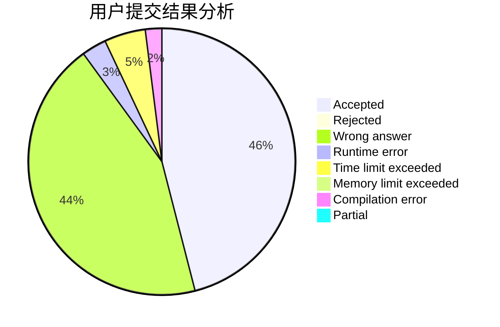
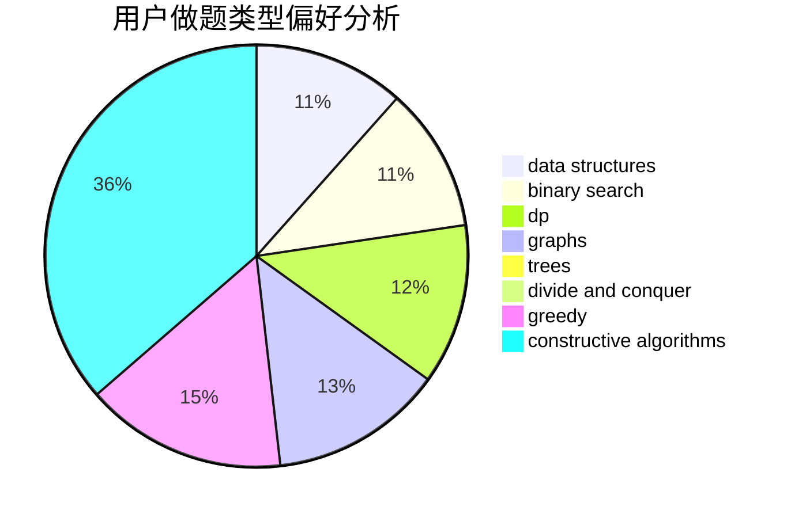
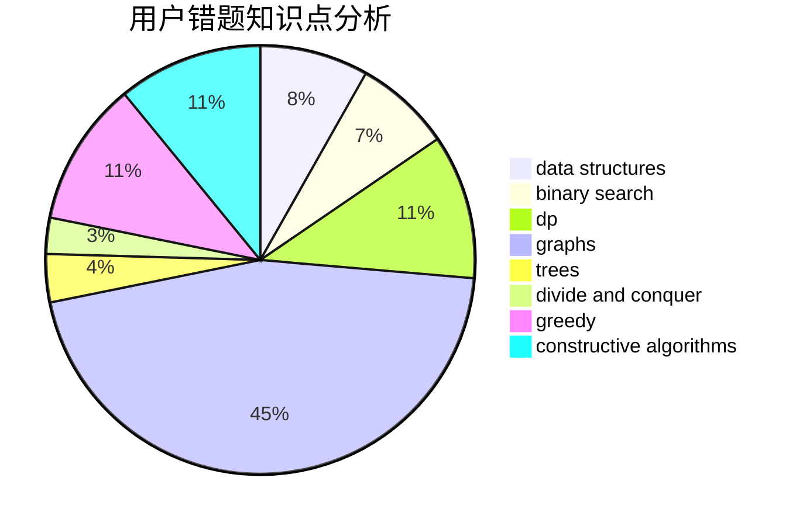

# Newbie_Rainbow_sjy

<!-- tabs:start -->

#### **用户提交结果分析**

#### **用户做题类型偏好分析**

#### **用户错题知识点分析**

<!-- tabs:end -->
# 推荐题目
[1336E2](https://codeforces.com/contest/1336E/problem/2)		bitmasks,
                        brute force,
                        combinatorics,
                        math		  
[1402B](https://codeforces.com/contest/1402/problem/B)		*special problem,
                        geometry,
                        sortings		  
[954I](https://codeforces.com/contest/954/problem/I)		fft,
                        math		  
[946E](https://codeforces.com/contest/946/problem/E)		greedy,
                        implementation		  
[691A](https://codeforces.com/contest/691/problem/A)		implementation		  
[1315C](https://codeforces.com/contest/1315/problem/C)		greedy		  
[1360G](https://codeforces.com/contest/1360/problem/G)		constructive algorithms,
                        greedy,
                        math		  
[1183E](https://codeforces.com/contest/1183/problem/E)		dp,
                        graphs,
                        implementation,
                        shortest paths		  
[429B](https://codeforces.com/contest/429/problem/B)		dp		  
[1137F](https://codeforces.com/contest/1137/problem/F)		data structures,
                        trees		  
