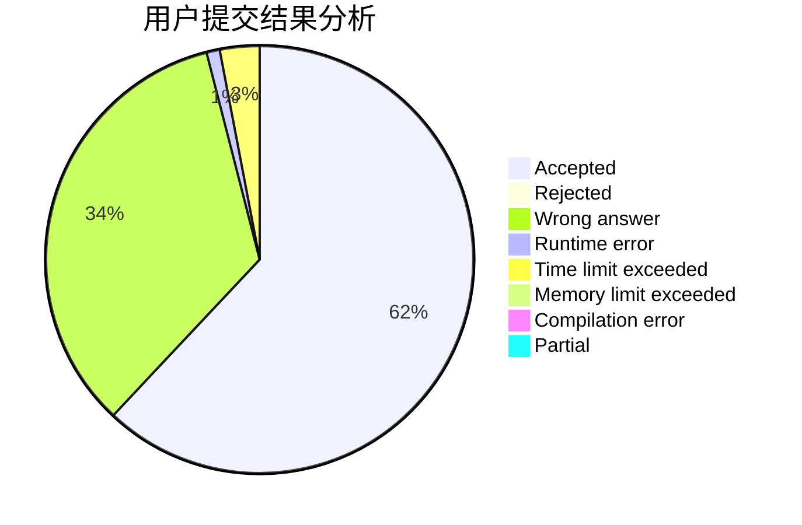
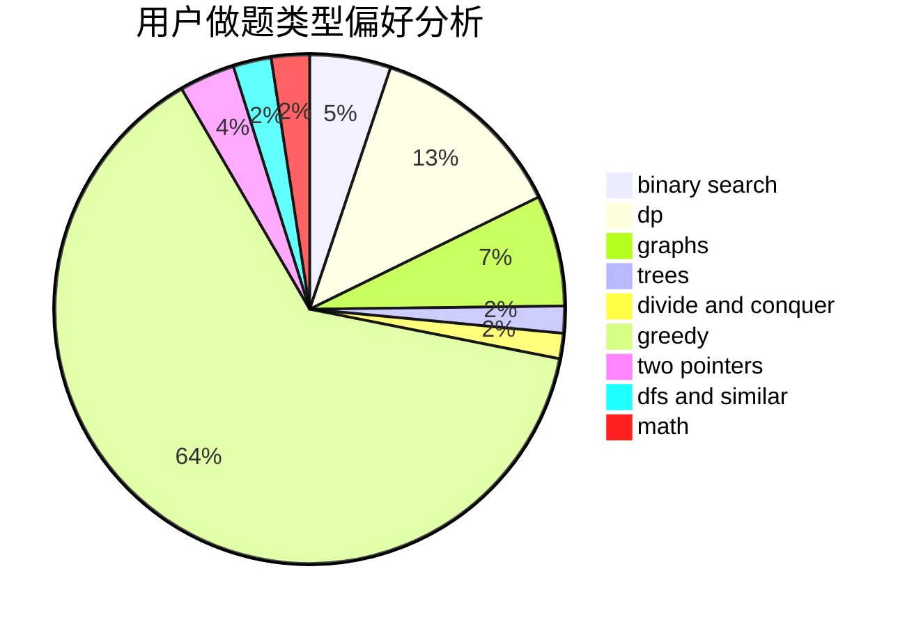

# Nickqw

<!-- tabs:start -->

#### **用户提交结果分析**

#### **用户做题类型偏好分析**

<!-- tabs:end -->
# 推荐题目
[1416A](https://codeforces.com/contest/1416/problem/A)
[1314A](https://codeforces.com/contest/1314/problem/A)
[327D](https://codeforces.com/contest/327/problem/D)
[1086C](https://codeforces.com/contest/1086/problem/C)
[667C](https://codeforces.com/contest/667/problem/C)
[681A](https://codeforces.com/contest/681/problem/A)
[17C](https://codeforces.com/contest/17/problem/C)
[977F](https://codeforces.com/contest/977/problem/F)
[409B](https://codeforces.com/contest/409/problem/B)
[174B](https://codeforces.com/contest/174/problem/B)
