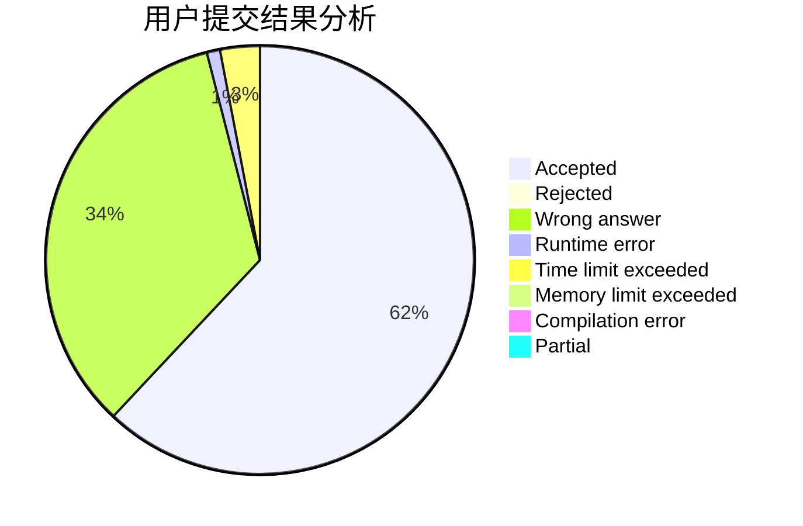
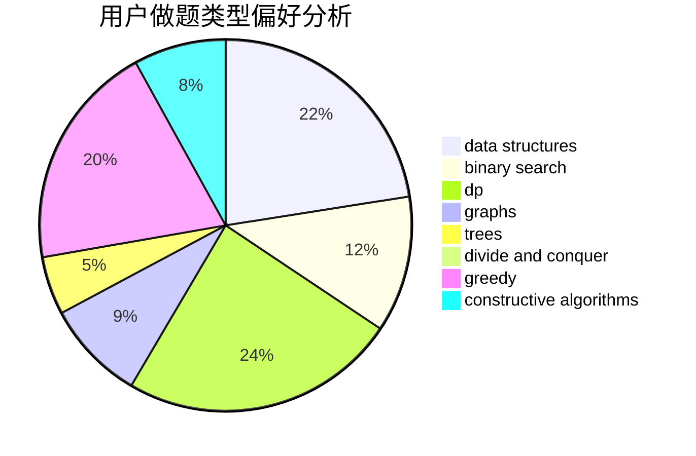
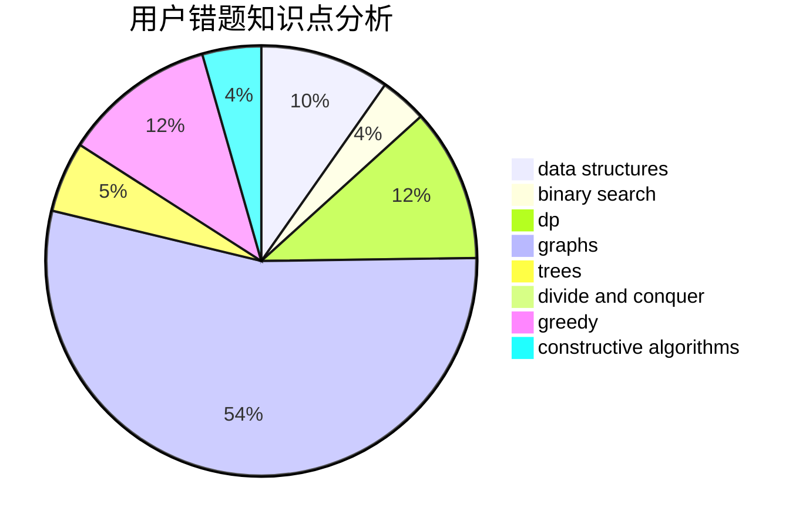

# Nickqw

<!-- tabs:start -->

#### **用户提交结果分析**

#### **用户做题类型偏好分析**

#### **用户错题知识点分析**

<!-- tabs:end -->
# 推荐题目
[1404E](https://codeforces.com/contest/1404/problem/E)		flows,
                        graph matchings,
                        graphs		  
[1305B](https://codeforces.com/contest/1305/problem/B)		constructive algorithms,
                        greedy,
                        strings,
                        two pointers		  
[306B](https://codeforces.com/contest/306/problem/B)		data structures,
                        greedy,
                        sortings		  
[1085G](https://codeforces.com/contest/1085/problem/G)		combinatorics,
                        data structures,
                        dp		  
[635A](https://codeforces.com/contest/635/problem/A)		brute force,
                        implementation		  
[660C](https://codeforces.com/contest/660/problem/C)		binary search,
                        dp,
                        two pointers		  
[158A](https://codeforces.com/contest/158/problem/A)		*special problem,
                        implementation		  
[956B](https://codeforces.com/contest/956/problem/B)		dsu,graphs,sortings,trees		  
[379D](https://codeforces.com/contest/379/problem/D)		bitmasks,
                        brute force,
                        dp		  
[1513F](https://codeforces.com/contest/1513/problem/F)		brute force,
                        constructive algorithms,
                        data structures,
                        sortings		  
