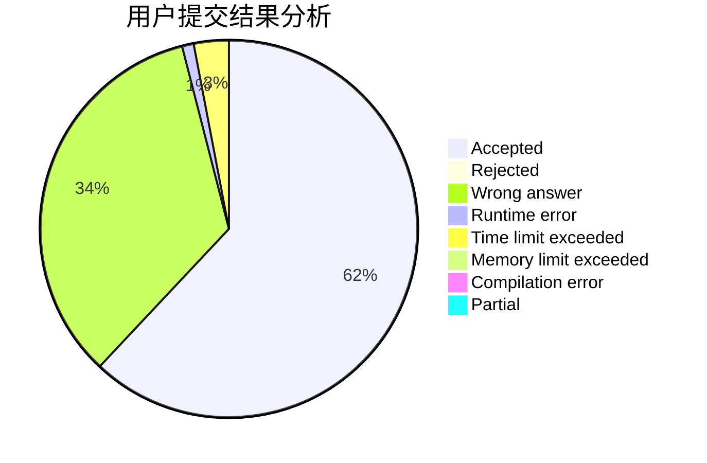
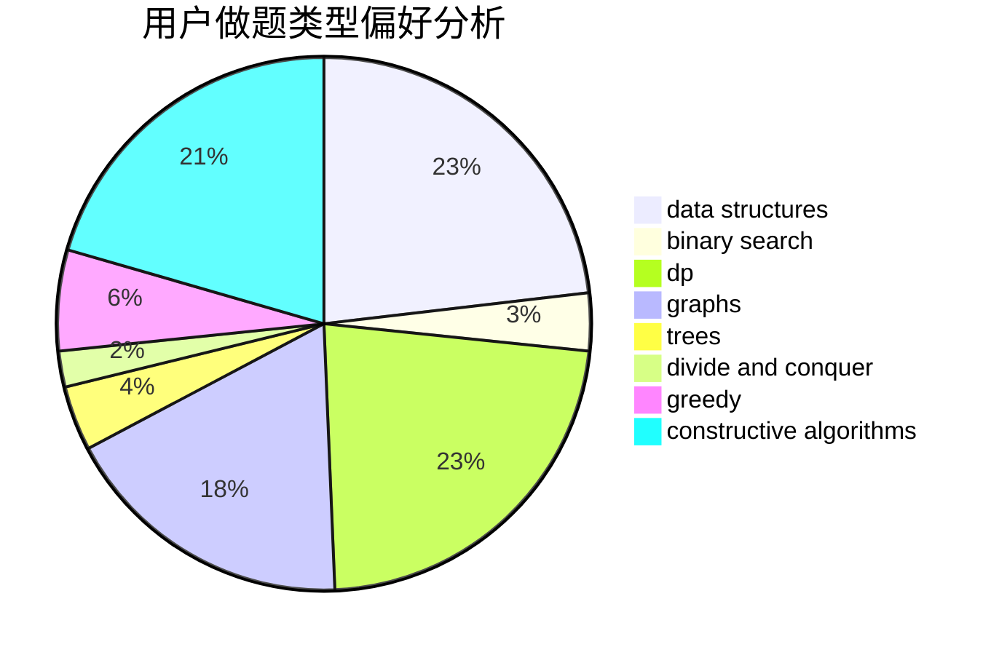
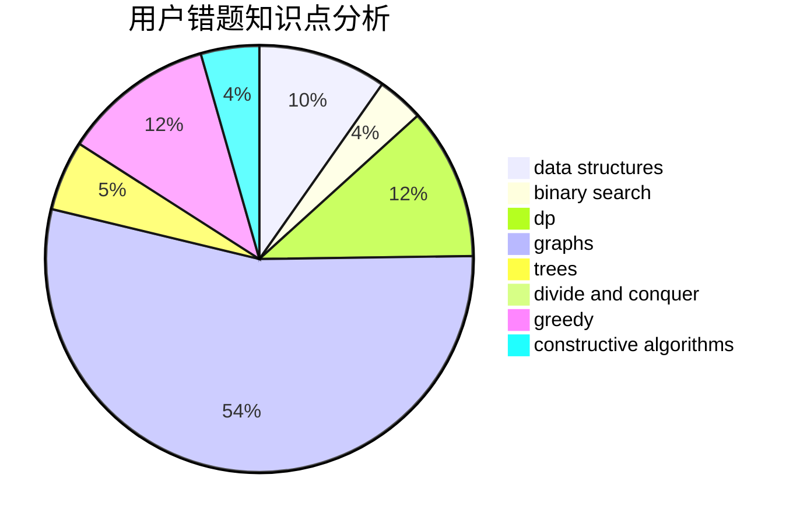

# Nickqw

<!-- tabs:start -->

#### **用户提交结果分析**

#### **用户做题类型偏好分析**

#### **用户错题知识点分析**

<!-- tabs:end -->
# 推荐题目
[1416A](https://codeforces.com/contest/1416/problem/A)		binary search,
                        data structures,
                        implementation,
                        two pointers		  
[1314A](https://codeforces.com/contest/1314/problem/A)		dsu,graphs,sortings,trees		  
[327D](https://codeforces.com/contest/327/problem/D)		constructive algorithms,
                        dfs and similar,
                        graphs		  
[1086C](https://codeforces.com/contest/1086/problem/C)		dsu,graphs,sortings,trees		  
[667C](https://codeforces.com/contest/667/problem/C)		dsu,graphs,sortings,trees		  
[681A](https://codeforces.com/contest/681/problem/A)		implementation		  
[17C](https://codeforces.com/contest/17/problem/C)		dp		  
[977F](https://codeforces.com/contest/977/problem/F)		dp		  
[409B](https://codeforces.com/contest/409/problem/B)		*special problem		  
[174B](https://codeforces.com/contest/174/problem/B)		dp,
                        greedy,
                        implementation		  
