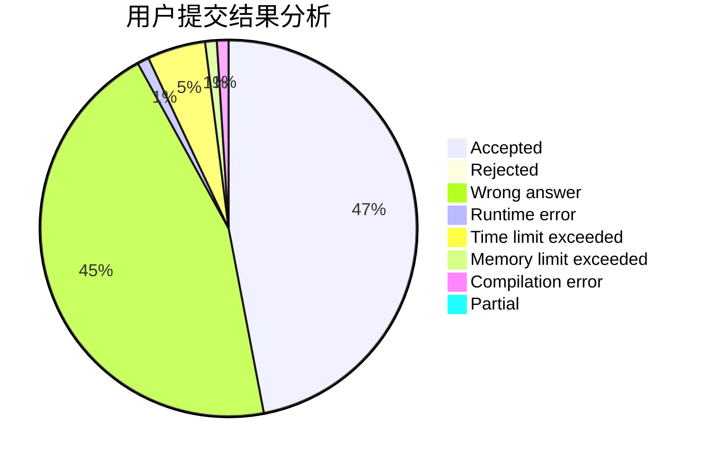
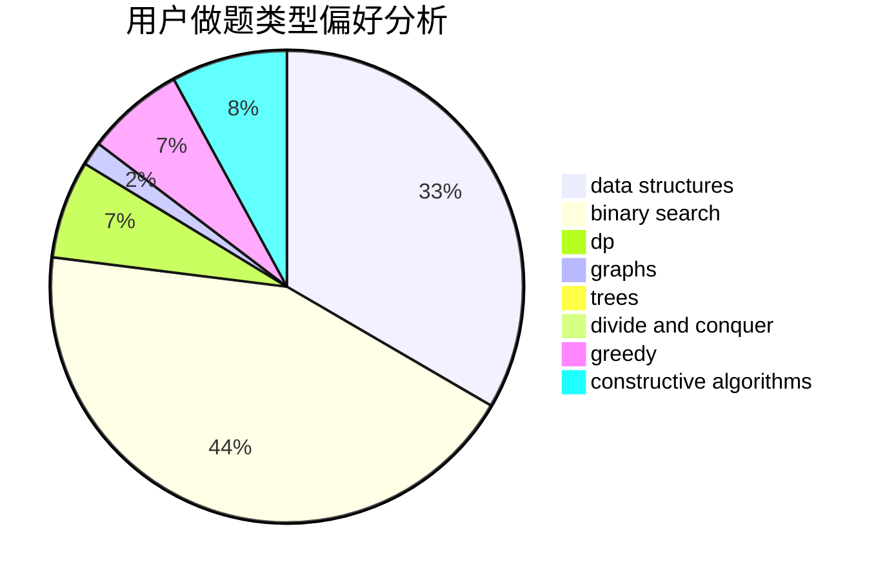
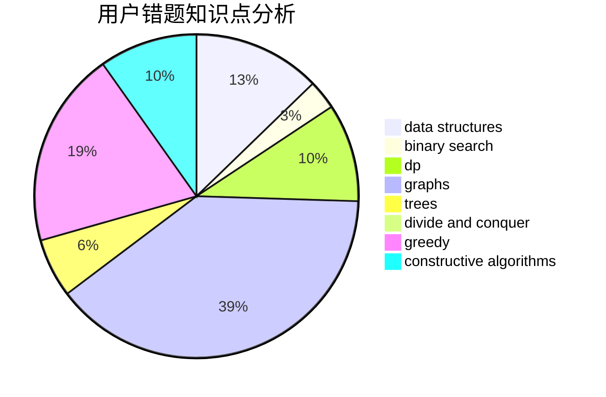

# Nickwzk

<!-- tabs:start -->

#### **用户提交结果分析**

#### **用户做题类型偏好分析**

#### **用户错题知识点分析**

<!-- tabs:end -->
# 推荐题目
[1254D](https://codeforces.com/contest/1254/problem/D)		data structures,
                        probabilities,
                        trees		  
[1269D](https://codeforces.com/contest/1269/problem/D)		dsu,graphs,sortings,trees		  
[508A](https://codeforces.com/contest/508/problem/A)		brute force		  
[1084C](https://codeforces.com/contest/1084/problem/C)		combinatorics,
                        dp,
                        implementation		  
[956B](https://codeforces.com/contest/956/problem/B)		dsu,graphs,sortings,trees		  
[1471D](https://codeforces.com/contest/1471/problem/D)		dsu,graphs,sortings,trees		  
[213E](https://codeforces.com/contest/213/problem/E)		data structures,
                        hashing,
                        strings		  
[825E](https://codeforces.com/contest/825/problem/E)		data structures,
                        dfs and similar,
                        graphs,
                        greedy		  
[923E](https://codeforces.com/contest/923/problem/E)		fft,
                        math,
                        matrices		  
[620B](https://codeforces.com/contest/620/problem/B)		implementation		  
