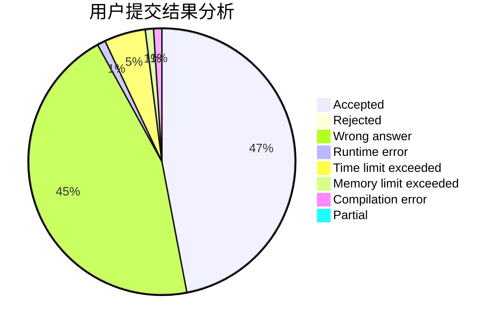
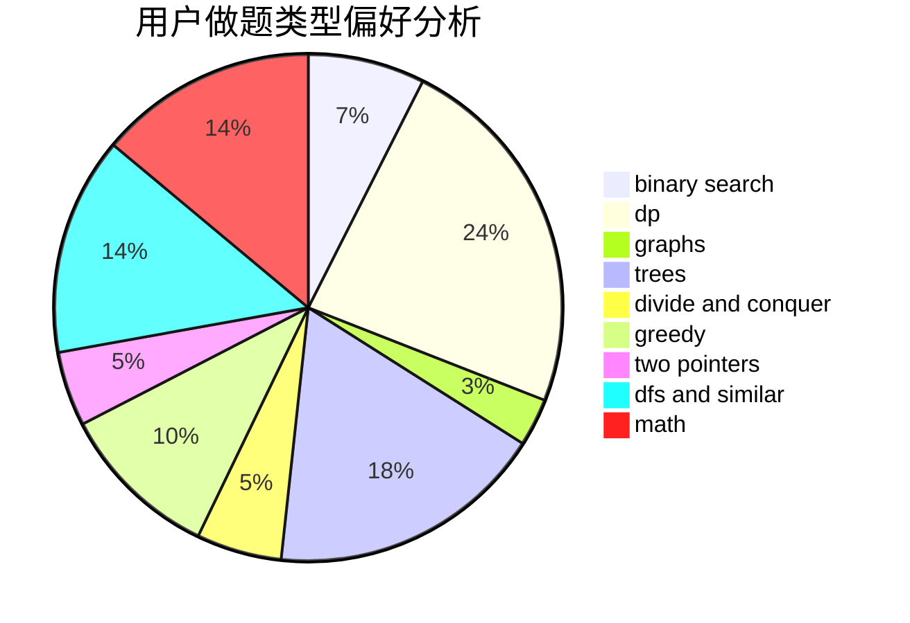

# Nickwzk

<!-- tabs:start -->

#### **用户提交结果分析**

#### **用户做题类型偏好分析**

<!-- tabs:end -->
# 推荐题目
[12621](https://codeforces.com/contest/1262/problem/1)
[1278D](https://codeforces.com/contest/1278/problem/D)
[528A](https://codeforces.com/contest/528/problem/A)
[1085B](https://codeforces.com/contest/1085/problem/B)
[977F](https://codeforces.com/contest/977/problem/F)
[147B](https://codeforces.com/contest/147/problem/B)
[233A](https://codeforces.com/contest/233/problem/A)
[845A](https://codeforces.com/contest/845/problem/A)
[947C](https://codeforces.com/contest/947/problem/C)
[643E](https://codeforces.com/contest/643/problem/E)
