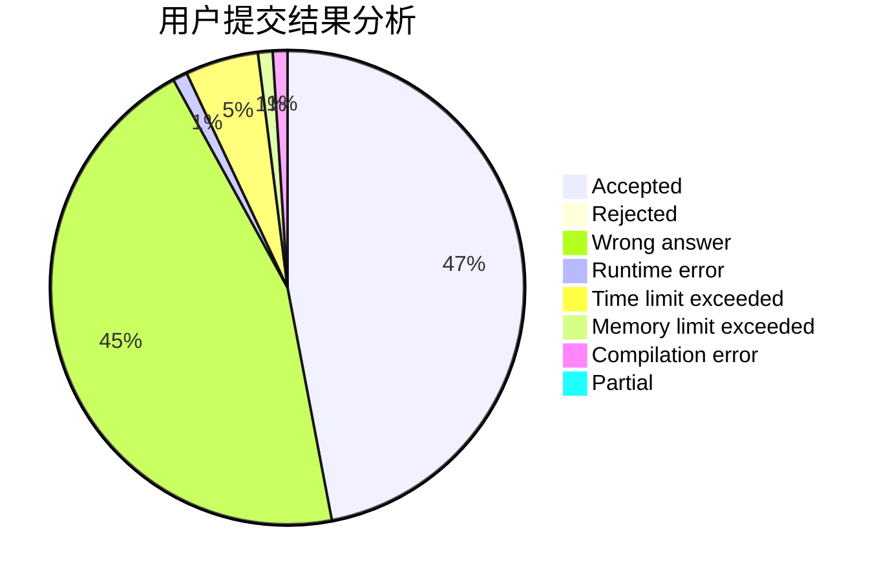
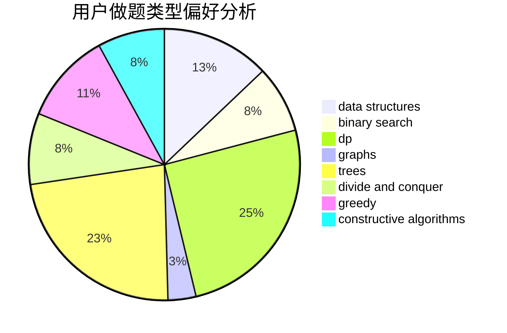
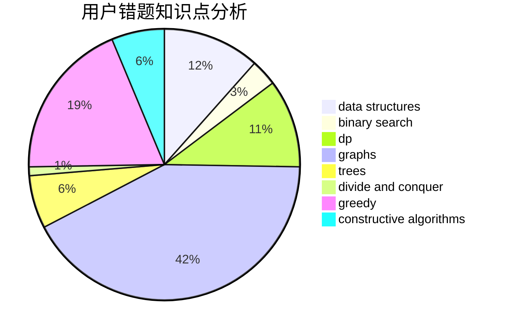

# Nickwzk

<!-- tabs:start -->

#### **用户提交结果分析**

#### **用户做题类型偏好分析**

#### **用户错题知识点分析**

<!-- tabs:end -->
# 推荐题目
[12621](https://codeforces.com/contest/1262/problem/1)		dsu,graphs,sortings,trees		  
[1278D](https://codeforces.com/contest/1278/problem/D)		data structures,
                        dsu,
                        graphs,
                        trees		  
[528A](https://codeforces.com/contest/528/problem/A)		dsu,graphs,sortings,trees		  
[1085B](https://codeforces.com/contest/1085/problem/B)		math		  
[977F](https://codeforces.com/contest/977/problem/F)		dp		  
[147B](https://codeforces.com/contest/147/problem/B)		binary search,
                        graphs,
                        matrices		  
[233A](https://codeforces.com/contest/233/problem/A)		implementation,
                        math		  
[845A](https://codeforces.com/contest/845/problem/A)		implementation,
                        sortings		  
[947C](https://codeforces.com/contest/947/problem/C)		dsu,graphs,sortings,trees		  
[643E](https://codeforces.com/contest/643/problem/E)		dp,
                        math,
                        probabilities,
                        trees		  
