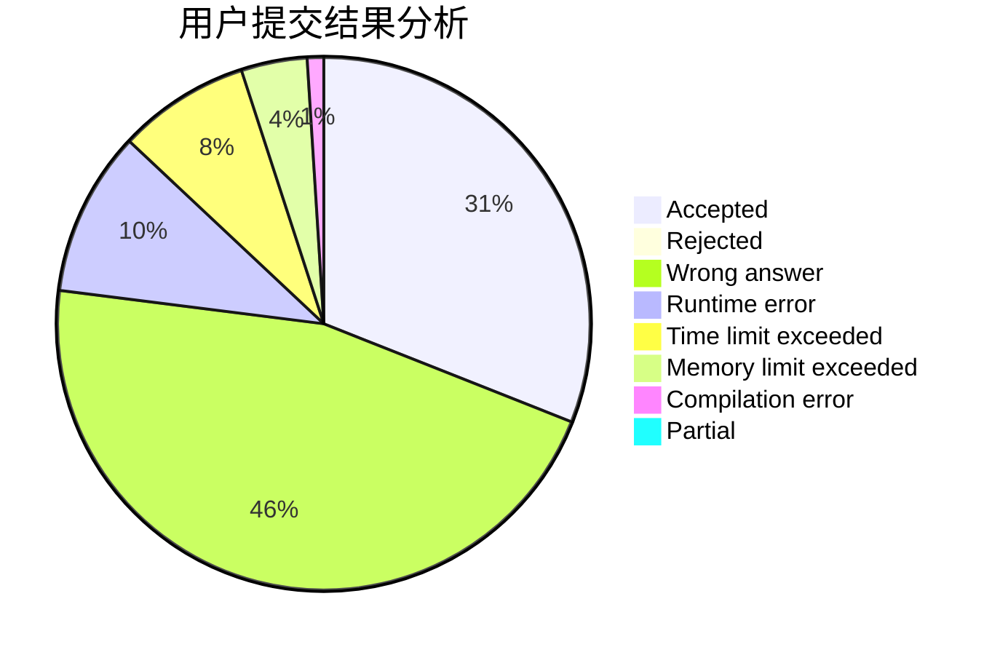
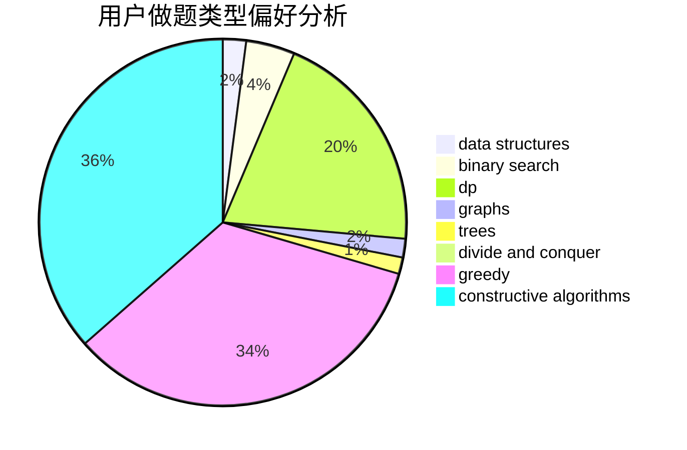

# Night
<!-- tabs:start -->
#### **用户提交结果分析**

#### **用户做题类型偏好分析**

#### **用户错题知识点分析**

<!-- tabs:end -->
# 推荐题目
[Find the Spruce](http://codeforces.com/problemset/problem/1461/B)		brute force,
                        dp,
                        implementation		  
[Different Divisors](http://codeforces.com/problemset/problem/1474/B)		binary search,
                        constructive algorithms,
                        greedy,
                        math,
                        number theory		  
[Extending Set of Points](http://codeforces.com/problemset/problem/1140/F)		data structures,
                        divide and conquer,
                        dsu		  
[Neighbor Grid](http://codeforces.com/problemset/problem/1375/B)		constructive algorithms,
                        greedy		  
[Beautiful Sets of Points](http://codeforces.com/problemset/problem/268/C)		constructive algorithms,
                        implementation		  
[Harmonious Graph](http://codeforces.com/problemset/problem/1253/D)		constructive algorithms,
                        dfs and similar,
                        dsu,
                        graphs,
                        greedy,
                        sortings		  
[Danger of Mad Snakes](http://codeforces.com/problemset/problem/1425/D)		combinatorics,
                        dp,
                        math		  
[Bear and Tree Jumps](http://codeforces.com/problemset/problem/771/C)		dfs and similar,
                        dp,
                        trees		  
[New Year Transportation](http://codeforces.com/problemset/problem/500/A)		dfs and similar,
                        graphs,
                        implementation		  
[Quasi-palindrome](http://codeforces.com/problemset/problem/863/A)		brute force,
                        implementation		  
<!-- tabs:start -->
#### **data structures**
[Find the Spruce](http://codeforces.com/problemset/problem/1140/F)		data structures,
                        divide and conquer,
                        dsu		  
[Different Divisors](http://codeforces.com/problemset/problem/926/J)		data structures		  
[Extending Set of Points](http://codeforces.com/problemset/problem/1070/B)		data structures,
                        greedy		  
[Neighbor Grid](http://codeforces.com/problemset/problem/1214/C)		data structures,
                        greedy		  
[Beautiful Sets of Points](http://codeforces.com/problemset/problem/1349/A)		data structures,
                        math,
                        number theory		  
[Harmonious Graph](http://codeforces.com/problemset/problem/1492/C)		binary search,
                        data structures,
                        dp,
                        greedy,
                        two pointers		  
[Danger of Mad Snakes](http://codeforces.com/problemset/problem/1490/G)		binary search,
                        data structures,
                        math		  
[Bear and Tree Jumps](http://codeforces.com/problemset/problem/1479/D)		binary search,
                        bitmasks,
                        brute force,
                        data structures,
                        probabilities,
                        trees		  
[New Year Transportation](http://codeforces.com/problemset/problem/1497/A)		brute force,
                        data structures,
                        greedy,
                        sortings		  
[Quasi-palindrome](http://codeforces.com/problemset/problem/1491/C)		brute force,
                        data structures,
                        dp,
                        greedy,
                        implementation		  
#### **binary search**
[Find the Spruce](http://codeforces.com/problemset/problem/1474/B)		binary search,
                        constructive algorithms,
                        greedy,
                        math,
                        number theory		  
[Different Divisors](http://codeforces.com/problemset/problem/650/B)		binary search,
                        brute force,
                        dp,
                        two pointers		  
[Extending Set of Points](https://codeforces.com/contest/866/problem/C)		binary search,
                        dp		  
[Neighbor Grid](http://codeforces.com/problemset/problem/975/C)		binary search		  
[Beautiful Sets of Points](http://codeforces.com/problemset/problem/1492/C)		binary search,
                        data structures,
                        dp,
                        greedy,
                        two pointers		  
[Harmonious Graph](http://codeforces.com/problemset/problem/1463/D)		binary search,
                        constructive algorithms,
                        greedy,
                        two pointers		  
[Danger of Mad Snakes](http://codeforces.com/problemset/problem/1490/G)		binary search,
                        data structures,
                        math		  
[Bear and Tree Jumps](http://codeforces.com/problemset/problem/1479/D)		binary search,
                        bitmasks,
                        brute force,
                        data structures,
                        probabilities,
                        trees		  
[New Year Transportation](http://codeforces.com/problemset/problem/1436/E)		binary search,
                        data structures,
                        two pointers		  
[Quasi-palindrome](http://codeforces.com/problemset/problem/1461/D)		binary search,
                        brute force,
                        data structures,
                        divide and conquer,
                        implementation,
                        sortings		  
#### **dp**
[Find the Spruce](http://codeforces.com/problemset/problem/1461/B)		brute force,
                        dp,
                        implementation		  
[Different Divisors](http://codeforces.com/problemset/problem/1425/D)		combinatorics,
                        dp,
                        math		  
[Extending Set of Points](http://codeforces.com/problemset/problem/771/C)		dfs and similar,
                        dp,
                        trees		  
[Neighbor Grid](http://codeforces.com/problemset/problem/682/D)		dp,
                        strings		  
[Beautiful Sets of Points](http://codeforces.com/problemset/problem/238/E)		dp,
                        graphs,
                        shortest paths		  
[Harmonious Graph](http://codeforces.com/problemset/problem/1381/D)		dfs and similar,
                        dp,
                        greedy,
                        trees,
                        two pointers		  
[Danger of Mad Snakes](http://codeforces.com/problemset/problem/650/B)		binary search,
                        brute force,
                        dp,
                        two pointers		  
[Bear and Tree Jumps](https://codeforces.com/contest/866/problem/C)		binary search,
                        dp		  
[New Year Transportation](http://codeforces.com/problemset/problem/838/C)		dp,
                        games		  
[Quasi-palindrome](https://codeforces.com/contest/1397/problem/E)		dp,
                        greedy,
                        implementation		  
#### **graph**
[Find the Spruce](http://codeforces.com/problemset/problem/1253/D)		constructive algorithms,
                        dfs and similar,
                        dsu,
                        graphs,
                        greedy,
                        sortings		  
[Different Divisors](http://codeforces.com/problemset/problem/500/A)		dfs and similar,
                        graphs,
                        implementation		  
[Extending Set of Points](http://codeforces.com/problemset/problem/316/C2)		flows,
                        graph matchings		  
[Neighbor Grid](http://codeforces.com/problemset/problem/238/E)		dp,
                        graphs,
                        shortest paths		  
[Beautiful Sets of Points](http://codeforces.com/problemset/problem/1089/M)		constructive algorithms,
                        graphs		  
[Harmonious Graph](http://codeforces.com/problemset/problem/909/E)		dfs and similar,
                        dp,
                        graphs,
                        greedy		  
[Danger of Mad Snakes](http://codeforces.com/problemset/problem/1487/C)		brute force,
                        constructive algorithms,
                        dfs and similar,
                        graphs,
                        greedy,
                        implementation,
                        math		  
[Bear and Tree Jumps](http://codeforces.com/problemset/problem/1437/C)		dp,
                        flows,
                        graph matchings,
                        greedy,
                        math,
                        sortings		  
[New Year Transportation](http://codeforces.com/problemset/problem/1470/D)		constructive algorithms,
                        dfs and similar,
                        graph matchings,
                        graphs,
                        greedy		  
[Quasi-palindrome](http://codeforces.com/problemset/problem/1476/C)		dp,
                        graphs,
                        greedy		  
#### **trees**
[Find the Spruce](http://codeforces.com/problemset/problem/771/C)		dfs and similar,
                        dp,
                        trees		  
[Different Divisors](http://codeforces.com/problemset/problem/1381/D)		dfs and similar,
                        dp,
                        greedy,
                        trees,
                        two pointers		  
[Extending Set of Points](http://codeforces.com/problemset/problem/1479/D)		binary search,
                        bitmasks,
                        brute force,
                        data structures,
                        probabilities,
                        trees		  
[Neighbor Grid](http://codeforces.com/problemset/problem/1511/C)		brute force,
                        data structures,
                        implementation,
                        trees		  
[Beautiful Sets of Points](http://codeforces.com/problemset/problem/1499/F)		combinatorics,
                        dfs and similar,
                        dp,
                        trees		  
[Harmonious Graph](http://codeforces.com/problemset/problem/1491/E)		brute force,
                        dfs and similar,
                        divide and conquer,
                        number theory,
                        trees		  
[Danger of Mad Snakes](http://codeforces.com/problemset/problem/1466/D)		data structures,
                        greedy,
                        sortings,
                        trees		  
[Bear and Tree Jumps](http://codeforces.com/problemset/problem/1495/D)		combinatorics,
                        dfs and similar,
                        graphs,
                        math,
                        shortest paths,
                        trees		  
[New Year Transportation](http://codeforces.com/problemset/problem/1303/G)		data structures,
                        divide and conquer,
                        geometry,
                        trees		  
[Quasi-palindrome](http://codeforces.com/problemset/problem/1454/E)		combinatorics,
                        dfs and similar,
                        graphs,
                        trees		  
#### **divide and conquer**
[Find the Spruce](http://codeforces.com/problemset/problem/1140/F)		data structures,
                        divide and conquer,
                        dsu		  
[Different Divisors](http://codeforces.com/problemset/problem/383/E)		combinatorics,
                        divide and conquer,
                        dp		  
[Extending Set of Points](http://codeforces.com/problemset/problem/1461/D)		binary search,
                        brute force,
                        data structures,
                        divide and conquer,
                        implementation,
                        sortings		  
[Neighbor Grid](http://codeforces.com/problemset/problem/1466/G)		combinatorics,
                        divide and conquer,
                        hashing,
                        math,
                        string suffix structures,
                        strings		  
[Beautiful Sets of Points](http://codeforces.com/problemset/problem/1490/D)		dfs and similar,
                        divide and conquer,
                        implementation		  
[Harmonious Graph](https://codeforces.com/contest/1483/problem/C)		data structures,
                        divide and conquer,
                        dp		  
[Danger of Mad Snakes](http://codeforces.com/problemset/problem/1491/E)		brute force,
                        dfs and similar,
                        divide and conquer,
                        number theory,
                        trees		  
[Bear and Tree Jumps](http://codeforces.com/problemset/problem/1303/G)		data structures,
                        divide and conquer,
                        geometry,
                        trees		  
[New Year Transportation](http://codeforces.com/problemset/problem/1494/D)		constructive algorithms,
                        data structures,
                        dfs and similar,
                        divide and conquer,
                        dsu,
                        greedy,
                        sortings,
                        trees		  
[Quasi-palindrome](http://codeforces.com/problemset/problem/1482/E)		data structures,
                        divide and conquer,
                        dp		  
#### **greedy**
[Find the Spruce](http://codeforces.com/problemset/problem/1474/B)		binary search,
                        constructive algorithms,
                        greedy,
                        math,
                        number theory		  
[Different Divisors](http://codeforces.com/problemset/problem/1375/B)		constructive algorithms,
                        greedy		  
[Extending Set of Points](http://codeforces.com/problemset/problem/1253/D)		constructive algorithms,
                        dfs and similar,
                        dsu,
                        graphs,
                        greedy,
                        sortings		  
[Neighbor Grid](http://codeforces.com/problemset/problem/1036/D)		greedy,
                        two pointers		  
[Beautiful Sets of Points](http://codeforces.com/problemset/problem/1411/F)		greedy,
                        math		  
[Harmonious Graph](http://codeforces.com/problemset/problem/27/B)		bitmasks,
                        brute force,
                        dfs and similar,
                        greedy		  
[Danger of Mad Snakes](http://codeforces.com/problemset/problem/892/A)		greedy,
                        implementation		  
[Bear and Tree Jumps](http://codeforces.com/problemset/problem/1381/D)		dfs and similar,
                        dp,
                        greedy,
                        trees,
                        two pointers		  
[New Year Transportation](http://codeforces.com/problemset/problem/1070/B)		data structures,
                        greedy		  
[Quasi-palindrome](http://codeforces.com/problemset/problem/258/A)		greedy,
                        math		  
#### **constructive algorithms**
[Find the Spruce](http://codeforces.com/problemset/problem/1474/B)		binary search,
                        constructive algorithms,
                        greedy,
                        math,
                        number theory		  
[Different Divisors](http://codeforces.com/problemset/problem/1375/B)		constructive algorithms,
                        greedy		  
[Extending Set of Points](http://codeforces.com/problemset/problem/268/C)		constructive algorithms,
                        implementation		  
[Neighbor Grid](http://codeforces.com/problemset/problem/1253/D)		constructive algorithms,
                        dfs and similar,
                        dsu,
                        graphs,
                        greedy,
                        sortings		  
[Beautiful Sets of Points](http://codeforces.com/problemset/problem/347/A)		constructive algorithms,
                        implementation,
                        sortings		  
[Harmonious Graph](http://codeforces.com/problemset/problem/493/D)		constructive algorithms,
                        games,
                        math		  
[Danger of Mad Snakes](http://codeforces.com/problemset/problem/398/A)		constructive algorithms,
                        implementation		  
[Bear and Tree Jumps](https://codeforces.com/contest/907/problem/D)		brute force,
                        constructive algorithms,
                        math		  
[New Year Transportation](http://codeforces.com/problemset/problem/398/C)		constructive algorithms		  
[Quasi-palindrome](http://codeforces.com/problemset/problem/1089/M)		constructive algorithms,
                        graphs		  
#### **sortings**
[Find the Spruce](http://codeforces.com/problemset/problem/1253/D)		constructive algorithms,
                        dfs and similar,
                        dsu,
                        graphs,
                        greedy,
                        sortings		  
[Different Divisors](http://codeforces.com/problemset/problem/347/A)		constructive algorithms,
                        implementation,
                        sortings		  
[Extending Set of Points](http://codeforces.com/problemset/problem/1365/F)		constructive algorithms,
                        implementation,
                        sortings		  
[Neighbor Grid](https://codeforces.com/contest/1496/problem/C)		geometry,
                        greedy,
                        math,
                        sortings		  
[Beautiful Sets of Points](http://codeforces.com/problemset/problem/1495/A)		geometry,
                        greedy,
                        math,
                        sortings		  
[Harmonious Graph](http://codeforces.com/problemset/problem/1497/A)		brute force,
                        data structures,
                        greedy,
                        sortings		  
[Danger of Mad Snakes](http://codeforces.com/problemset/problem/1427/A)		math,
                        sortings		  
[Bear and Tree Jumps](http://codeforces.com/problemset/problem/1461/D)		binary search,
                        brute force,
                        data structures,
                        divide and conquer,
                        implementation,
                        sortings		  
[New Year Transportation](http://codeforces.com/problemset/problem/1437/C)		dp,
                        flows,
                        graph matchings,
                        greedy,
                        math,
                        sortings		  
[Quasi-palindrome](http://codeforces.com/problemset/problem/1473/A)		greedy,
                        implementation,
                        math,
                        sortings		  
<!-- tabs:end -->
