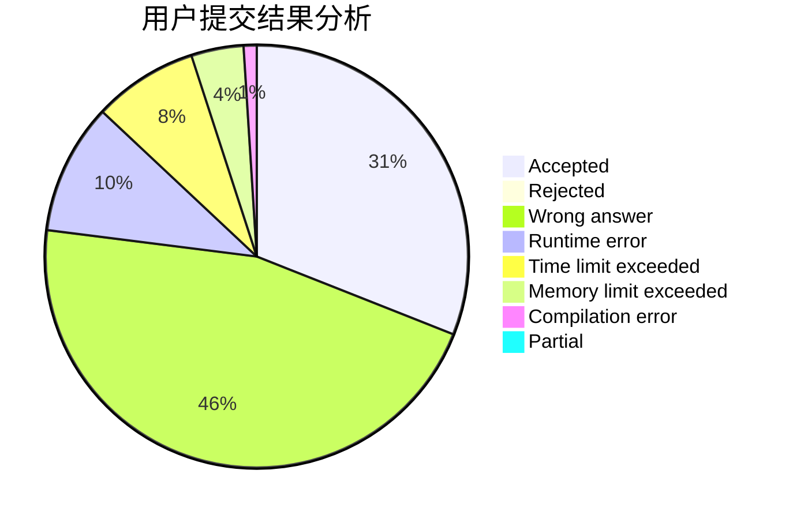
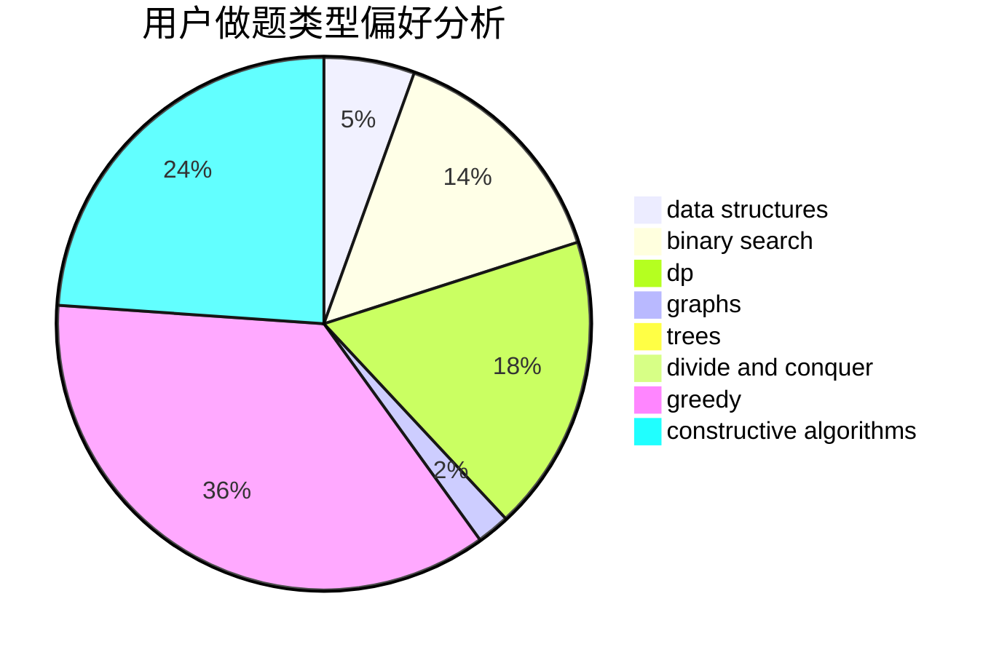

# Night

<!-- tabs:start -->

#### **用户提交结果分析**

#### **用户做题类型偏好分析**

#### **用户错题知识点分析**

<!-- tabs:end -->
# 推荐题目
[1468L](https://codeforces.com/contest/1468/problem/L)		binary search,
                        greedy,
                        math,
                        number theory		  
[295A](https://codeforces.com/contest/295/problem/A)		data structures,
                        implementation		  
[521A](https://codeforces.com/contest/521/problem/A)		dsu,graphs,sortings,trees		  
[58E](https://codeforces.com/contest/58/problem/E)		dp		  
[1030G](https://codeforces.com/contest/1030/problem/G)		number theory		  
[1142D](https://codeforces.com/contest/1142/problem/D)		dp		  
[1037A](https://codeforces.com/contest/1037/problem/A)		constructive algorithms,
                        greedy,
                        math		  
[372C](https://codeforces.com/contest/372/problem/C)		data structures,
                        dp,
                        math		  
[883C](https://codeforces.com/contest/883/problem/C)		binary search,
                        implementation		  
[856C](https://codeforces.com/contest/856/problem/C)		combinatorics,
                        dp,
                        math		  
