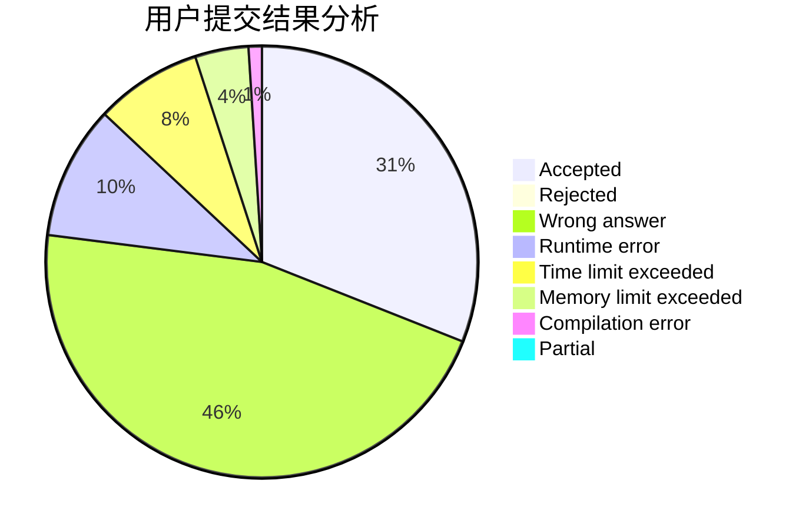
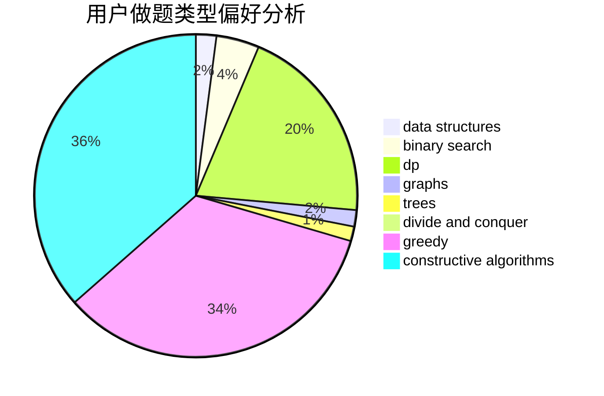

# Night

<!-- tabs:start -->

#### **用户提交结果分析**

#### **用户做题类型偏好分析**

#### **用户错题知识点分析**

<!-- tabs:end -->
# 推荐题目
[1461B](https://codeforces.com/contest/1461/problem/B)		brute force,
                        dp,
                        implementation		  
[27B](https://codeforces.com/contest/27/problem/B)		bitmasks,
                        brute force,
                        dfs and similar,
                        greedy		  
[500A](https://codeforces.com/contest/500/problem/A)		dfs and similar,
                        graphs,
                        implementation		  
[56B](https://codeforces.com/contest/56/problem/B)		implementation		  
[1030C](https://codeforces.com/contest/1030/problem/C)		implementation		  
[1140F](https://codeforces.com/contest/1140/problem/F)		data structures,
                        divide and conquer,
                        dsu		  
[1036D](https://codeforces.com/contest/1036/problem/D)		greedy,
                        two pointers		  
[347A](https://codeforces.com/contest/347/problem/A)		constructive algorithms,
                        implementation,
                        sortings		  
[863A](https://codeforces.com/contest/863/problem/A)		brute force,
                        implementation		  
[838C](https://codeforces.com/contest/838/problem/C)		dp,
                        games		  
