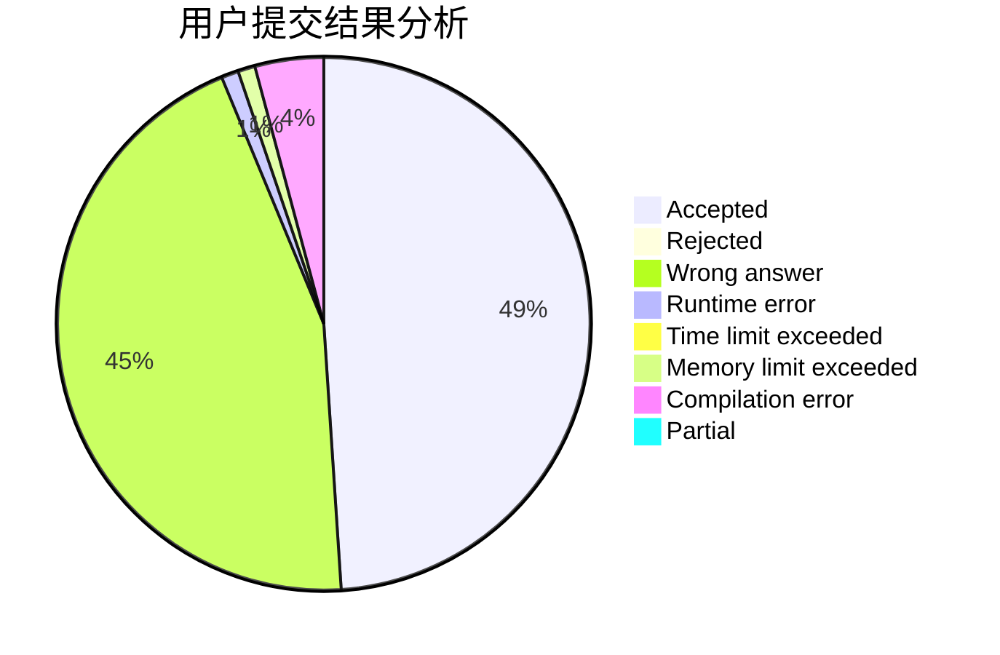
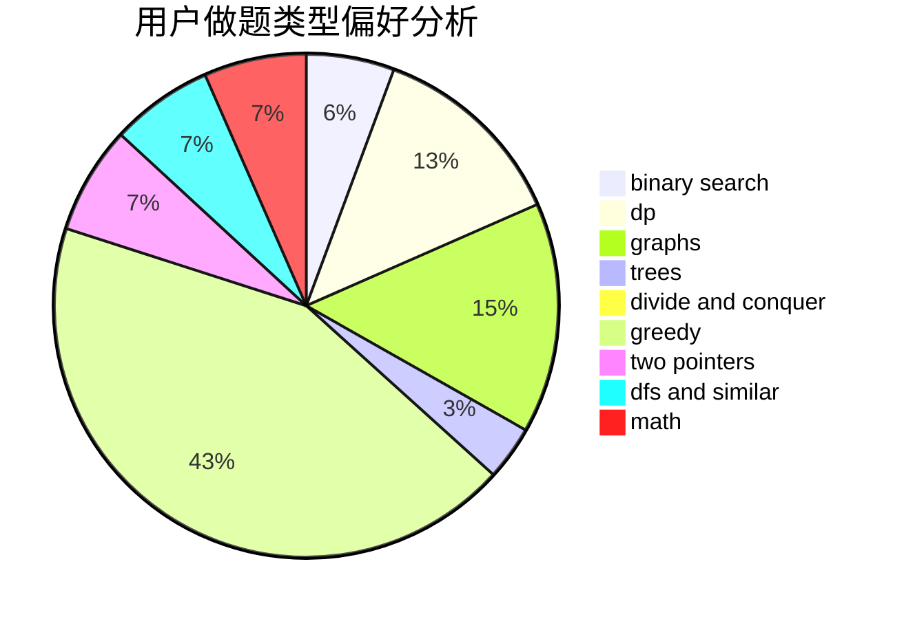

# NightStalker

<!-- tabs:start -->

#### **用户提交结果分析**

#### **用户做题类型偏好分析**

<!-- tabs:end -->
# 推荐题目
[1423I](https://codeforces.com/contest/1423/problem/I)
[746G](https://codeforces.com/contest/746/problem/G)
[1408C](https://codeforces.com/contest/1408/problem/C)
[782A](https://codeforces.com/contest/782/problem/A)
[505C](https://codeforces.com/contest/505/problem/C)
[840D](https://codeforces.com/contest/840/problem/D)
[1151D](https://codeforces.com/contest/1151/problem/D)
[98C](https://codeforces.com/contest/98/problem/C)
[1130E](https://codeforces.com/contest/1130/problem/E)
[76D](https://codeforces.com/contest/76/problem/D)
