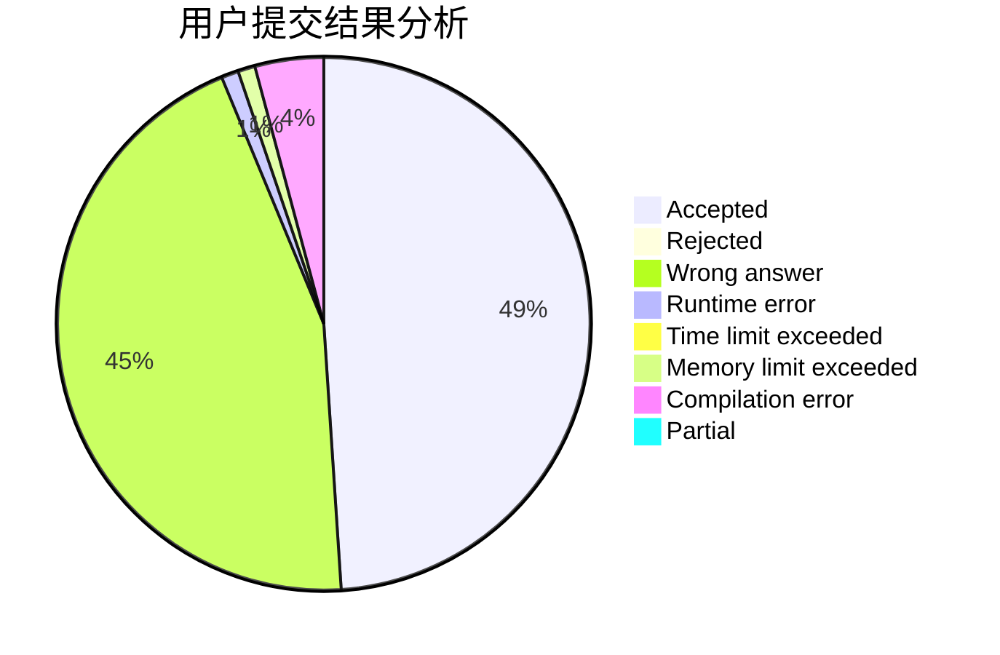
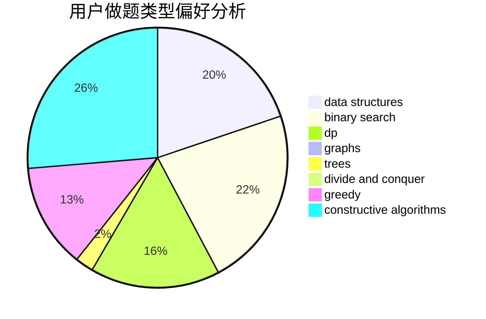
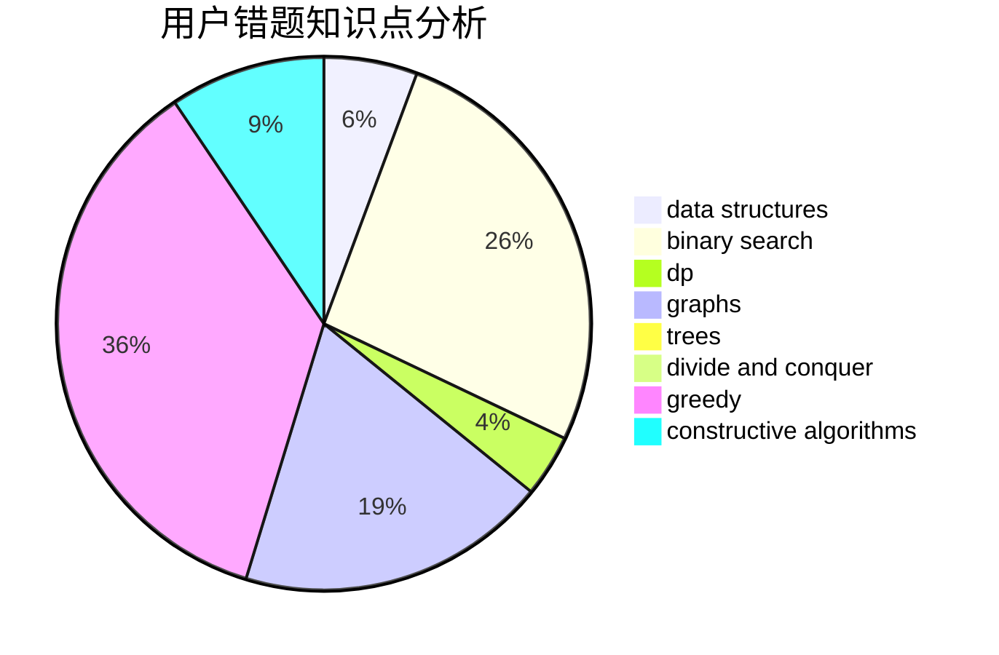

# NightStalker

<!-- tabs:start -->

#### **用户提交结果分析**

#### **用户做题类型偏好分析**

#### **用户错题知识点分析**

<!-- tabs:end -->
# 推荐题目
[1415E](https://codeforces.com/contest/1415/problem/E)		constructive algorithms,
                        greedy,
                        math		  
[730A](https://codeforces.com/contest/730/problem/A)		greedy,
                        implementation		  
[1399B](https://codeforces.com/contest/1399/problem/B)		greedy		  
[763C](https://codeforces.com/contest/763/problem/C)		brute force,
                        implementation,
                        math,
                        number theory		  
[484B](https://codeforces.com/contest/484/problem/B)		binary search,
                        math,
                        sortings,
                        two pointers		  
[820D](https://codeforces.com/contest/820/problem/D)		dsu,graphs,sortings,trees		  
[114A](https://codeforces.com/contest/114/problem/A)		math		  
[975D](https://codeforces.com/contest/975/problem/D)		geometry,
                        math		  
[1129A1](https://codeforces.com/contest/1129A/problem/1)		brute force,
                        greedy		  
[750D](https://codeforces.com/contest/750/problem/D)		brute force,
                        data structures,
                        dfs and similar,
                        dp,
                        implementation		  
