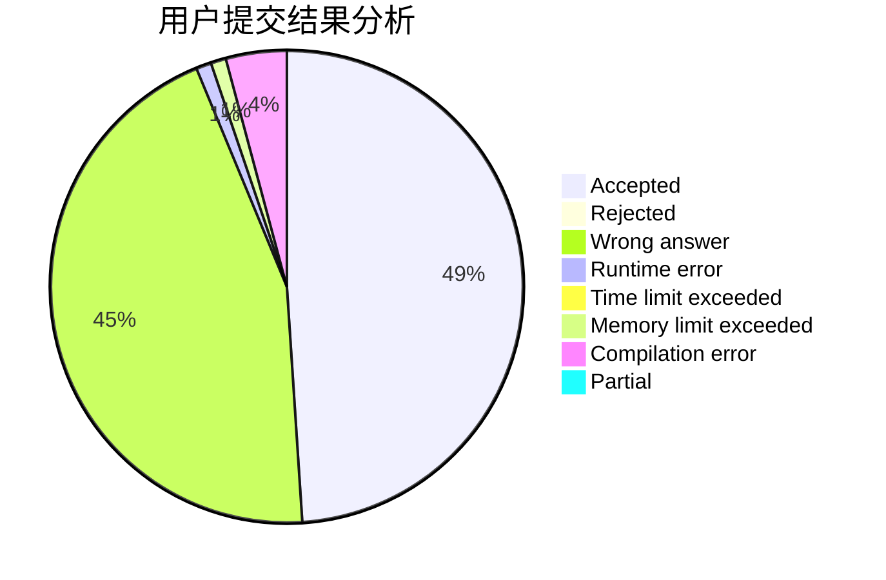
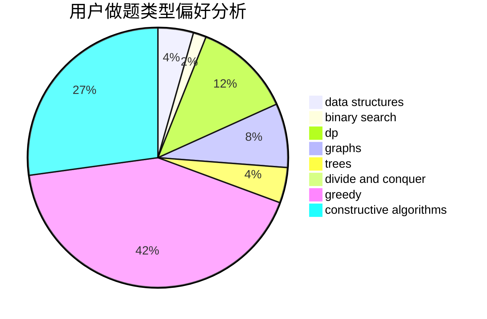
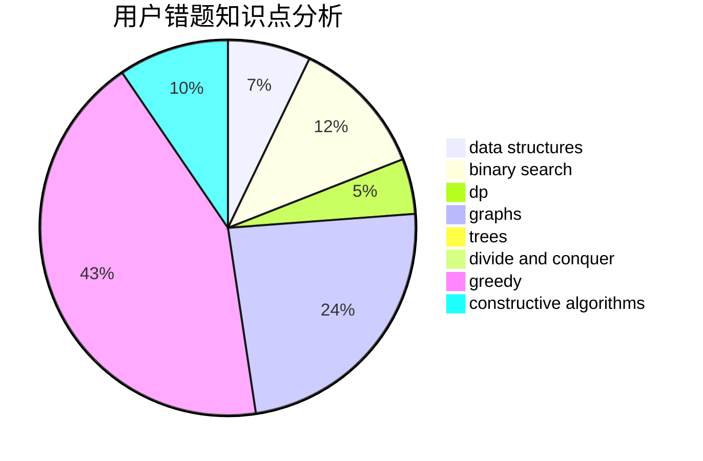

# NightStalker

<!-- tabs:start -->

#### **用户提交结果分析**

#### **用户做题类型偏好分析**

#### **用户错题知识点分析**

<!-- tabs:end -->
# 推荐题目
[1423I](https://codeforces.com/contest/1423/problem/I)		bitmasks		  
[746G](https://codeforces.com/contest/746/problem/G)		constructive algorithms,
                        graphs,
                        trees		  
[1408C](https://codeforces.com/contest/1408/problem/C)		binary search,
                        dp,
                        implementation,
                        math,
                        two pointers		  
[782A](https://codeforces.com/contest/782/problem/A)		dsu,graphs,sortings,trees		  
[505C](https://codeforces.com/contest/505/problem/C)		dfs and similar,
                        dp,
                        two pointers		  
[840D](https://codeforces.com/contest/840/problem/D)		data structures,
                        probabilities		  
[1151D](https://codeforces.com/contest/1151/problem/D)		greedy,
                        math,
                        sortings		  
[98C](https://codeforces.com/contest/98/problem/C)		geometry,
                        ternary search		  
[1130E](https://codeforces.com/contest/1130/problem/E)		dsu,graphs,sortings,trees		  
[76D](https://codeforces.com/contest/76/problem/D)		dp,
                        greedy,
                        math		  
