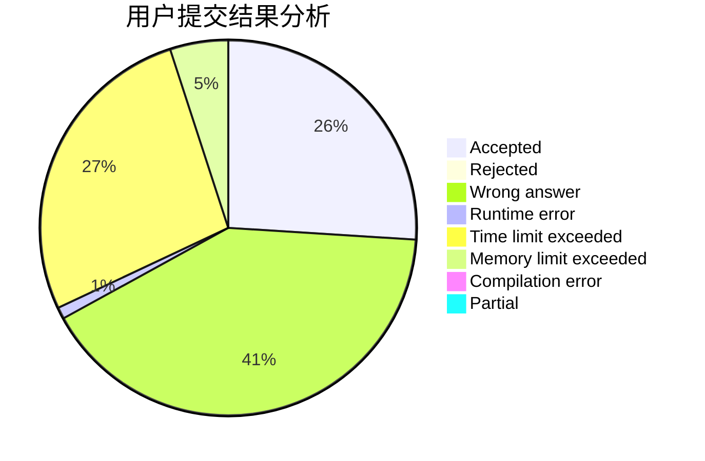
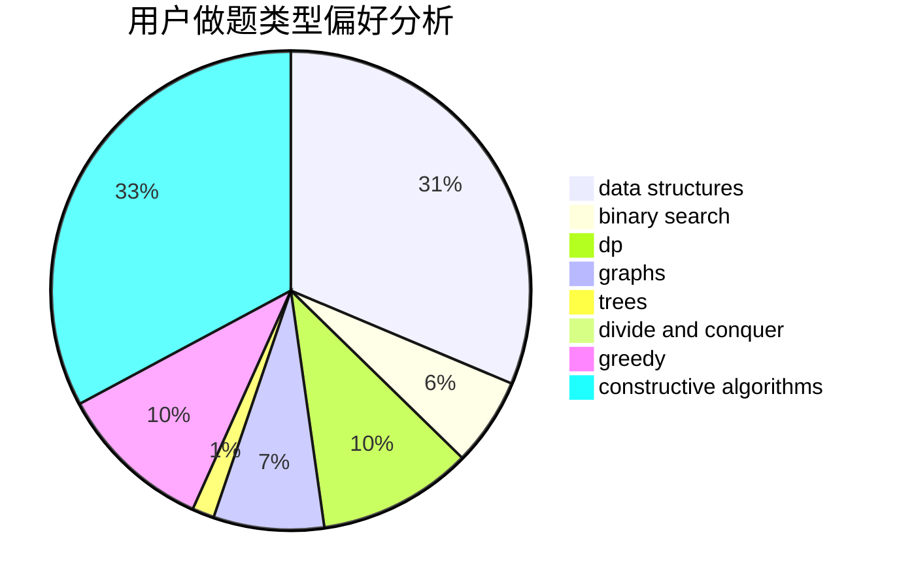
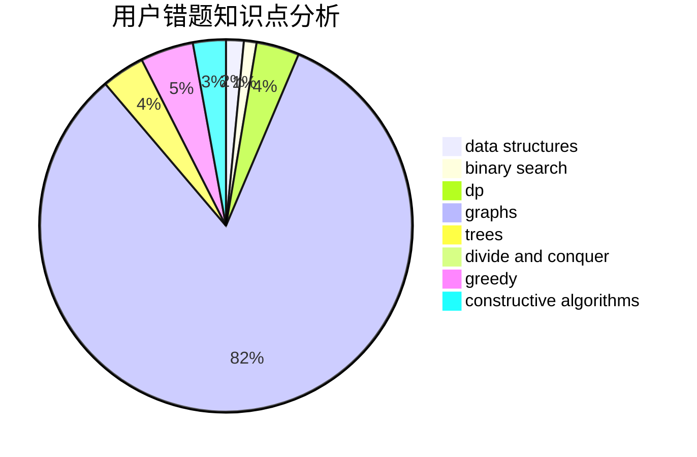

# NiroBC

<!-- tabs:start -->

#### **用户提交结果分析**

#### **用户做题类型偏好分析**

#### **用户错题知识点分析**

<!-- tabs:end -->
# 推荐题目
[14282](https://codeforces.com/contest/1428/problem/2)		dsu,graphs,sortings,trees		  
[1090D](https://codeforces.com/contest/1090/problem/D)		constructive algorithms		  
[908A](https://codeforces.com/contest/908/problem/A)		brute force,
                        implementation		  
[894E](https://codeforces.com/contest/894/problem/E)		dp,
                        graphs		  
[702C](https://codeforces.com/contest/702/problem/C)		binary search,
                        implementation,
                        two pointers		  
[281D](https://codeforces.com/contest/281/problem/D)		dsu,graphs,sortings,trees		  
[424B](https://codeforces.com/contest/424/problem/B)		binary search,
                        greedy,
                        implementation,
                        sortings		  
[116C](https://codeforces.com/contest/116/problem/C)		dsu,graphs,sortings,trees		  
[67B](https://codeforces.com/contest/67/problem/B)		greedy		  
[1236E](https://codeforces.com/contest/1236/problem/E)		binary search,
                        data structures,
                        dp,
                        dsu		  
