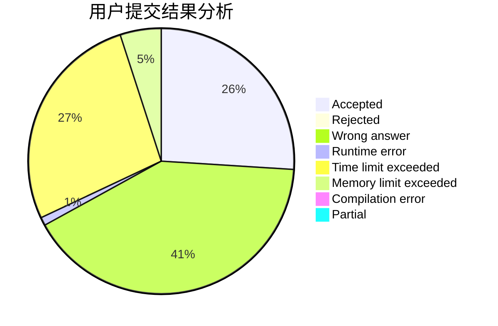
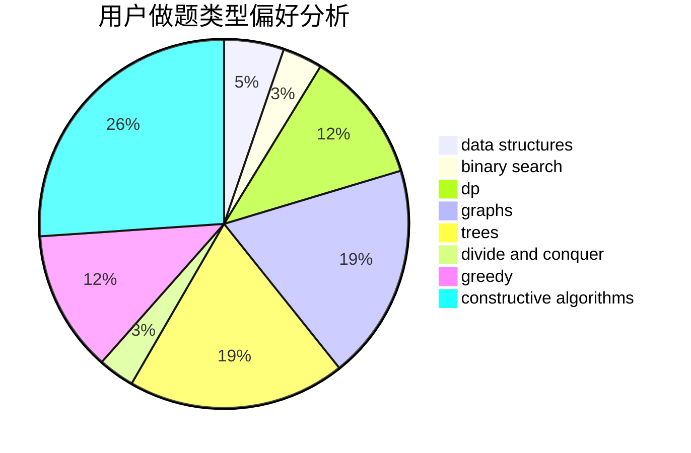
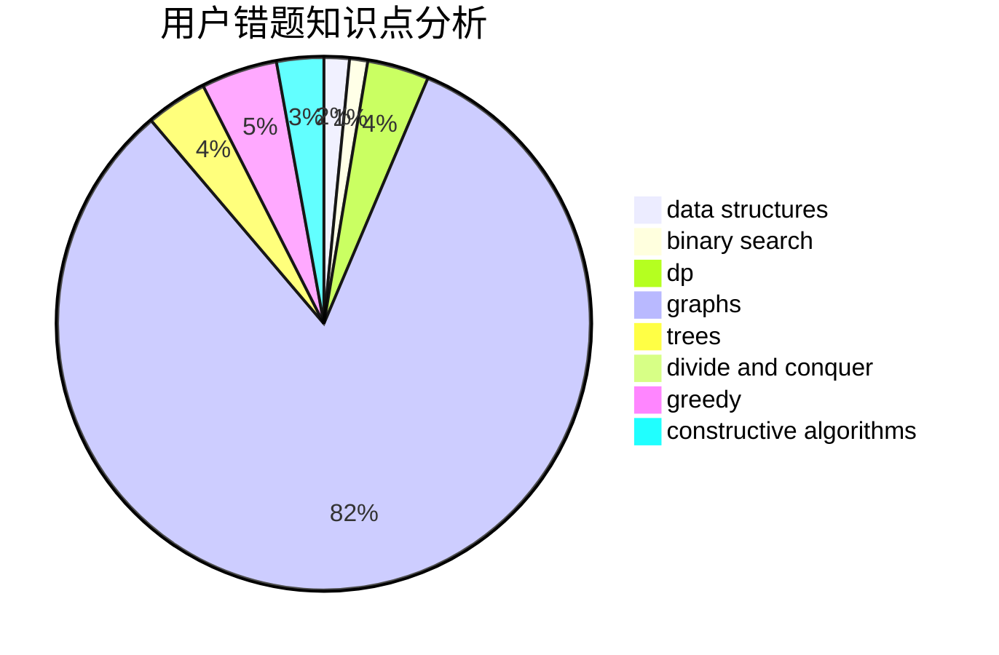

# NiroBC

<!-- tabs:start -->

#### **用户提交结果分析**

#### **用户做题类型偏好分析**

#### **用户错题知识点分析**

<!-- tabs:end -->
# 推荐题目
[1420C1](https://codeforces.com/contest/1420C/problem/1)		constructive algorithms,
                        dp,
                        greedy		  
[108C](https://codeforces.com/contest/108/problem/C)		dsu,graphs,sortings,trees		  
[888C](https://codeforces.com/contest/888/problem/C)		binary search,
                        implementation,
                        two pointers		  
[875A](https://codeforces.com/contest/875/problem/A)		brute force,
                        math		  
[678E](https://codeforces.com/contest/678/problem/E)		bitmasks,
                        dp,
                        math,
                        probabilities		  
[266A](https://codeforces.com/contest/266/problem/A)		implementation		  
[396C](https://codeforces.com/contest/396/problem/C)		data structures,
                        graphs,
                        trees		  
[1166F](https://codeforces.com/contest/1166/problem/F)		data structures,
                        dsu,
                        graphs,
                        hashing		  
[659G](https://codeforces.com/contest/659/problem/G)		combinatorics,
                        dp,
                        number theory		  
[1227G](https://codeforces.com/contest/1227/problem/G)		constructive algorithms		  
