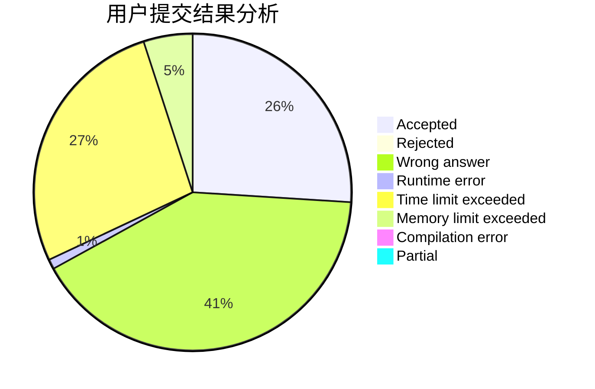
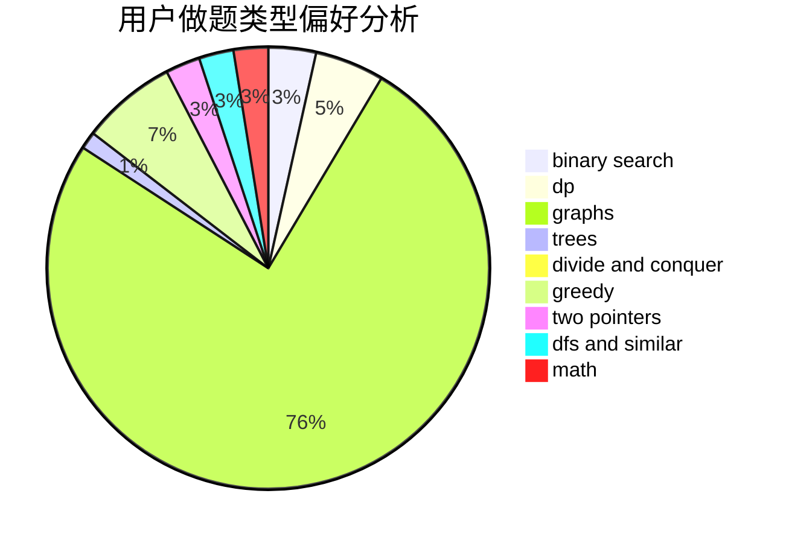

# NiroBC

<!-- tabs:start -->

#### **用户提交结果分析**

#### **用户做题类型偏好分析**

<!-- tabs:end -->
# 推荐题目
[14282](https://codeforces.com/contest/1428/problem/2)
[1090D](https://codeforces.com/contest/1090/problem/D)
[908A](https://codeforces.com/contest/908/problem/A)
[894E](https://codeforces.com/contest/894/problem/E)
[702C](https://codeforces.com/contest/702/problem/C)
[281D](https://codeforces.com/contest/281/problem/D)
[424B](https://codeforces.com/contest/424/problem/B)
[116C](https://codeforces.com/contest/116/problem/C)
[67B](https://codeforces.com/contest/67/problem/B)
[1236E](https://codeforces.com/contest/1236/problem/E)
