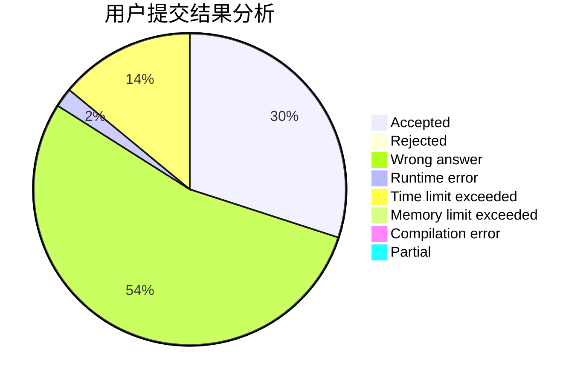
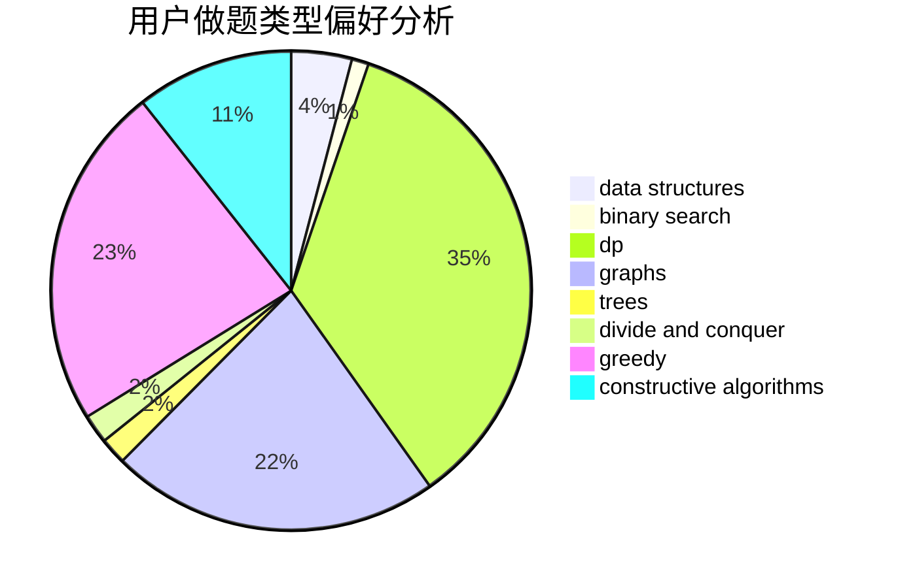
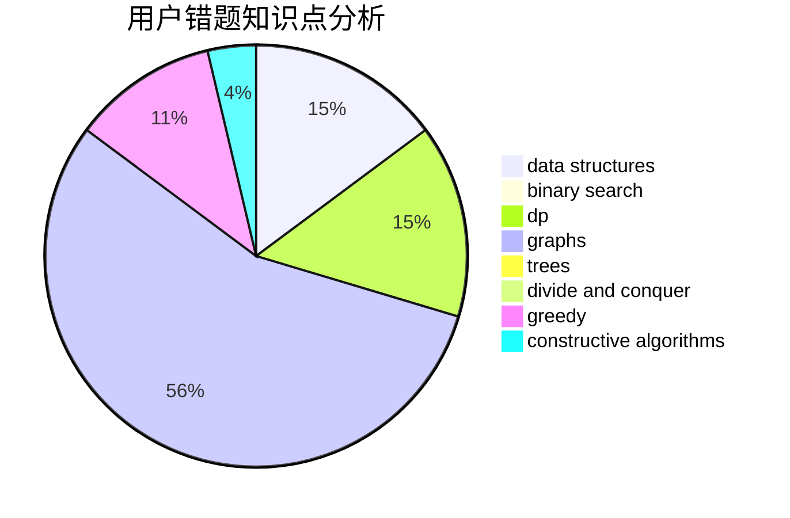

# NooB_inCsu

<!-- tabs:start -->

#### **用户提交结果分析**

#### **用户做题类型偏好分析**

#### **用户错题知识点分析**

<!-- tabs:end -->
# 推荐题目
[1343A](https://codeforces.com/contest/1343/problem/A)		brute force,
                        math		  
[1220D](https://codeforces.com/contest/1220/problem/D)		bitmasks,
                        math,
                        number theory		  
[580B](https://codeforces.com/contest/580/problem/B)		binary search,
                        sortings,
                        two pointers		  
[1402B](https://codeforces.com/contest/1402/problem/B)		*special problem,
                        geometry,
                        sortings		  
[317D](https://codeforces.com/contest/317/problem/D)		dp,
                        games		  
[1283F](https://codeforces.com/contest/1283/problem/F)		constructive algorithms,
                        greedy,
                        trees		  
[27C](https://codeforces.com/contest/27/problem/C)		constructive algorithms,
                        greedy		  
[686A](https://codeforces.com/contest/686/problem/A)		constructive algorithms,
                        implementation		  
[808G](https://codeforces.com/contest/808/problem/G)		dp,
                        strings		  
[1144G](https://codeforces.com/contest/1144/problem/G)		dp,
                        greedy		  
