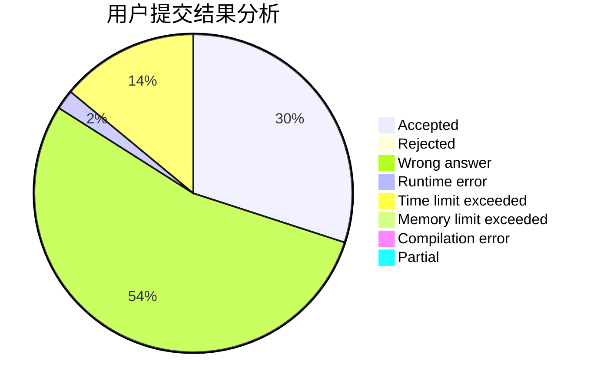
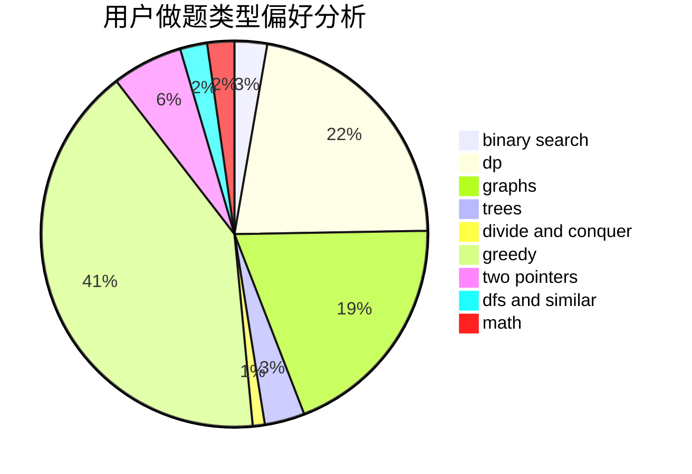

# NooB_inCsu

<!-- tabs:start -->

#### **用户提交结果分析**

#### **用户做题类型偏好分析**

<!-- tabs:end -->
# 推荐题目
[1349E](https://codeforces.com/contest/1349/problem/E)
[1228D](https://codeforces.com/contest/1228/problem/D)
[600D](https://codeforces.com/contest/600/problem/D)
[1413D](https://codeforces.com/contest/1413/problem/D)
[347A](https://codeforces.com/contest/347/problem/A)
[1290F](https://codeforces.com/contest/1290/problem/F)
[295B](https://codeforces.com/contest/295/problem/B)
[708A](https://codeforces.com/contest/708/problem/A)
[825F](https://codeforces.com/contest/825/problem/F)
[1147A](https://codeforces.com/contest/1147/problem/A)
