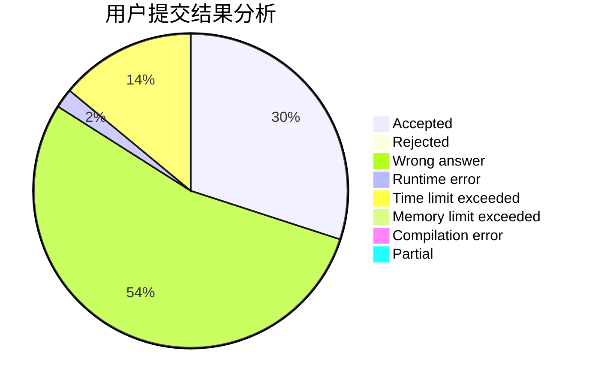
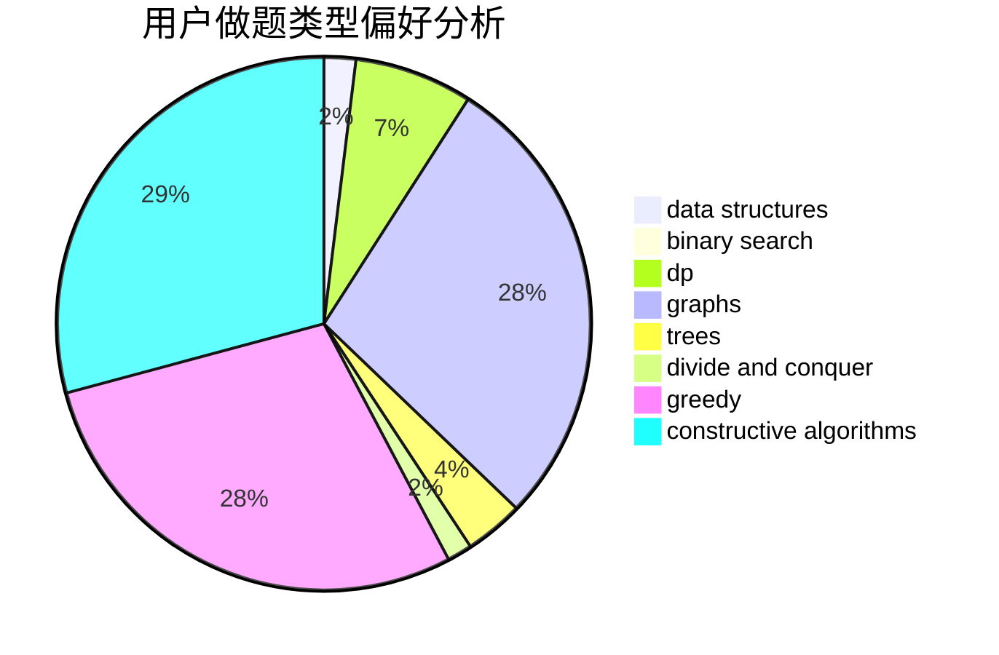
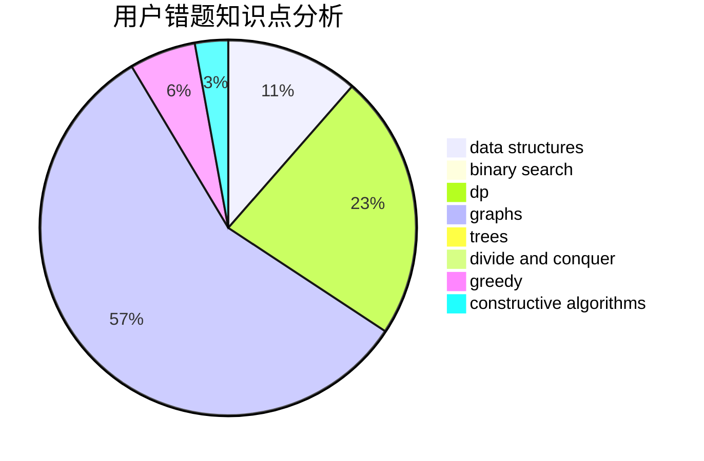

# NooB_inCsu

<!-- tabs:start -->

#### **用户提交结果分析**

#### **用户做题类型偏好分析**

#### **用户错题知识点分析**

<!-- tabs:end -->
# 推荐题目
[1349E](https://codeforces.com/contest/1349/problem/E)		constructive algorithms,
                        dp,
                        greedy		  
[1228D](https://codeforces.com/contest/1228/problem/D)		brute force,
                        constructive algorithms,
                        graphs,
                        hashing,
                        implementation		  
[600D](https://codeforces.com/contest/600/problem/D)		geometry		  
[1413D](https://codeforces.com/contest/1413/problem/D)		data structures,
                        greedy,
                        implementation		  
[347A](https://codeforces.com/contest/347/problem/A)		constructive algorithms,
                        implementation,
                        sortings		  
[1290F](https://codeforces.com/contest/1290/problem/F)		dp		  
[295B](https://codeforces.com/contest/295/problem/B)		dp,
                        graphs,
                        shortest paths		  
[708A](https://codeforces.com/contest/708/problem/A)		constructive algorithms,
                        greedy,
                        implementation,
                        strings		  
[825F](https://codeforces.com/contest/825/problem/F)		dp,
                        hashing,
                        string suffix structures,
                        strings		  
[1147A](https://codeforces.com/contest/1147/problem/A)		graphs		  
