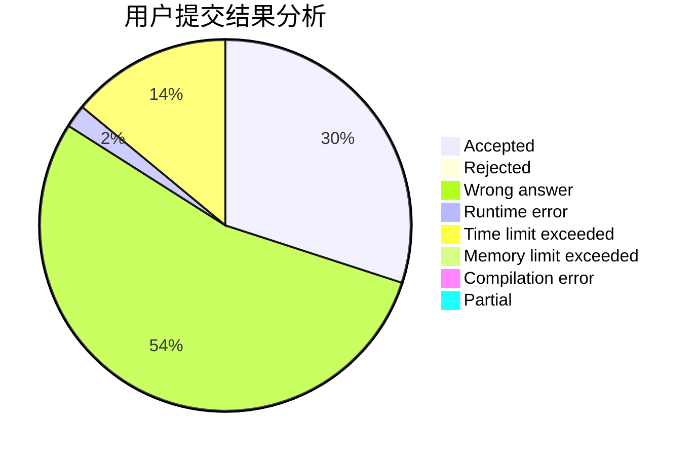
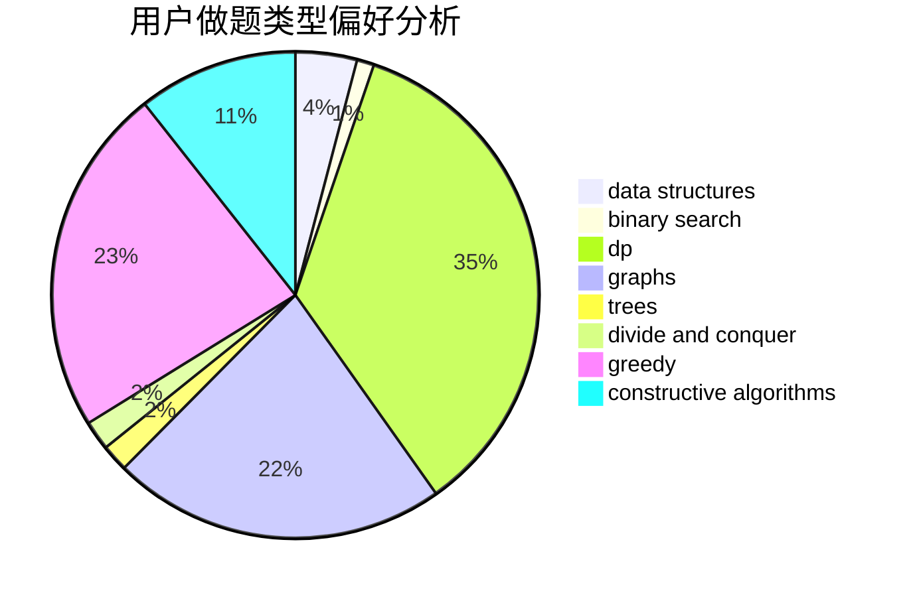
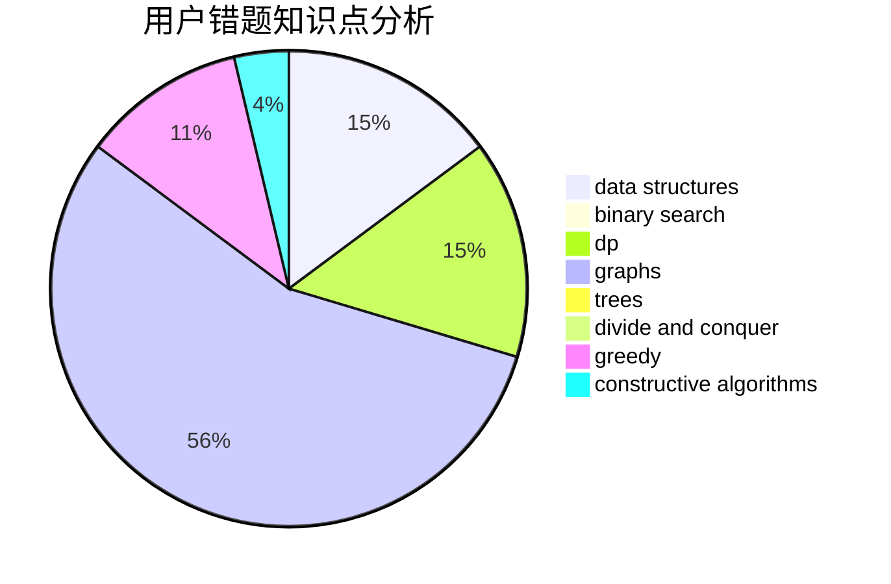

# NooB_inCsu
<!-- tabs:start -->
#### **用户提交结果分析**

#### **用户做题类型偏好分析**

#### **用户错题知识点分析**

<!-- tabs:end -->
# 推荐题目
[By Elevator or Stairs?](http://codeforces.com/problemset/problem/1249/E)		dp,
                        shortest paths		  
[Candies](http://codeforces.com/problemset/problem/1343/A)		brute force,
                        math		  
[Free Ice Cream](http://codeforces.com/problemset/problem/686/A)		constructive algorithms,
                        implementation		  
[Game with Powers](http://codeforces.com/problemset/problem/317/D)		dp,
                        games		  
[Alex and Julian](http://codeforces.com/problemset/problem/1220/D)		bitmasks,
                        math,
                        number theory		  
[Roads](http://codeforces.com/problemset/problem/1402/B)		*special problem,
                        geometry,
                        sortings		  
[DIY Garland](http://codeforces.com/problemset/problem/1283/F)		constructive algorithms,
                        greedy,
                        trees		  
[Garlands](http://codeforces.com/problemset/problem/707/E)		data structures		  
[Unordered Subsequence](http://codeforces.com/problemset/problem/27/C)		constructive algorithms,
                        greedy		  
[Kefa and Company](http://codeforces.com/problemset/problem/580/B)		binary search,
                        sortings,
                        two pointers		  
<!-- tabs:start -->
#### **data structures**
[By Elevator or Stairs?](http://codeforces.com/problemset/problem/707/E)		data structures		  
[Candies](http://codeforces.com/problemset/problem/1278/D)		data structures,
                        dsu,
                        graphs,
                        trees		  
[Free Ice Cream](http://codeforces.com/problemset/problem/1062/E)		binary search,
                        data structures,
                        dfs and similar,
                        greedy,
                        trees		  
[Game with Powers](http://codeforces.com/problemset/problem/819/B)		data structures,
                        implementation,
                        math		  
[Alex and Julian](http://codeforces.com/problemset/problem/1508/C)		data structures,
                        dfs and similar,
                        dsu,
                        graphs,
                        greedy,
                        math		  
[Roads](http://codeforces.com/problemset/problem/1200/A)		brute force,
                        data structures,
                        implementation		  
[DIY Garland](https://codeforces.com/contest/1291/problem/D)		binary search,
                        constructive algorithms,
                        data structures,
                        strings,
                        two pointers		  
[Garlands](http://codeforces.com/problemset/problem/1492/C)		binary search,
                        data structures,
                        dp,
                        greedy,
                        two pointers		  
[Unordered Subsequence](http://codeforces.com/problemset/problem/1490/G)		binary search,
                        data structures,
                        math		  
[Kefa and Company](http://codeforces.com/problemset/problem/1479/D)		binary search,
                        bitmasks,
                        brute force,
                        data structures,
                        probabilities,
                        trees		  
#### **binary search**
[By Elevator or Stairs?](http://codeforces.com/problemset/problem/580/B)		binary search,
                        sortings,
                        two pointers		  
[Candies](http://codeforces.com/problemset/problem/825/D)		binary search,
                        greedy,
                        implementation		  
[Free Ice Cream](http://codeforces.com/problemset/problem/1165/F1)		binary search,
                        greedy		  
[Game with Powers](http://codeforces.com/problemset/problem/961/F)		binary search,
                        hashing,
                        string suffix structures		  
[Alex and Julian](http://codeforces.com/problemset/problem/1062/E)		binary search,
                        data structures,
                        dfs and similar,
                        greedy,
                        trees		  
[Roads](http://codeforces.com/problemset/problem/1490/C)		binary search,
                        brute force,
                        brute force,
                        math		  
[DIY Garland](https://codeforces.com/contest/1291/problem/D)		binary search,
                        constructive algorithms,
                        data structures,
                        strings,
                        two pointers		  
[Garlands](http://codeforces.com/problemset/problem/1131/C)		binary search,
                        greedy,
                        sortings		  
[Unordered Subsequence](http://codeforces.com/problemset/problem/1492/C)		binary search,
                        data structures,
                        dp,
                        greedy,
                        two pointers		  
[Kefa and Company](http://codeforces.com/problemset/problem/1463/D)		binary search,
                        constructive algorithms,
                        greedy,
                        two pointers		  
#### **dp**
[By Elevator or Stairs?](http://codeforces.com/problemset/problem/1249/E)		dp,
                        shortest paths		  
[Candies](http://codeforces.com/problemset/problem/317/D)		dp,
                        games		  
[Free Ice Cream](http://codeforces.com/problemset/problem/1149/B)		dp,
                        implementation,
                        strings		  
[Game with Powers](http://codeforces.com/problemset/problem/364/B)		dp,
                        greedy		  
[Alex and Julian](http://codeforces.com/problemset/problem/1144/G)		dp,
                        greedy		  
[Roads](http://codeforces.com/problemset/problem/1466/H)		combinatorics,
                        dp,
                        graphs,
                        greedy,
                        math		  
[DIY Garland](http://codeforces.com/problemset/problem/1452/D)		combinatorics,
                        dp,
                        math		  
[Garlands](http://codeforces.com/problemset/problem/808/G)		dp,
                        strings		  
[Unordered Subsequence](http://codeforces.com/problemset/problem/1404/B)		dfs and similar,
                        dp,
                        games,
                        trees		  
[Kefa and Company](http://codeforces.com/problemset/problem/540/D)		dp,
                        probabilities		  
#### **graph**
[By Elevator or Stairs?](http://codeforces.com/problemset/problem/320/B)		dfs and similar,
                        graphs		  
[Candies](http://codeforces.com/problemset/problem/1278/D)		data structures,
                        dsu,
                        graphs,
                        trees		  
[Free Ice Cream](http://codeforces.com/problemset/problem/1184/E1)		graphs,
                        trees		  
[Game with Powers](http://codeforces.com/problemset/problem/1466/H)		combinatorics,
                        dp,
                        graphs,
                        greedy,
                        math		  
[Alex and Julian](http://codeforces.com/problemset/problem/1508/C)		data structures,
                        dfs and similar,
                        dsu,
                        graphs,
                        greedy,
                        math		  
[Roads](http://codeforces.com/problemset/problem/1360/C)		constructive algorithms,
                        graph matchings,
                        greedy,
                        sortings		  
[DIY Garland](http://codeforces.com/problemset/problem/1487/C)		brute force,
                        constructive algorithms,
                        dfs and similar,
                        graphs,
                        greedy,
                        implementation,
                        math		  
[Garlands](http://codeforces.com/problemset/problem/1437/C)		dp,
                        flows,
                        graph matchings,
                        greedy,
                        math,
                        sortings		  
[Unordered Subsequence](http://codeforces.com/problemset/problem/1470/D)		constructive algorithms,
                        dfs and similar,
                        graph matchings,
                        graphs,
                        greedy		  
[Kefa and Company](http://codeforces.com/problemset/problem/1476/C)		dp,
                        graphs,
                        greedy		  
#### **trees**
[By Elevator or Stairs?](http://codeforces.com/problemset/problem/1283/F)		constructive algorithms,
                        greedy,
                        trees		  
[Candies](http://codeforces.com/problemset/problem/1278/D)		data structures,
                        dsu,
                        graphs,
                        trees		  
[Free Ice Cream](http://codeforces.com/problemset/problem/1062/E)		binary search,
                        data structures,
                        dfs and similar,
                        greedy,
                        trees		  
[Game with Powers](http://codeforces.com/problemset/problem/1184/E1)		graphs,
                        trees		  
[Alex and Julian](http://codeforces.com/problemset/problem/1404/B)		dfs and similar,
                        dp,
                        games,
                        trees		  
[Roads](http://codeforces.com/problemset/problem/1479/D)		binary search,
                        bitmasks,
                        brute force,
                        data structures,
                        probabilities,
                        trees		  
[DIY Garland](http://codeforces.com/problemset/problem/1511/C)		brute force,
                        data structures,
                        implementation,
                        trees		  
[Garlands](http://codeforces.com/problemset/problem/1499/F)		combinatorics,
                        dfs and similar,
                        dp,
                        trees		  
[Unordered Subsequence](http://codeforces.com/problemset/problem/1491/E)		brute force,
                        dfs and similar,
                        divide and conquer,
                        number theory,
                        trees		  
[Kefa and Company](http://codeforces.com/problemset/problem/1466/D)		data structures,
                        greedy,
                        sortings,
                        trees		  
#### **divide and conquer**
[By Elevator or Stairs?](http://codeforces.com/problemset/problem/1461/D)		binary search,
                        brute force,
                        data structures,
                        divide and conquer,
                        implementation,
                        sortings		  
[Candies](http://codeforces.com/problemset/problem/1466/G)		combinatorics,
                        divide and conquer,
                        hashing,
                        math,
                        string suffix structures,
                        strings		  
[Free Ice Cream](http://codeforces.com/problemset/problem/1490/D)		dfs and similar,
                        divide and conquer,
                        implementation		  
[Game with Powers](https://codeforces.com/contest/1483/problem/C)		data structures,
                        divide and conquer,
                        dp		  
[Alex and Julian](http://codeforces.com/problemset/problem/1491/E)		brute force,
                        dfs and similar,
                        divide and conquer,
                        number theory,
                        trees		  
[Roads](http://codeforces.com/problemset/problem/1303/G)		data structures,
                        divide and conquer,
                        geometry,
                        trees		  
[DIY Garland](http://codeforces.com/problemset/problem/1494/D)		constructive algorithms,
                        data structures,
                        dfs and similar,
                        divide and conquer,
                        dsu,
                        greedy,
                        sortings,
                        trees		  
[Garlands](http://codeforces.com/problemset/problem/1482/E)		data structures,
                        divide and conquer,
                        dp		  
[Unordered Subsequence](http://codeforces.com/problemset/problem/566/C)		dfs and similar,
                        divide and conquer,
                        trees		  
[Kefa and Company](http://codeforces.com/problemset/problem/1428/F)		binary search,
                        data structures,
                        divide and conquer,
                        dp,
                        two pointers		  
#### **greedy**
[By Elevator or Stairs?](http://codeforces.com/problemset/problem/1283/F)		constructive algorithms,
                        greedy,
                        trees		  
[Candies](http://codeforces.com/problemset/problem/27/C)		constructive algorithms,
                        greedy		  
[Free Ice Cream](http://codeforces.com/problemset/problem/369/A)		greedy,
                        implementation		  
[Game with Powers](http://codeforces.com/problemset/problem/825/D)		binary search,
                        greedy,
                        implementation		  
[Alex and Julian](http://codeforces.com/problemset/problem/1165/F1)		binary search,
                        greedy		  
[Roads](http://codeforces.com/problemset/problem/364/B)		dp,
                        greedy		  
[DIY Garland](http://codeforces.com/problemset/problem/1367/C)		constructive algorithms,
                        greedy,
                        math		  
[Garlands](http://codeforces.com/problemset/problem/1062/E)		binary search,
                        data structures,
                        dfs and similar,
                        greedy,
                        trees		  
[Unordered Subsequence](http://codeforces.com/problemset/problem/1144/G)		dp,
                        greedy		  
[Kefa and Company](http://codeforces.com/problemset/problem/1466/H)		combinatorics,
                        dp,
                        graphs,
                        greedy,
                        math		  
#### **constructive algorithms**
[By Elevator or Stairs?](http://codeforces.com/problemset/problem/686/A)		constructive algorithms,
                        implementation		  
[Candies](http://codeforces.com/problemset/problem/1283/F)		constructive algorithms,
                        greedy,
                        trees		  
[Free Ice Cream](http://codeforces.com/problemset/problem/27/C)		constructive algorithms,
                        greedy		  
[Game with Powers](http://codeforces.com/problemset/problem/1012/D)		constructive algorithms,
                        strings		  
[Alex and Julian](http://codeforces.com/problemset/problem/1367/C)		constructive algorithms,
                        greedy,
                        math		  
[Roads](https://codeforces.com/contest/966/problem/C)		constructive algorithms,
                        math		  
[DIY Garland](http://codeforces.com/problemset/problem/1360/C)		constructive algorithms,
                        graph matchings,
                        greedy,
                        sortings		  
[Garlands](http://codeforces.com/problemset/problem/1452/F)		constructive algorithms,
                        greedy		  
[Unordered Subsequence](https://codeforces.com/contest/1291/problem/D)		binary search,
                        constructive algorithms,
                        data structures,
                        strings,
                        two pointers		  
[Kefa and Company](http://codeforces.com/problemset/problem/1493/A)		constructive algorithms,
                        greedy		  
#### **sortings**
[By Elevator or Stairs?](http://codeforces.com/problemset/problem/1402/B)		*special problem,
                        geometry,
                        sortings		  
[Candies](http://codeforces.com/problemset/problem/580/B)		binary search,
                        sortings,
                        two pointers		  
[Free Ice Cream](http://codeforces.com/problemset/problem/1360/C)		constructive algorithms,
                        graph matchings,
                        greedy,
                        sortings		  
[Game with Powers](http://codeforces.com/problemset/problem/1131/C)		binary search,
                        greedy,
                        sortings		  
[Alex and Julian](https://codeforces.com/contest/1496/problem/C)		geometry,
                        greedy,
                        math,
                        sortings		  
[Roads](http://codeforces.com/problemset/problem/1495/A)		geometry,
                        greedy,
                        math,
                        sortings		  
[DIY Garland](http://codeforces.com/problemset/problem/1497/A)		brute force,
                        data structures,
                        greedy,
                        sortings		  
[Garlands](http://codeforces.com/problemset/problem/1427/A)		math,
                        sortings		  
[Unordered Subsequence](http://codeforces.com/problemset/problem/1461/D)		binary search,
                        brute force,
                        data structures,
                        divide and conquer,
                        implementation,
                        sortings		  
[Kefa and Company](http://codeforces.com/problemset/problem/1437/C)		dp,
                        flows,
                        graph matchings,
                        greedy,
                        math,
                        sortings		  
<!-- tabs:end -->
