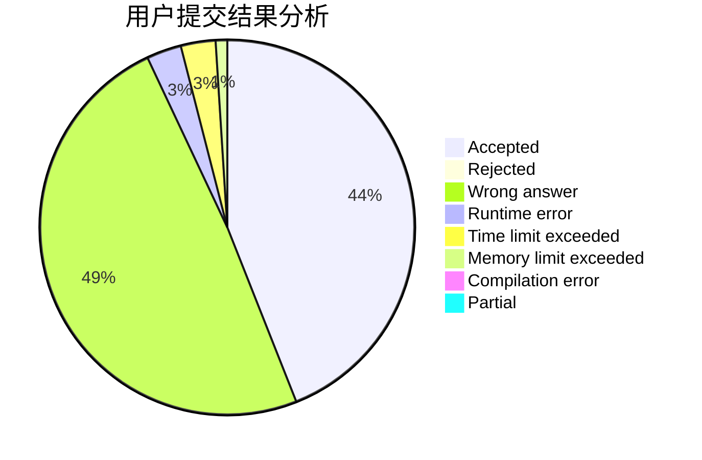
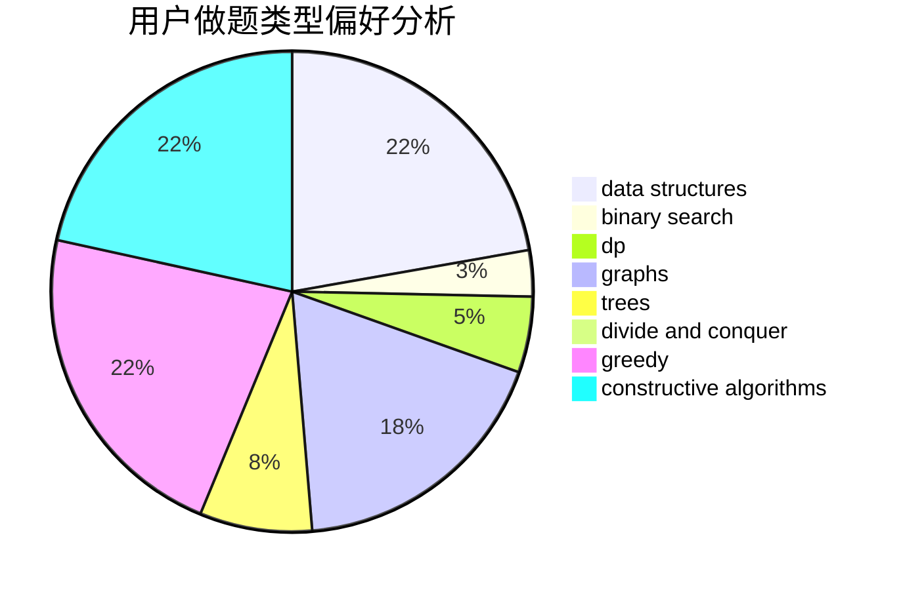
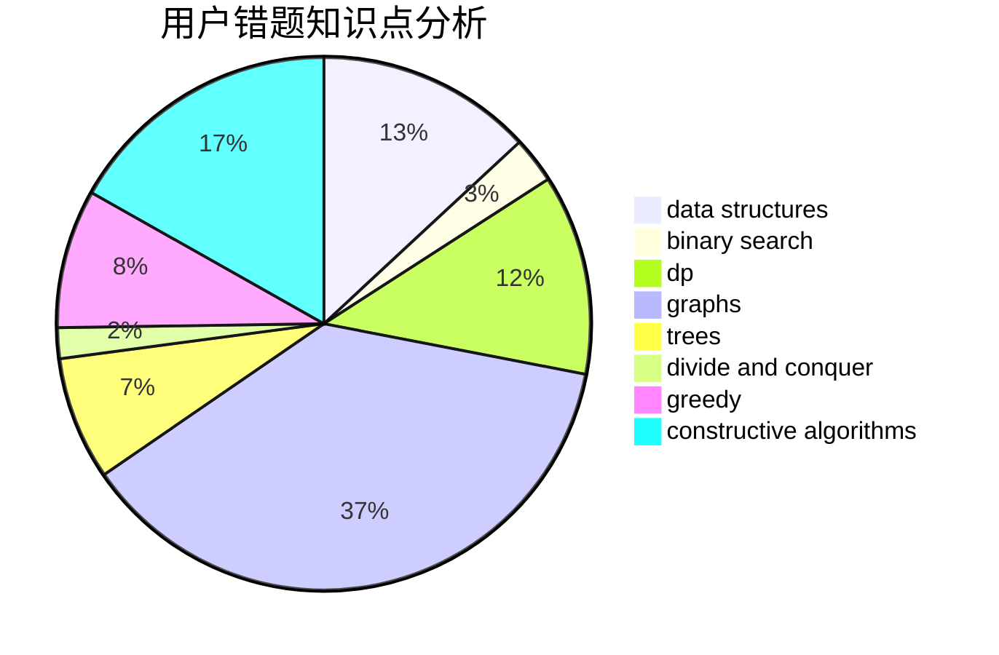

# Not_A_SingleDogQrz
<!-- tabs:start -->
#### **用户提交结果分析**

#### **用户做题类型偏好分析**

#### **用户错题知识点分析**

<!-- tabs:end -->
# 推荐题目
[Pokémon Army (hard version)](http://codeforces.com/problemset/problem/1420/C2)		data structures,
                        divide and conquer,
                        dp,
                        greedy,
                        implementation		  
[Password](http://codeforces.com/problemset/problem/79/D)		bitmasks,
                        dp,
                        shortest paths		  
[Hag's Khashba](http://codeforces.com/problemset/problem/975/E)		geometry		  
[Plus and xor](http://codeforces.com/problemset/problem/76/D)		dp,
                        greedy,
                        math		  
[Amr and Pins](http://codeforces.com/problemset/problem/507/B)		geometry,
                        math		  
[Encryption (medium)](http://codeforces.com/problemset/problem/958/C2)		dp		  
[New Year and Days](http://codeforces.com/problemset/problem/611/A)		implementation		  
[Drazil and Park](https://codeforces.com/contest/516/problem/C)		data structures		  
[Garlands](http://codeforces.com/problemset/problem/707/E)		data structures		  
[Vasya and Triangle](https://codeforces.com/contest/1053/problem/A)		geometry,
                        number theory		  
<!-- tabs:start -->
#### **data structures**
[Pokémon Army (hard version)](http://codeforces.com/problemset/problem/1420/C2)		data structures,
                        divide and conquer,
                        dp,
                        greedy,
                        implementation		  
[Password](https://codeforces.com/contest/516/problem/C)		data structures		  
[Hag's Khashba](http://codeforces.com/problemset/problem/707/E)		data structures		  
[Plus and xor](http://codeforces.com/problemset/problem/1119/F)		data structures,
                        dp,
                        trees		  
[Amr and Pins](http://codeforces.com/problemset/problem/1042/D)		data structures,
                        divide and conquer,
                        two pointers		  
[Encryption (medium)](http://codeforces.com/problemset/problem/115/E)		data structures,
                        dp		  
[New Year and Days](http://codeforces.com/problemset/problem/1492/C)		binary search,
                        data structures,
                        dp,
                        greedy,
                        two pointers		  
[Drazil and Park](http://codeforces.com/problemset/problem/1490/G)		binary search,
                        data structures,
                        math		  
[Garlands](http://codeforces.com/problemset/problem/1479/D)		binary search,
                        bitmasks,
                        brute force,
                        data structures,
                        probabilities,
                        trees		  
[Vasya and Triangle](http://codeforces.com/problemset/problem/1497/A)		brute force,
                        data structures,
                        greedy,
                        sortings		  
#### **binary search**
[Pokémon Army (hard version)](https://codeforces.com/contest/897/problem/C)		binary search,
                        dfs and similar		  
[Password](http://codeforces.com/problemset/problem/1082/E)		binary search,
                        dp,
                        greedy		  
[Hag's Khashba](http://codeforces.com/problemset/problem/1492/C)		binary search,
                        data structures,
                        dp,
                        greedy,
                        two pointers		  
[Plus and xor](http://codeforces.com/problemset/problem/1463/D)		binary search,
                        constructive algorithms,
                        greedy,
                        two pointers		  
[Amr and Pins](http://codeforces.com/problemset/problem/1490/G)		binary search,
                        data structures,
                        math		  
[Encryption (medium)](http://codeforces.com/problemset/problem/1479/D)		binary search,
                        bitmasks,
                        brute force,
                        data structures,
                        probabilities,
                        trees		  
[New Year and Days](http://codeforces.com/problemset/problem/1436/E)		binary search,
                        data structures,
                        two pointers		  
[Drazil and Park](http://codeforces.com/problemset/problem/1461/D)		binary search,
                        brute force,
                        data structures,
                        divide and conquer,
                        implementation,
                        sortings		  
[Garlands](http://codeforces.com/problemset/problem/1493/C)		binary search,
                        brute force,
                        constructive algorithms,
                        greedy,
                        strings		  
[Vasya and Triangle](http://codeforces.com/problemset/problem/1487/D)		binary search,
                        brute force,
                        math,
                        number theory		  
#### **dp**
[Pokémon Army (hard version)](http://codeforces.com/problemset/problem/1420/C2)		data structures,
                        divide and conquer,
                        dp,
                        greedy,
                        implementation		  
[Password](http://codeforces.com/problemset/problem/79/D)		bitmasks,
                        dp,
                        shortest paths		  
[Hag's Khashba](http://codeforces.com/problemset/problem/76/D)		dp,
                        greedy,
                        math		  
[Plus and xor](http://codeforces.com/problemset/problem/958/C2)		dp		  
[Amr and Pins](http://codeforces.com/problemset/problem/1119/F)		data structures,
                        dp,
                        trees		  
[Encryption (medium)](http://codeforces.com/problemset/problem/1363/F)		dp,
                        strings		  
[New Year and Days](http://codeforces.com/problemset/problem/379/D)		bitmasks,
                        brute force,
                        dp		  
[Drazil and Park](https://codeforces.com/contest/1457/problem/C)		brute force,
                        dp,
                        implementation		  
[Garlands](http://codeforces.com/problemset/problem/115/E)		data structures,
                        dp		  
[Vasya and Triangle](http://codeforces.com/problemset/problem/1082/E)		binary search,
                        dp,
                        greedy		  
#### **graph**
[Pokémon Army (hard version)](http://codeforces.com/problemset/problem/1068/C)		constructive algorithms,
                        graphs		  
[Password](http://codeforces.com/problemset/problem/1487/C)		brute force,
                        constructive algorithms,
                        dfs and similar,
                        graphs,
                        greedy,
                        implementation,
                        math		  
[Hag's Khashba](http://codeforces.com/problemset/problem/1437/C)		dp,
                        flows,
                        graph matchings,
                        greedy,
                        math,
                        sortings		  
[Plus and xor](http://codeforces.com/problemset/problem/1470/D)		constructive algorithms,
                        dfs and similar,
                        graph matchings,
                        graphs,
                        greedy		  
[Amr and Pins](http://codeforces.com/problemset/problem/1476/C)		dp,
                        graphs,
                        greedy		  
[Encryption (medium)](http://codeforces.com/problemset/problem/1304/D)		constructive algorithms,
                        graphs,
                        greedy,
                        two pointers		  
[New Year and Days](http://codeforces.com/problemset/problem/1475/C)		combinatorics,
                        graphs,
                        math		  
[Drazil and Park](http://codeforces.com/problemset/problem/553/E)		dp,
                        fft,
                        graphs,
                        math,
                        probabilities		  
[Garlands](http://codeforces.com/problemset/problem/1495/C)		constructive algorithms,
                        graphs		  
[Vasya and Triangle](http://codeforces.com/problemset/problem/1510/K)		brute force,
                        graphs,
                        implementation		  
#### **trees**
[Pokémon Army (hard version)](https://codeforces.com/contest/1099/problem/D)		constructive algorithms,
                        dfs and similar,
                        greedy,
                        trees		  
[Password](http://codeforces.com/problemset/problem/1119/F)		data structures,
                        dp,
                        trees		  
[Hag's Khashba](http://codeforces.com/problemset/problem/1479/D)		binary search,
                        bitmasks,
                        brute force,
                        data structures,
                        probabilities,
                        trees		  
[Plus and xor](http://codeforces.com/problemset/problem/1511/C)		brute force,
                        data structures,
                        implementation,
                        trees		  
[Amr and Pins](http://codeforces.com/problemset/problem/1499/F)		combinatorics,
                        dfs and similar,
                        dp,
                        trees		  
[Encryption (medium)](http://codeforces.com/problemset/problem/1491/E)		brute force,
                        dfs and similar,
                        divide and conquer,
                        number theory,
                        trees		  
[New Year and Days](http://codeforces.com/problemset/problem/1466/D)		data structures,
                        greedy,
                        sortings,
                        trees		  
[Drazil and Park](http://codeforces.com/problemset/problem/1495/D)		combinatorics,
                        dfs and similar,
                        graphs,
                        math,
                        shortest paths,
                        trees		  
[Garlands](http://codeforces.com/problemset/problem/1303/G)		data structures,
                        divide and conquer,
                        geometry,
                        trees		  
[Vasya and Triangle](http://codeforces.com/problemset/problem/1454/E)		combinatorics,
                        dfs and similar,
                        graphs,
                        trees		  
#### **divide and conquer**
[Pokémon Army (hard version)](http://codeforces.com/problemset/problem/1420/C2)		data structures,
                        divide and conquer,
                        dp,
                        greedy,
                        implementation		  
[Password](http://codeforces.com/problemset/problem/161/C)		divide and conquer		  
[Hag's Khashba](http://codeforces.com/problemset/problem/1375/H)		constructive algorithms,
                        divide and conquer		  
[Plus and xor](http://codeforces.com/problemset/problem/1042/D)		data structures,
                        divide and conquer,
                        two pointers		  
[Amr and Pins](http://codeforces.com/problemset/problem/1461/D)		binary search,
                        brute force,
                        data structures,
                        divide and conquer,
                        implementation,
                        sortings		  
[Encryption (medium)](http://codeforces.com/problemset/problem/1466/G)		combinatorics,
                        divide and conquer,
                        hashing,
                        math,
                        string suffix structures,
                        strings		  
[New Year and Days](http://codeforces.com/problemset/problem/1490/D)		dfs and similar,
                        divide and conquer,
                        implementation		  
[Drazil and Park](https://codeforces.com/contest/1483/problem/C)		data structures,
                        divide and conquer,
                        dp		  
[Garlands](http://codeforces.com/problemset/problem/1491/E)		brute force,
                        dfs and similar,
                        divide and conquer,
                        number theory,
                        trees		  
[Vasya and Triangle](http://codeforces.com/problemset/problem/1303/G)		data structures,
                        divide and conquer,
                        geometry,
                        trees		  
#### **greedy**
[Pokémon Army (hard version)](http://codeforces.com/problemset/problem/1420/C2)		data structures,
                        divide and conquer,
                        dp,
                        greedy,
                        implementation		  
[Password](http://codeforces.com/problemset/problem/76/D)		dp,
                        greedy,
                        math		  
[Hag's Khashba](https://codeforces.com/contest/1099/problem/D)		constructive algorithms,
                        dfs and similar,
                        greedy,
                        trees		  
[Plus and xor](http://codeforces.com/problemset/problem/1082/E)		binary search,
                        dp,
                        greedy		  
[Amr and Pins](http://codeforces.com/problemset/problem/1492/C)		binary search,
                        data structures,
                        dp,
                        greedy,
                        two pointers		  
[Encryption (medium)](https://codeforces.com/contest/1496/problem/C)		geometry,
                        greedy,
                        math,
                        sortings		  
[New Year and Days](http://codeforces.com/problemset/problem/1493/A)		constructive algorithms,
                        greedy		  
[Drazil and Park](http://codeforces.com/problemset/problem/1463/D)		binary search,
                        constructive algorithms,
                        greedy,
                        two pointers		  
[Garlands](http://codeforces.com/problemset/problem/1462/C)		brute force,
                        greedy,
                        math		  
[Vasya and Triangle](http://codeforces.com/problemset/problem/1494/B)		bitmasks,
                        brute force,
                        greedy,
                        implementation		  
#### **constructive algorithms**
[Pokémon Army (hard version)](http://codeforces.com/problemset/problem/1068/C)		constructive algorithms,
                        graphs		  
[Password](https://codeforces.com/contest/1099/problem/D)		constructive algorithms,
                        dfs and similar,
                        greedy,
                        trees		  
[Hag's Khashba](http://codeforces.com/problemset/problem/1375/H)		constructive algorithms,
                        divide and conquer		  
[Plus and xor](http://codeforces.com/problemset/problem/894/C)		constructive algorithms,
                        math		  
[Amr and Pins](https://codeforces.com/contest/1457/problem/D)		bitmasks,
                        brute force,
                        constructive algorithms		  
[Encryption (medium)](http://codeforces.com/problemset/problem/1493/A)		constructive algorithms,
                        greedy		  
[New Year and Days](http://codeforces.com/problemset/problem/1463/D)		binary search,
                        constructive algorithms,
                        greedy,
                        two pointers		  
[Drazil and Park](https://codeforces.com/contest/1456/problem/B)		bitmasks,
                        brute force,
                        constructive algorithms		  
[Garlands](http://codeforces.com/problemset/problem/1492/D)		bitmasks,
                        constructive algorithms,
                        greedy,
                        math		  
[Vasya and Triangle](https://codeforces.com/contest/1504/problem/D)		constructive algorithms,
                        games,
                        interactive		  
#### **sortings**
[Pokémon Army (hard version)](https://codeforces.com/contest/1496/problem/C)		geometry,
                        greedy,
                        math,
                        sortings		  
[Password](http://codeforces.com/problemset/problem/1495/A)		geometry,
                        greedy,
                        math,
                        sortings		  
[Hag's Khashba](http://codeforces.com/problemset/problem/1497/A)		brute force,
                        data structures,
                        greedy,
                        sortings		  
[Plus and xor](http://codeforces.com/problemset/problem/1427/A)		math,
                        sortings		  
[Amr and Pins](http://codeforces.com/problemset/problem/1461/D)		binary search,
                        brute force,
                        data structures,
                        divide and conquer,
                        implementation,
                        sortings		  
[Encryption (medium)](http://codeforces.com/problemset/problem/1437/C)		dp,
                        flows,
                        graph matchings,
                        greedy,
                        math,
                        sortings		  
[New Year and Days](http://codeforces.com/problemset/problem/1473/A)		greedy,
                        implementation,
                        math,
                        sortings		  
[Drazil and Park](http://codeforces.com/problemset/problem/1486/B)		binary search,
                        geometry,
                        shortest paths,
                        sortings		  
[Garlands](http://codeforces.com/problemset/problem/1480/B)		greedy,
                        implementation,
                        sortings		  
[Vasya and Triangle](http://codeforces.com/problemset/problem/1420/D)		combinatorics,
                        data structures,
                        sortings		  
<!-- tabs:end -->
