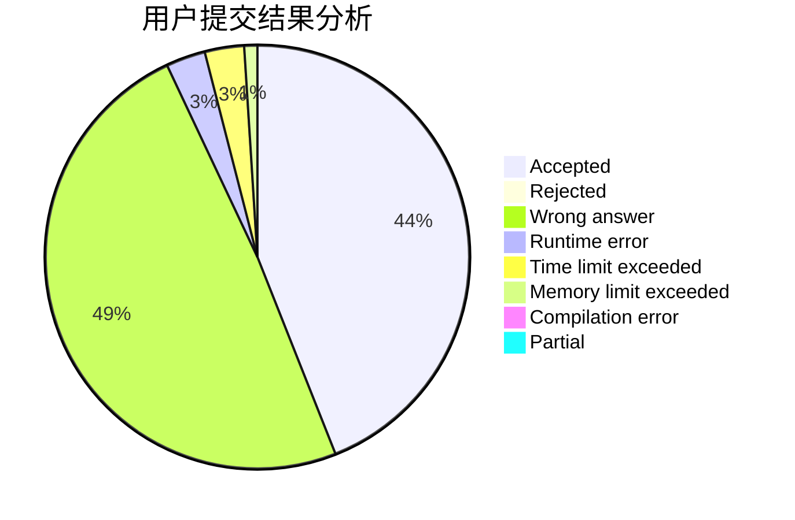
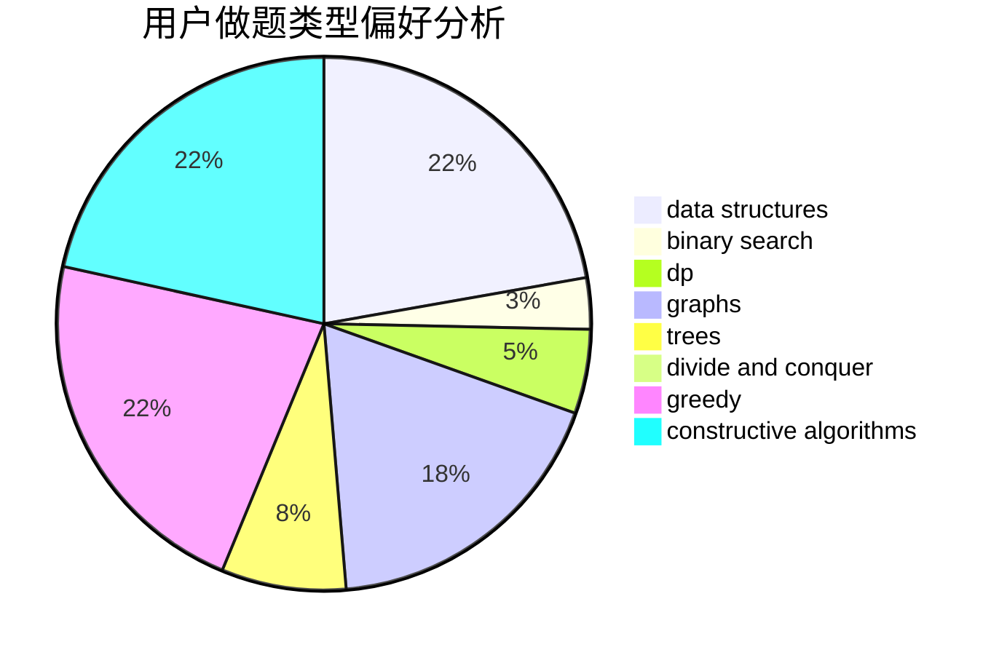
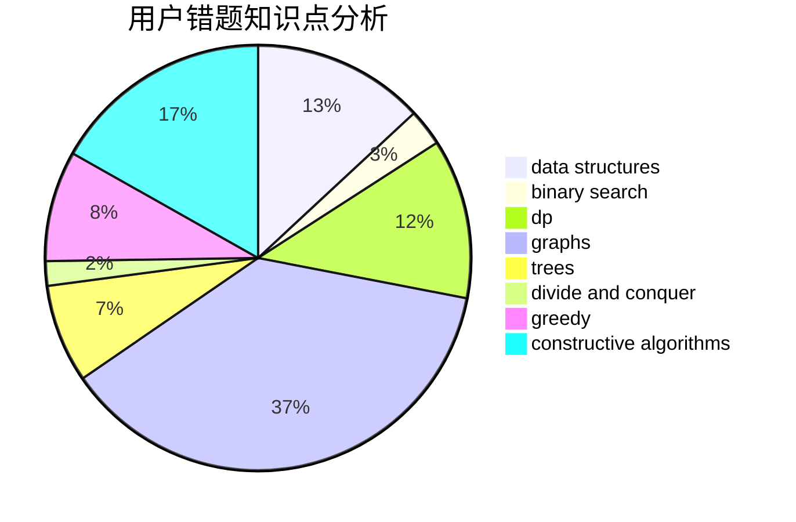

# Not_A_SingleDogQrz

<!-- tabs:start -->

#### **用户提交结果分析**

#### **用户做题类型偏好分析**

#### **用户错题知识点分析**

<!-- tabs:end -->
# 推荐题目
[507B](https://codeforces.com/contest/507/problem/B)		geometry,
                        math		  
[611A](https://codeforces.com/contest/611/problem/A)		implementation		  
[177B2](https://codeforces.com/contest/177B/problem/2)		number theory		  
[975E](https://codeforces.com/contest/975/problem/E)		geometry		  
[894C](https://codeforces.com/contest/894/problem/C)		constructive algorithms,
                        math		  
[76D](https://codeforces.com/contest/76/problem/D)		dp,
                        greedy,
                        math		  
[215C](https://codeforces.com/contest/215/problem/C)		brute force,
                        implementation		  
[79D](https://codeforces.com/contest/79/problem/D)		bitmasks,
                        dp,
                        shortest paths		  
[516C](https://codeforces.com/contest/516/problem/C)		dsu,graphs,sortings,trees		  
[526D](https://codeforces.com/contest/526/problem/D)		hashing,
                        string suffix structures,
                        strings		  
