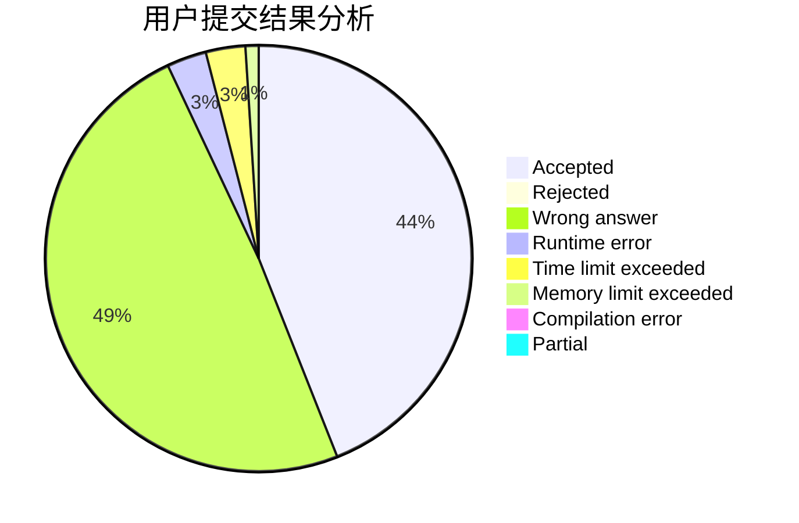
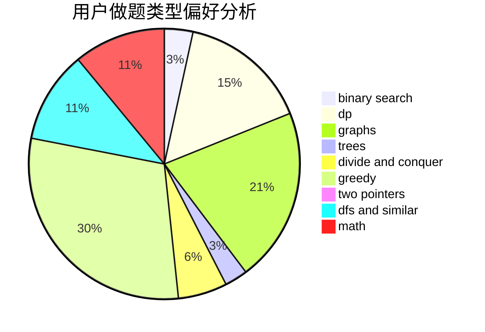

# Not_A_SingleDogQrz

<!-- tabs:start -->

#### **用户提交结果分析**

#### **用户做题类型偏好分析**

<!-- tabs:end -->
# 推荐题目
[527C](https://codeforces.com/contest/527/problem/C)
[630A](https://codeforces.com/contest/630/problem/A)
[204C](https://codeforces.com/contest/204/problem/C)
[98D](https://codeforces.com/contest/98/problem/D)
[912B](https://codeforces.com/contest/912/problem/B)
[78C](https://codeforces.com/contest/78/problem/C)
[234C](https://codeforces.com/contest/234/problem/C)
[814A](https://codeforces.com/contest/814/problem/A)
[543C](https://codeforces.com/contest/543/problem/C)
[550C](https://codeforces.com/contest/550/problem/C)
