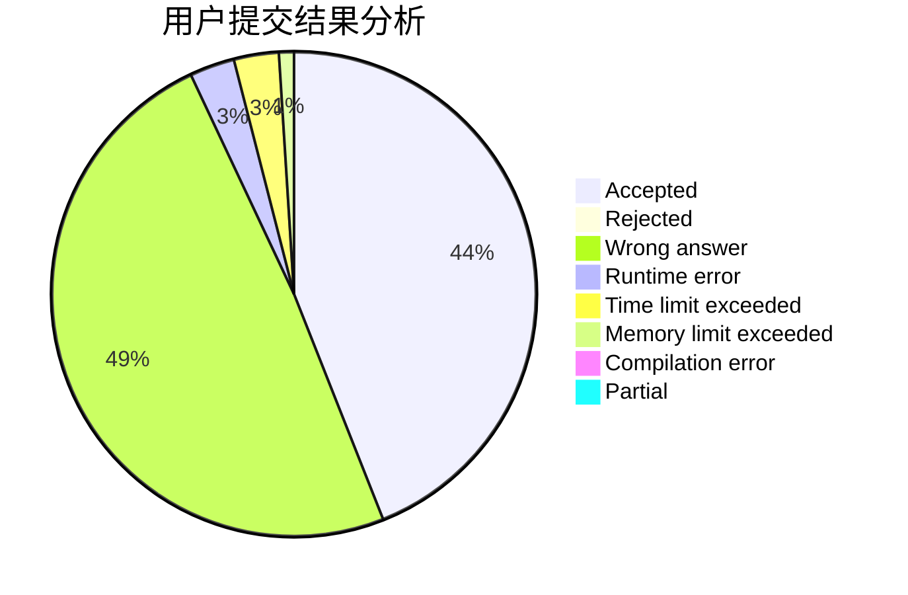
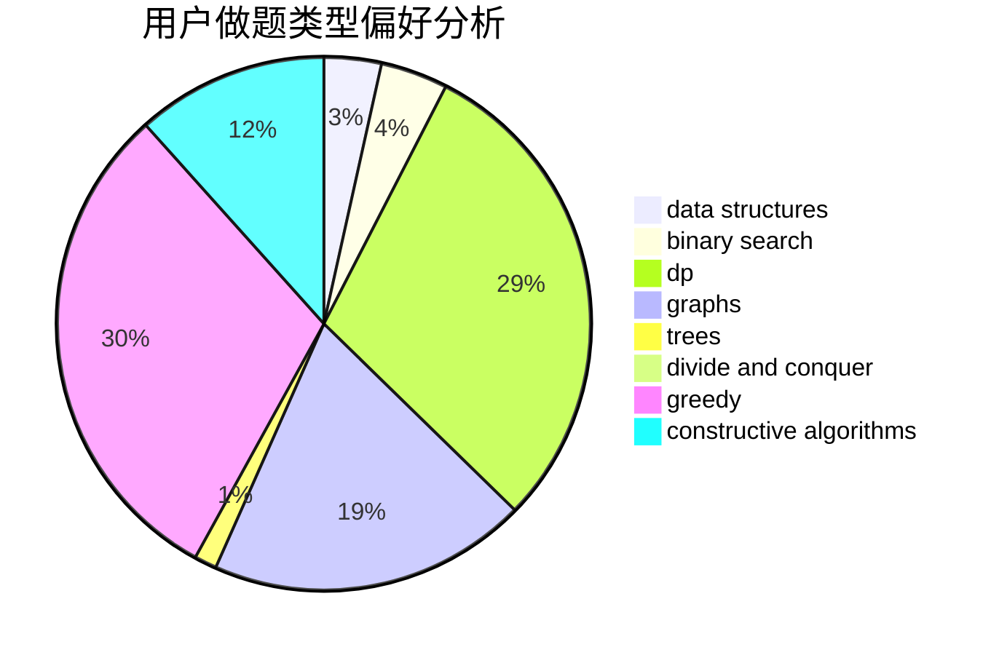
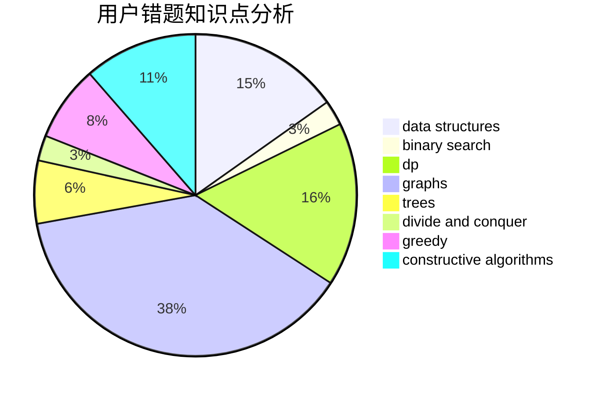

# Not_A_SingleDogQrz

<!-- tabs:start -->

#### **用户提交结果分析**

#### **用户做题类型偏好分析**

#### **用户错题知识点分析**

<!-- tabs:end -->
# 推荐题目
[527C](https://codeforces.com/contest/527/problem/C)		binary search,
                        data structures,
                        implementation		  
[630A](https://codeforces.com/contest/630/problem/A)		number theory		  
[204C](https://codeforces.com/contest/204/problem/C)		math,
                        probabilities		  
[98D](https://codeforces.com/contest/98/problem/D)		constructive algorithms		  
[912B](https://codeforces.com/contest/912/problem/B)		bitmasks,
                        constructive algorithms,
                        number theory		  
[78C](https://codeforces.com/contest/78/problem/C)		dp,
                        games,
                        number theory		  
[234C](https://codeforces.com/contest/234/problem/C)		dp,
                        implementation		  
[814A](https://codeforces.com/contest/814/problem/A)		constructive algorithms,
                        greedy,
                        implementation,
                        sortings		  
[543C](https://codeforces.com/contest/543/problem/C)		bitmasks,
                        dp		  
[550C](https://codeforces.com/contest/550/problem/C)		brute force,
                        dp,
                        math		  
