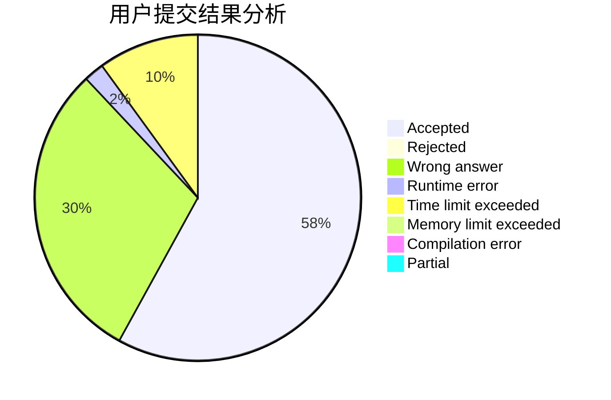
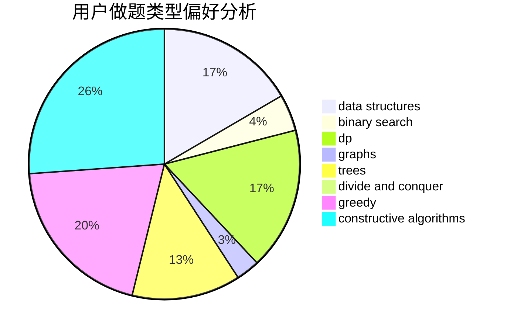
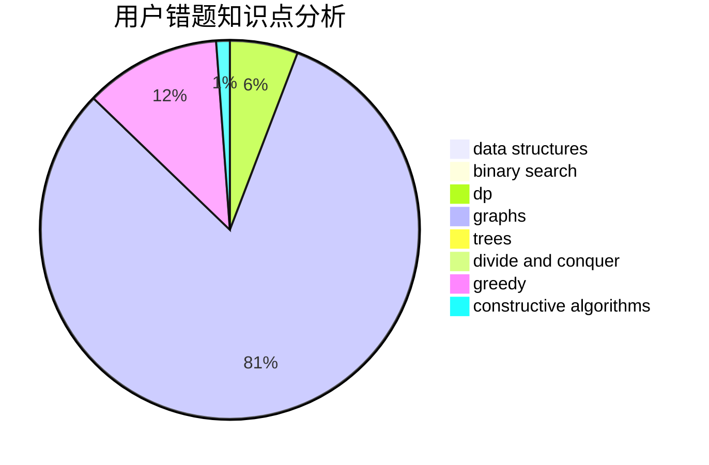

# Nothing_To_Lose

<!-- tabs:start -->

#### **用户提交结果分析**

#### **用户做题类型偏好分析**

#### **用户错题知识点分析**

<!-- tabs:end -->
# 推荐题目
[1480A](https://codeforces.com/contest/1480/problem/A)		games,
                        greedy,
                        strings		  
[1504E](https://codeforces.com/contest/1504/problem/E)		dsu,graphs,sortings,trees		  
[952E](https://codeforces.com/contest/952/problem/E)		nan		  
[201C](https://codeforces.com/contest/201/problem/C)		dp		  
[86C](https://codeforces.com/contest/86/problem/C)		dp,
                        string suffix structures,
                        trees		  
[1227B](https://codeforces.com/contest/1227/problem/B)		constructive algorithms		  
[567F](https://codeforces.com/contest/567/problem/F)		dp		  
[1162D](https://codeforces.com/contest/1162/problem/D)		dsu,graphs,sortings,trees		  
[11162](https://codeforces.com/contest/1116/problem/2)		dsu,graphs,sortings,trees		  
[253A](https://codeforces.com/contest/253/problem/A)		greedy		  
