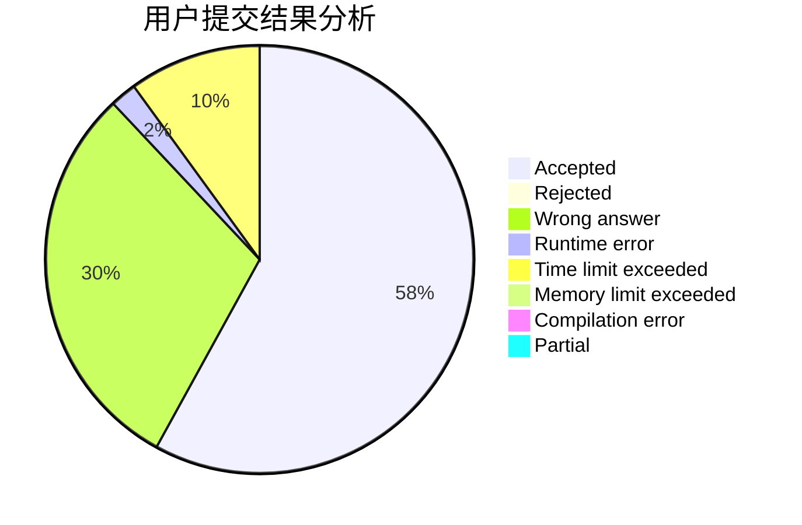
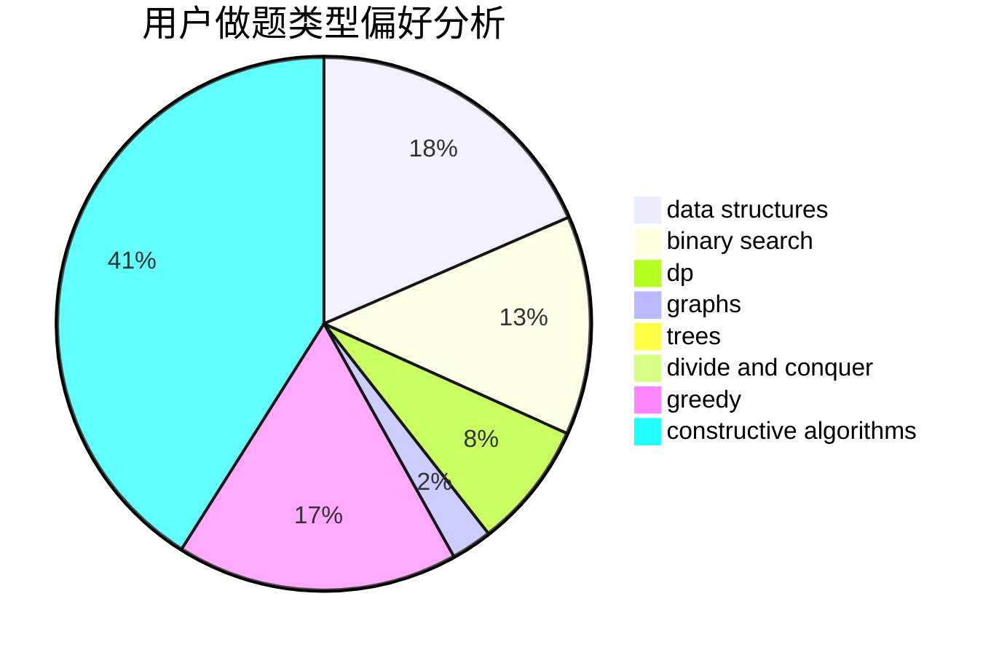
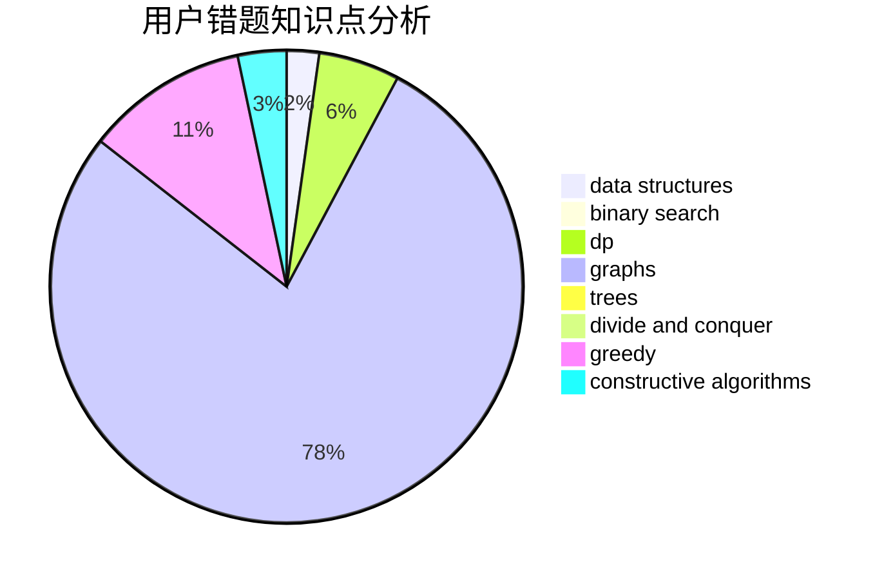

# Nothing_To_Lose

<!-- tabs:start -->

#### **用户提交结果分析**

#### **用户做题类型偏好分析**

#### **用户错题知识点分析**

<!-- tabs:end -->
# 推荐题目
[1472A](https://codeforces.com/contest/1472/problem/A)		greedy,
                        math		  
[1495E](https://codeforces.com/contest/1495/problem/E)		brute force,
                        data structures,
                        greedy,
                        implementation		  
[931F](https://codeforces.com/contest/931/problem/F)		dsu,graphs,sortings,trees		  
[176D](https://codeforces.com/contest/176/problem/D)		dp		  
[851B](https://codeforces.com/contest/851/problem/B)		geometry,
                        math		  
[121D](https://codeforces.com/contest/121/problem/D)		binary search,
                        implementation,
                        two pointers		  
[543D](https://codeforces.com/contest/543/problem/D)		dp,
                        trees		  
[1159F](https://codeforces.com/contest/1159/problem/F)		dsu,graphs,sortings,trees		  
[1115G2](https://codeforces.com/contest/1115G/problem/2)		*special problem		  
[231C](https://codeforces.com/contest/231/problem/C)		binary search,
                        sortings,
                        two pointers		  
