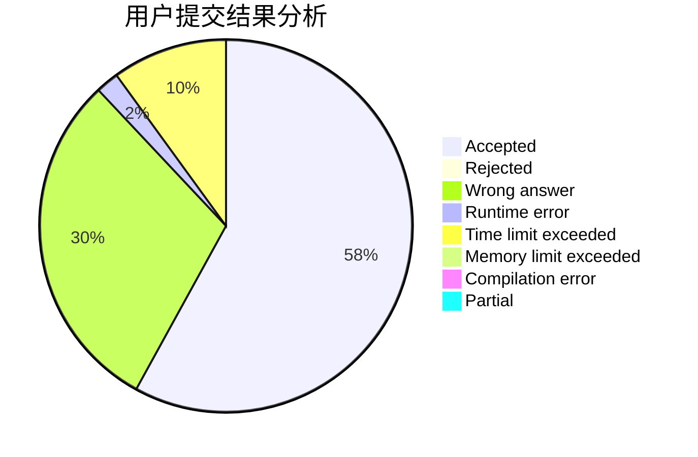
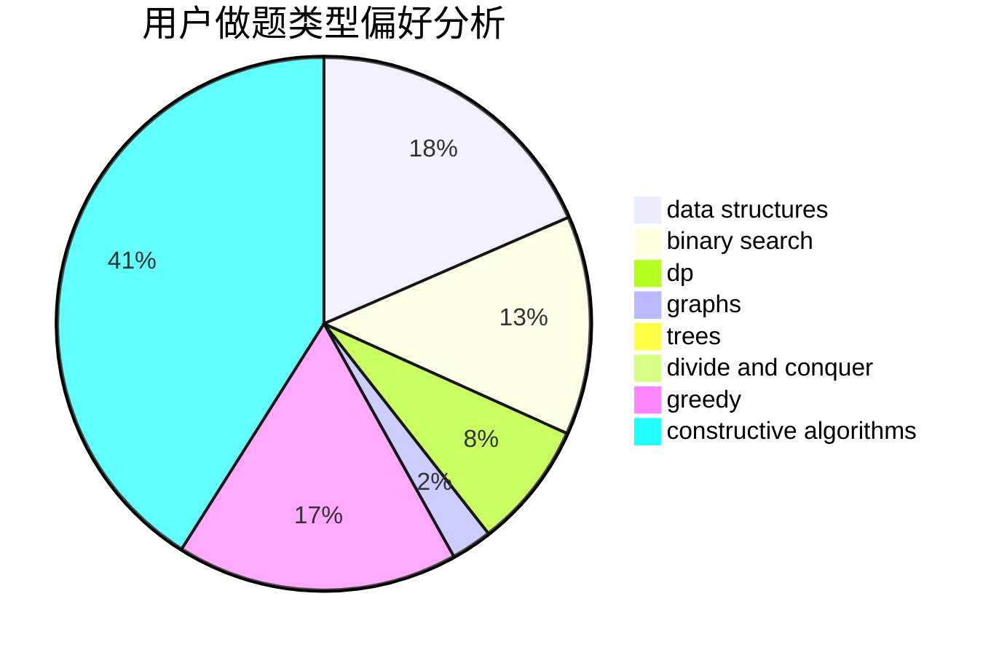
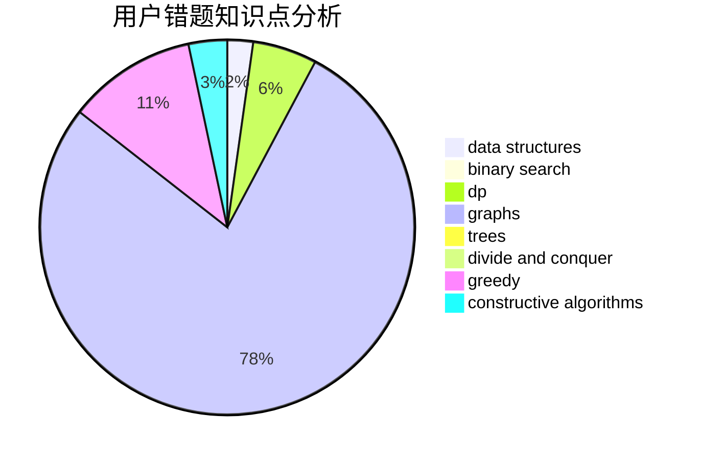

# Nothing_To_Lose
<!-- tabs:start -->
#### **用户提交结果分析**

#### **用户做题类型偏好分析**

#### **用户错题知识点分析**

<!-- tabs:end -->
# 推荐题目
[Cards for Friends](http://codeforces.com/problemset/problem/1472/A)		greedy,
                        math		  
[Fun with Integers](http://codeforces.com/problemset/problem/1062/D)		dfs and similar,
                        graphs,
                        implementation,
                        math		  
[OR oracle](http://codeforces.com/problemset/problem/1115/G2)		*special problem		  
[Ann and Books](http://codeforces.com/problemset/problem/877/F)		data structures,
                        flows,
                        hashing		  
[Danger of Mad Snakes](http://codeforces.com/problemset/problem/1425/D)		combinatorics,
                        dp,
                        math		  
[Teodor is not a liar!](https://codeforces.com/contest/931/problem/F)		data structures,
                        dp		  
[Buying a TV Set](http://codeforces.com/problemset/problem/1041/B)		math		  
[Palindromic Paths](http://codeforces.com/problemset/problem/1205/C)		implementation,
                        interactive		  
[Winding polygonal line](https://codeforces.com/contest/1159/problem/F)		constructive algorithms,
                        geometry,
                        greedy,
                        math		  
[Road Improvement](http://codeforces.com/problemset/problem/543/D)		dp,
                        trees		  
<!-- tabs:start -->
#### **data structures**
[Cards for Friends](http://codeforces.com/problemset/problem/877/F)		data structures,
                        flows,
                        hashing		  
[Fun with Integers](https://codeforces.com/contest/931/problem/F)		data structures,
                        dp		  
[OR oracle](http://codeforces.com/problemset/problem/292/E)		data structures		  
[Ann and Books](https://codeforces.com/contest/759/problem/C)		data structures		  
[Danger of Mad Snakes](http://codeforces.com/problemset/problem/407/E)		data structures		  
[Teodor is not a liar!](http://codeforces.com/problemset/problem/1495/E)		brute force,
                        data structures,
                        greedy,
                        implementation		  
[Buying a TV Set](http://codeforces.com/problemset/problem/283/E)		combinatorics,
                        data structures,
                        math		  
[Palindromic Paths](http://codeforces.com/problemset/problem/1408/H)		binary search,
                        data structures,
                        flows,
                        greedy		  
[Winding polygonal line](http://codeforces.com/problemset/problem/1492/C)		binary search,
                        data structures,
                        dp,
                        greedy,
                        two pointers		  
[Road Improvement](http://codeforces.com/problemset/problem/1490/G)		binary search,
                        data structures,
                        math		  
#### **binary search**
[Cards for Friends](http://codeforces.com/problemset/problem/121/D)		binary search,
                        implementation,
                        two pointers		  
[Fun with Integers](http://codeforces.com/problemset/problem/231/C)		binary search,
                        sortings,
                        two pointers		  
[OR oracle](http://codeforces.com/problemset/problem/1408/H)		binary search,
                        data structures,
                        flows,
                        greedy		  
[Ann and Books](http://codeforces.com/problemset/problem/1251/D)		binary search,
                        greedy,
                        sortings		  
[Danger of Mad Snakes](http://codeforces.com/problemset/problem/1492/C)		binary search,
                        data structures,
                        dp,
                        greedy,
                        two pointers		  
[Teodor is not a liar!](http://codeforces.com/problemset/problem/1463/D)		binary search,
                        constructive algorithms,
                        greedy,
                        two pointers		  
[Buying a TV Set](http://codeforces.com/problemset/problem/1490/G)		binary search,
                        data structures,
                        math		  
[Palindromic Paths](http://codeforces.com/problemset/problem/1479/D)		binary search,
                        bitmasks,
                        brute force,
                        data structures,
                        probabilities,
                        trees		  
[Winding polygonal line](http://codeforces.com/problemset/problem/1436/E)		binary search,
                        data structures,
                        two pointers		  
[Road Improvement](http://codeforces.com/problemset/problem/1461/D)		binary search,
                        brute force,
                        data structures,
                        divide and conquer,
                        implementation,
                        sortings		  
#### **dp**
[Cards for Friends](http://codeforces.com/problemset/problem/1425/D)		combinatorics,
                        dp,
                        math		  
[Fun with Integers](https://codeforces.com/contest/931/problem/F)		data structures,
                        dp		  
[OR oracle](http://codeforces.com/problemset/problem/543/D)		dp,
                        trees		  
[Ann and Books](http://codeforces.com/problemset/problem/417/D)		bitmasks,
                        dp,
                        greedy,
                        sortings		  
[Danger of Mad Snakes](http://codeforces.com/problemset/problem/176/D)		dp		  
[Teodor is not a liar!](http://codeforces.com/problemset/problem/1015/F)		dp,
                        strings		  
[Buying a TV Set](http://codeforces.com/problemset/problem/1292/D)		dp,
                        graphs,
                        greedy,
                        math,
                        number theory,
                        trees		  
[Palindromic Paths](http://codeforces.com/problemset/problem/1466/B)		dp,
                        greedy		  
[Winding polygonal line](http://codeforces.com/problemset/problem/1455/D)		dp,
                        greedy,
                        sortings		  
[Road Improvement](http://codeforces.com/problemset/problem/1492/C)		binary search,
                        data structures,
                        dp,
                        greedy,
                        two pointers		  
#### **graph**
[Cards for Friends](http://codeforces.com/problemset/problem/1062/D)		dfs and similar,
                        graphs,
                        implementation,
                        math		  
[Fun with Integers](http://codeforces.com/problemset/problem/1292/D)		dp,
                        graphs,
                        greedy,
                        math,
                        number theory,
                        trees		  
[OR oracle](http://codeforces.com/problemset/problem/1487/C)		brute force,
                        constructive algorithms,
                        dfs and similar,
                        graphs,
                        greedy,
                        implementation,
                        math		  
[Ann and Books](http://codeforces.com/problemset/problem/1437/C)		dp,
                        flows,
                        graph matchings,
                        greedy,
                        math,
                        sortings		  
[Danger of Mad Snakes](http://codeforces.com/problemset/problem/1470/D)		constructive algorithms,
                        dfs and similar,
                        graph matchings,
                        graphs,
                        greedy		  
[Teodor is not a liar!](http://codeforces.com/problemset/problem/1476/C)		dp,
                        graphs,
                        greedy		  
[Buying a TV Set](http://codeforces.com/problemset/problem/1304/D)		constructive algorithms,
                        graphs,
                        greedy,
                        two pointers		  
[Palindromic Paths](http://codeforces.com/problemset/problem/1475/C)		combinatorics,
                        graphs,
                        math		  
[Winding polygonal line](http://codeforces.com/problemset/problem/553/E)		dp,
                        fft,
                        graphs,
                        math,
                        probabilities		  
[Road Improvement](http://codeforces.com/problemset/problem/1495/C)		constructive algorithms,
                        graphs		  
#### **trees**
[Cards for Friends](http://codeforces.com/problemset/problem/543/D)		dp,
                        trees		  
[Fun with Integers](https://codeforces.com/contest/1189/problem/D2)		constructive algorithms,
                        dfs and similar,
                        implementation,
                        trees		  
[OR oracle](http://codeforces.com/problemset/problem/1292/D)		dp,
                        graphs,
                        greedy,
                        math,
                        number theory,
                        trees		  
[Ann and Books](http://codeforces.com/problemset/problem/1205/D)		constructive algorithms,
                        trees		  
[Danger of Mad Snakes](http://codeforces.com/problemset/problem/1479/D)		binary search,
                        bitmasks,
                        brute force,
                        data structures,
                        probabilities,
                        trees		  
[Teodor is not a liar!](http://codeforces.com/problemset/problem/1511/C)		brute force,
                        data structures,
                        implementation,
                        trees		  
[Buying a TV Set](http://codeforces.com/problemset/problem/1499/F)		combinatorics,
                        dfs and similar,
                        dp,
                        trees		  
[Palindromic Paths](http://codeforces.com/problemset/problem/1491/E)		brute force,
                        dfs and similar,
                        divide and conquer,
                        number theory,
                        trees		  
[Winding polygonal line](http://codeforces.com/problemset/problem/1466/D)		data structures,
                        greedy,
                        sortings,
                        trees		  
[Road Improvement](http://codeforces.com/problemset/problem/1495/D)		combinatorics,
                        dfs and similar,
                        graphs,
                        math,
                        shortest paths,
                        trees		  
#### **divide and conquer**
[Cards for Friends](http://codeforces.com/problemset/problem/1461/D)		binary search,
                        brute force,
                        data structures,
                        divide and conquer,
                        implementation,
                        sortings		  
[Fun with Integers](http://codeforces.com/problemset/problem/1466/G)		combinatorics,
                        divide and conquer,
                        hashing,
                        math,
                        string suffix structures,
                        strings		  
[OR oracle](http://codeforces.com/problemset/problem/1490/D)		dfs and similar,
                        divide and conquer,
                        implementation		  
[Ann and Books](https://codeforces.com/contest/1483/problem/C)		data structures,
                        divide and conquer,
                        dp		  
[Danger of Mad Snakes](http://codeforces.com/problemset/problem/1491/E)		brute force,
                        dfs and similar,
                        divide and conquer,
                        number theory,
                        trees		  
[Teodor is not a liar!](http://codeforces.com/problemset/problem/1303/G)		data structures,
                        divide and conquer,
                        geometry,
                        trees		  
[Buying a TV Set](http://codeforces.com/problemset/problem/1494/D)		constructive algorithms,
                        data structures,
                        dfs and similar,
                        divide and conquer,
                        dsu,
                        greedy,
                        sortings,
                        trees		  
[Palindromic Paths](http://codeforces.com/problemset/problem/1482/E)		data structures,
                        divide and conquer,
                        dp		  
[Winding polygonal line](http://codeforces.com/problemset/problem/566/C)		dfs and similar,
                        divide and conquer,
                        trees		  
[Road Improvement](http://codeforces.com/problemset/problem/1428/F)		binary search,
                        data structures,
                        divide and conquer,
                        dp,
                        two pointers		  
#### **greedy**
[Cards for Friends](http://codeforces.com/problemset/problem/1472/A)		greedy,
                        math		  
[Fun with Integers](https://codeforces.com/contest/1159/problem/F)		constructive algorithms,
                        geometry,
                        greedy,
                        math		  
[OR oracle](http://codeforces.com/problemset/problem/417/D)		bitmasks,
                        dp,
                        greedy,
                        sortings		  
[Ann and Books](http://codeforces.com/problemset/problem/1495/E)		brute force,
                        data structures,
                        greedy,
                        implementation		  
[Danger of Mad Snakes](http://codeforces.com/problemset/problem/1292/D)		dp,
                        graphs,
                        greedy,
                        math,
                        number theory,
                        trees		  
[Teodor is not a liar!](http://codeforces.com/problemset/problem/1408/H)		binary search,
                        data structures,
                        flows,
                        greedy		  
[Buying a TV Set](http://codeforces.com/problemset/problem/1181/A)		greedy,
                        math		  
[Palindromic Paths](http://codeforces.com/problemset/problem/1466/B)		dp,
                        greedy		  
[Winding polygonal line](http://codeforces.com/problemset/problem/1455/D)		dp,
                        greedy,
                        sortings		  
[Road Improvement](http://codeforces.com/problemset/problem/1251/D)		binary search,
                        greedy,
                        sortings		  
#### **constructive algorithms**
[Cards for Friends](https://codeforces.com/contest/1159/problem/F)		constructive algorithms,
                        geometry,
                        greedy,
                        math		  
[Fun with Integers](https://codeforces.com/contest/1189/problem/D2)		constructive algorithms,
                        dfs and similar,
                        implementation,
                        trees		  
[OR oracle](http://codeforces.com/problemset/problem/439/C)		brute force,
                        constructive algorithms,
                        implementation,
                        number theory		  
[Ann and Books](http://codeforces.com/problemset/problem/1205/D)		constructive algorithms,
                        trees		  
[Danger of Mad Snakes](http://codeforces.com/problemset/problem/1513/A)		constructive algorithms,
                        implementation		  
[Teodor is not a liar!](http://codeforces.com/problemset/problem/1352/F)		constructive algorithms,
                        dfs and similar,
                        math		  
[Buying a TV Set](http://codeforces.com/problemset/problem/1493/A)		constructive algorithms,
                        greedy		  
[Palindromic Paths](http://codeforces.com/problemset/problem/1463/D)		binary search,
                        constructive algorithms,
                        greedy,
                        two pointers		  
[Winding polygonal line](https://codeforces.com/contest/1456/problem/B)		bitmasks,
                        brute force,
                        constructive algorithms		  
[Road Improvement](http://codeforces.com/problemset/problem/1492/D)		bitmasks,
                        constructive algorithms,
                        greedy,
                        math		  
#### **sortings**
[Cards for Friends](http://codeforces.com/problemset/problem/417/D)		bitmasks,
                        dp,
                        greedy,
                        sortings		  
[Fun with Integers](http://codeforces.com/problemset/problem/231/C)		binary search,
                        sortings,
                        two pointers		  
[OR oracle](http://codeforces.com/problemset/problem/1455/D)		dp,
                        greedy,
                        sortings		  
[Ann and Books](http://codeforces.com/problemset/problem/1251/D)		binary search,
                        greedy,
                        sortings		  
[Danger of Mad Snakes](https://codeforces.com/contest/1496/problem/C)		geometry,
                        greedy,
                        math,
                        sortings		  
[Teodor is not a liar!](http://codeforces.com/problemset/problem/1495/A)		geometry,
                        greedy,
                        math,
                        sortings		  
[Buying a TV Set](http://codeforces.com/problemset/problem/1497/A)		brute force,
                        data structures,
                        greedy,
                        sortings		  
[Palindromic Paths](http://codeforces.com/problemset/problem/1427/A)		math,
                        sortings		  
[Winding polygonal line](http://codeforces.com/problemset/problem/1461/D)		binary search,
                        brute force,
                        data structures,
                        divide and conquer,
                        implementation,
                        sortings		  
[Road Improvement](http://codeforces.com/problemset/problem/1437/C)		dp,
                        flows,
                        graph matchings,
                        greedy,
                        math,
                        sortings		  
<!-- tabs:end -->
