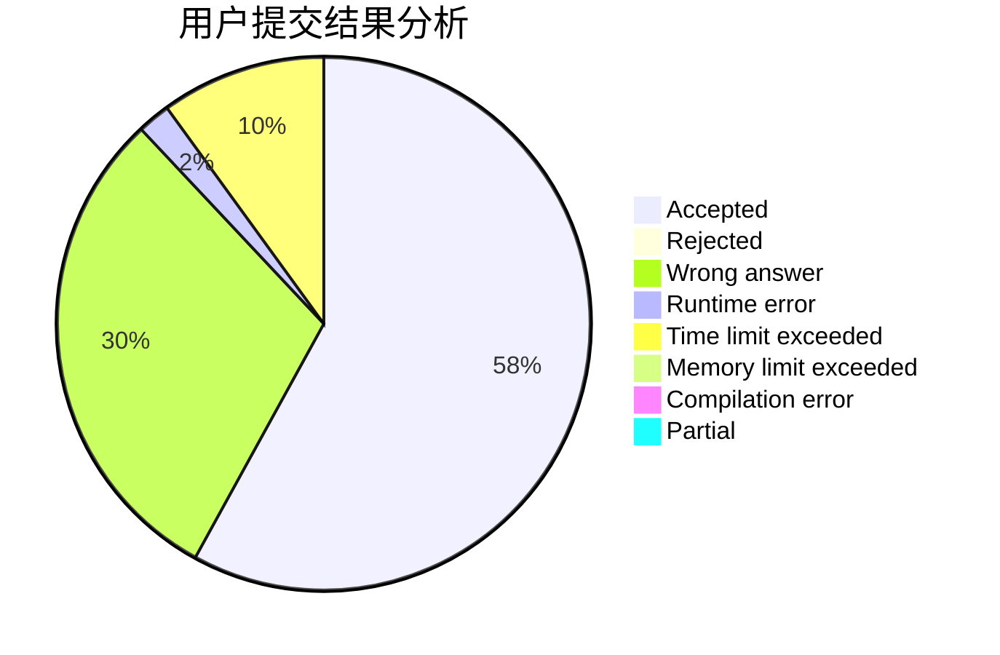
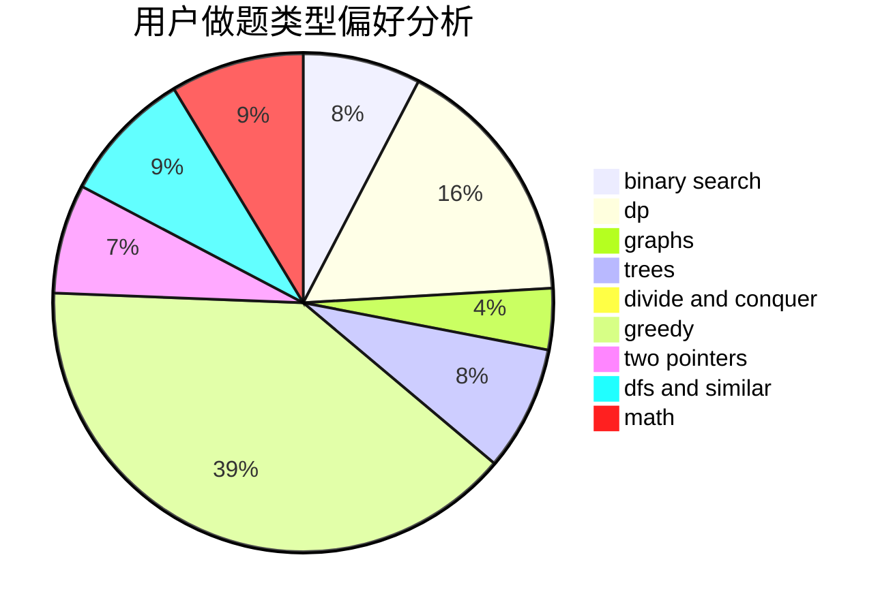

# Nothing_To_Lose

<!-- tabs:start -->

#### **用户提交结果分析**

#### **用户做题类型偏好分析**

<!-- tabs:end -->
# 推荐题目
[1480A](https://codeforces.com/contest/1480/problem/A)
[1504E](https://codeforces.com/contest/1504/problem/E)
[952E](https://codeforces.com/contest/952/problem/E)
[201C](https://codeforces.com/contest/201/problem/C)
[86C](https://codeforces.com/contest/86/problem/C)
[1227B](https://codeforces.com/contest/1227/problem/B)
[567F](https://codeforces.com/contest/567/problem/F)
[1162D](https://codeforces.com/contest/1162/problem/D)
[11162](https://codeforces.com/contest/1116/problem/2)
[253A](https://codeforces.com/contest/253/problem/A)
