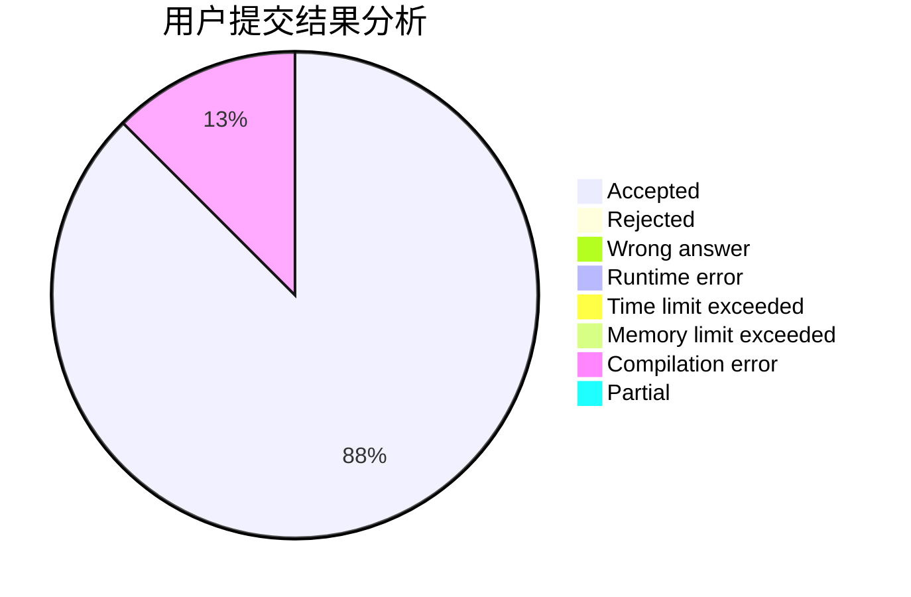
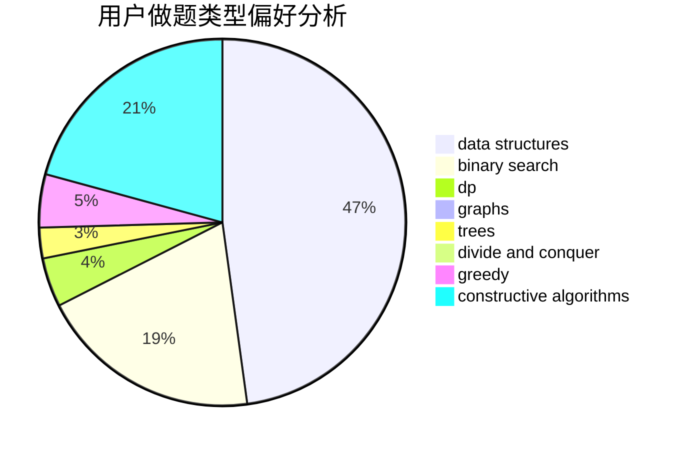

# 99ipq

<!-- tabs:start -->

#### **用户提交结果分析**

#### **用户做题类型偏好分析**

#### **用户错题知识点分析**

<!-- tabs:end -->
# 推荐题目
[1437G](https://codeforces.com/contest/1437/problem/G)		data structures,
                        string suffix structures,
                        strings,
                        trees		  
[1262D2](https://codeforces.com/contest/1262D/problem/2)		dsu,graphs,sortings,trees		  
[1456B](https://codeforces.com/contest/1456/problem/B)		dsu,graphs,sortings,trees		  
[1388A](https://codeforces.com/contest/1388/problem/A)		brute force,
                        greedy,
                        math,
                        number theory		  
[1213G](https://codeforces.com/contest/1213/problem/G)		divide and conquer,
                        dsu,
                        graphs,
                        sortings,
                        trees		  
[1300E](https://codeforces.com/contest/1300/problem/E)		dsu,graphs,sortings,trees		  
[1265A](https://codeforces.com/contest/1265/problem/A)		constructive algorithms,
                        greedy		  
[1454E](https://codeforces.com/contest/1454/problem/E)		combinatorics,
                        dfs and similar,
                        graphs,
                        trees		  
[1145D](https://codeforces.com/contest/1145/problem/D)		implementation		  
[1455A](https://codeforces.com/contest/1455/problem/A)		math,
                        number theory		  
