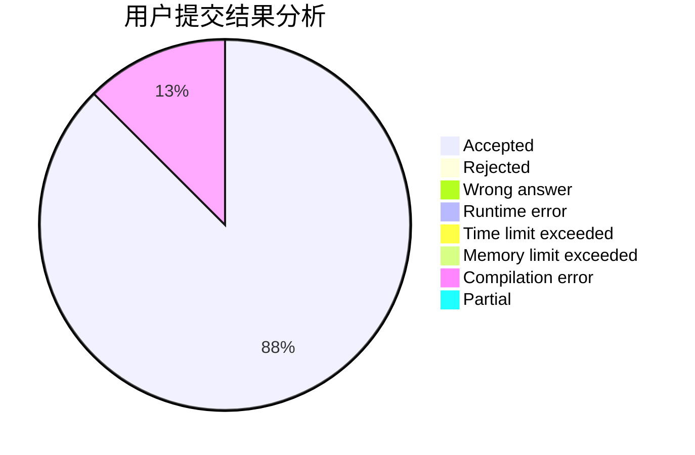
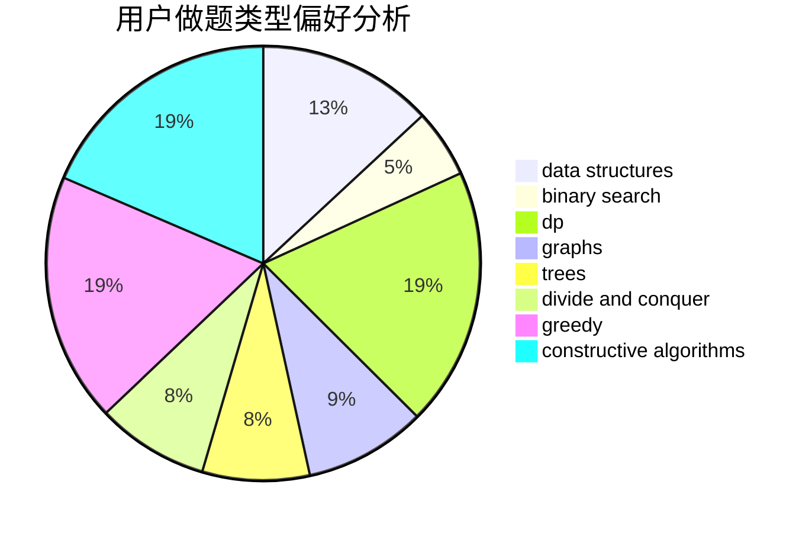

# 99ipq

<!-- tabs:start -->

#### **用户提交结果分析**

#### **用户做题类型偏好分析**

#### **用户错题知识点分析**

<!-- tabs:end -->
# 推荐题目
[1447D](https://codeforces.com/contest/1447/problem/D)		dsu,graphs,sortings,trees		  
[1268A](https://codeforces.com/contest/1268/problem/A)		constructive algorithms,
                        greedy,
                        implementation,
                        strings		  
[1465F](https://codeforces.com/contest/1465/problem/F)		dsu,graphs,sortings,trees		  
[1397D](https://codeforces.com/contest/1397/problem/D)		dsu,graphs,sortings,trees		  
[1219B](https://codeforces.com/contest/1219/problem/B)		dsu,graphs,sortings,trees		  
[1310C](https://codeforces.com/contest/1310/problem/C)		binary search,
                        dp,
                        strings		  
[1270F](https://codeforces.com/contest/1270/problem/F)		math,
                        strings		  
[1464B](https://codeforces.com/contest/1464/problem/B)		dsu,graphs,sortings,trees		  
[1147E](https://codeforces.com/contest/1147/problem/E)		interactive		  
[1464D](https://codeforces.com/contest/1464/problem/D)		dsu,graphs,sortings,trees		  
