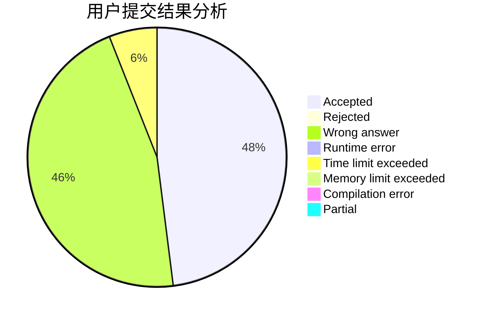
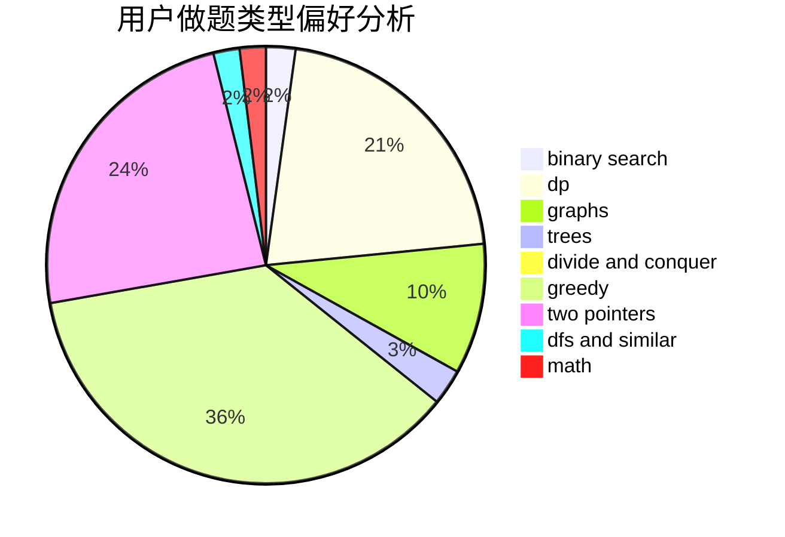

# Nothing_matter

<!-- tabs:start -->

#### **用户提交结果分析**

#### **用户做题类型偏好分析**

<!-- tabs:end -->
# 推荐题目
[788B](https://codeforces.com/contest/788/problem/B)
[1034D](https://codeforces.com/contest/1034/problem/D)
[918D](https://codeforces.com/contest/918/problem/D)
[1013A](https://codeforces.com/contest/1013/problem/A)
[98E](https://codeforces.com/contest/98/problem/E)
[847E](https://codeforces.com/contest/847/problem/E)
[644A](https://codeforces.com/contest/644/problem/A)
[918A](https://codeforces.com/contest/918/problem/A)
[216A](https://codeforces.com/contest/216/problem/A)
[1250H](https://codeforces.com/contest/1250/problem/H)
