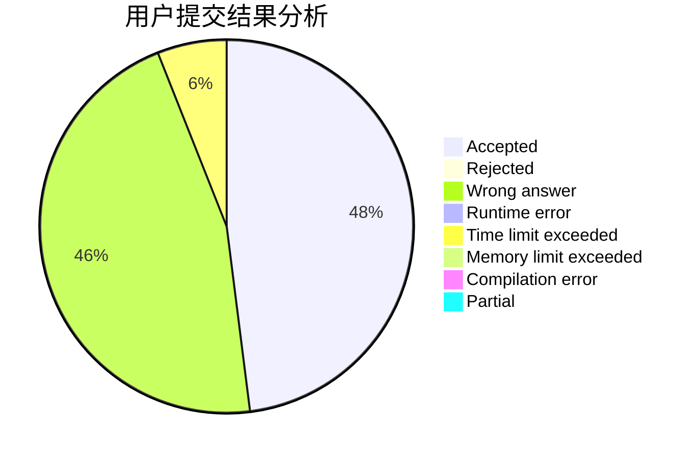
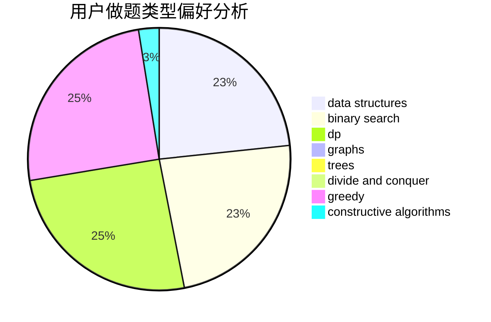
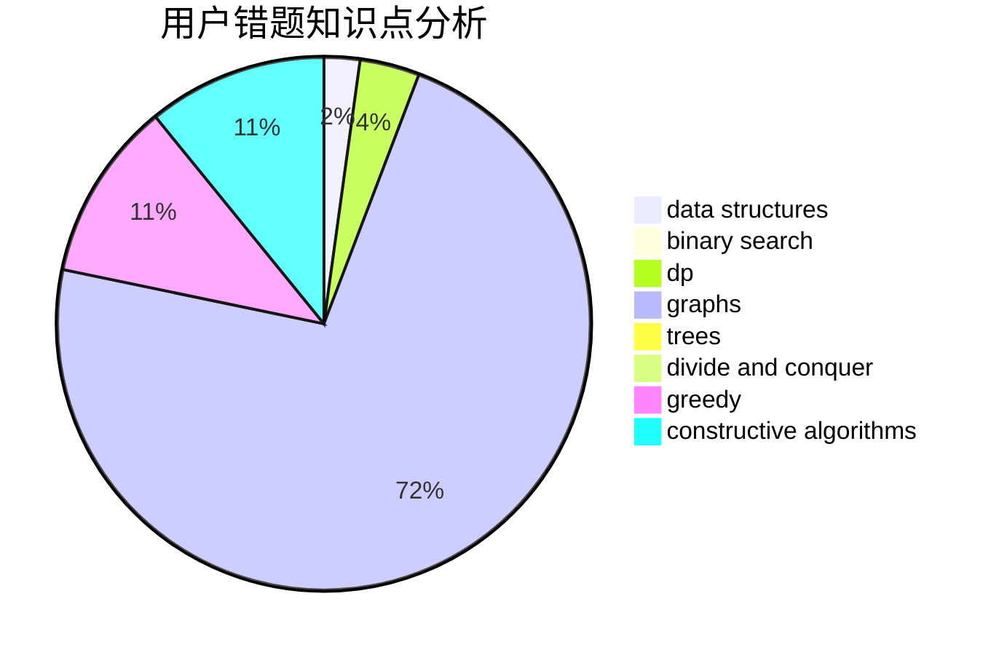

# Nothing_matter

<!-- tabs:start -->

#### **用户提交结果分析**

#### **用户做题类型偏好分析**

#### **用户错题知识点分析**

<!-- tabs:end -->
# 推荐题目
[768C](https://codeforces.com/contest/768/problem/C)		brute force,
                        dp,
                        implementation,
                        sortings		  
[1034A](https://codeforces.com/contest/1034/problem/A)		number theory		  
[902B](https://codeforces.com/contest/902/problem/B)		dfs and similar,
                        dsu,
                        greedy		  
[1012C](https://codeforces.com/contest/1012/problem/C)		dp		  
[976A](https://codeforces.com/contest/976/problem/A)		implementation		  
[828E](https://codeforces.com/contest/828/problem/E)		dsu,graphs,sortings,trees		  
[620E](https://codeforces.com/contest/620/problem/E)		bitmasks,
                        data structures,
                        trees		  
[901C](https://codeforces.com/contest/901/problem/C)		binary search,
                        data structures,
                        dfs and similar,
                        dsu,
                        graphs,
                        two pointers		  
[191C](https://codeforces.com/contest/191/problem/C)		data structures,
                        dfs and similar,
                        trees		  
[1245F](https://codeforces.com/contest/1245/problem/F)		bitmasks,
                        brute force,
                        combinatorics,
                        dp		  
