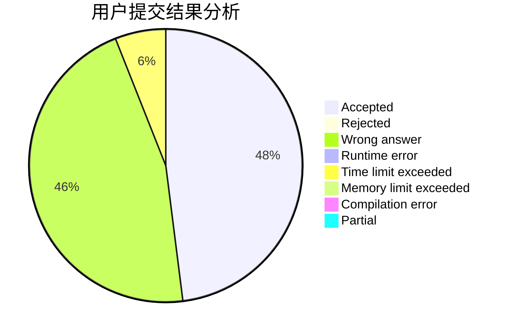
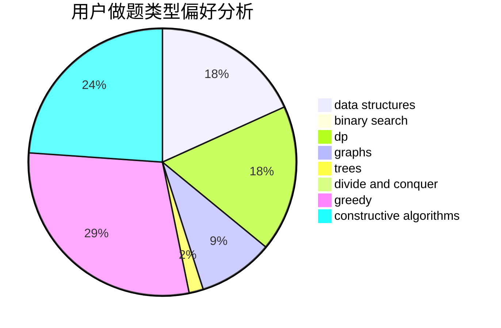
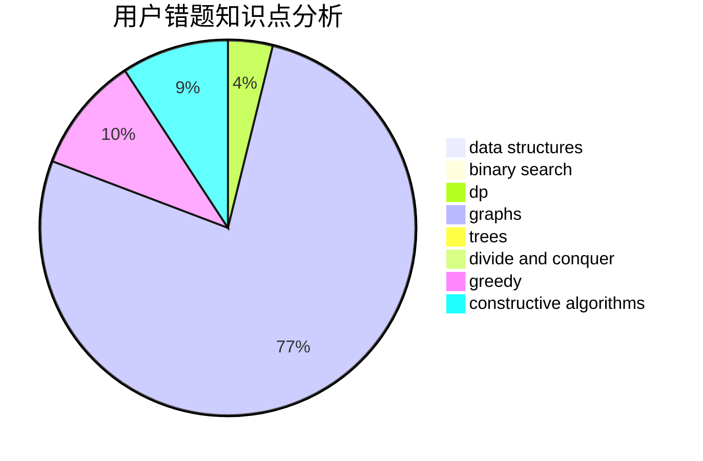

# Nothing_matter

<!-- tabs:start -->

#### **用户提交结果分析**

#### **用户做题类型偏好分析**

#### **用户错题知识点分析**

<!-- tabs:end -->
# 推荐题目
[788B](https://codeforces.com/contest/788/problem/B)		combinatorics,
                        constructive algorithms,
                        dfs and similar,
                        dsu,
                        graphs		  
[1034D](https://codeforces.com/contest/1034/problem/D)		binary search,
                        data structures,
                        two pointers		  
[918D](https://codeforces.com/contest/918/problem/D)		dsu,graphs,sortings,trees		  
[1013A](https://codeforces.com/contest/1013/problem/A)		math		  
[98E](https://codeforces.com/contest/98/problem/E)		dp,
                        games,
                        math,
                        probabilities		  
[847E](https://codeforces.com/contest/847/problem/E)		binary search,
                        dp		  
[644A](https://codeforces.com/contest/644/problem/A)		*special problem,
                        constructive algorithms		  
[918A](https://codeforces.com/contest/918/problem/A)		brute force,
                        implementation		  
[216A](https://codeforces.com/contest/216/problem/A)		implementation,
                        math		  
[1250H](https://codeforces.com/contest/1250/problem/H)		math		  
