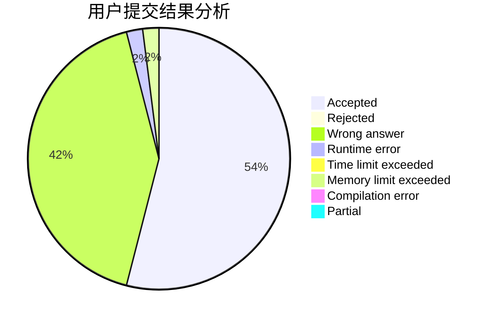
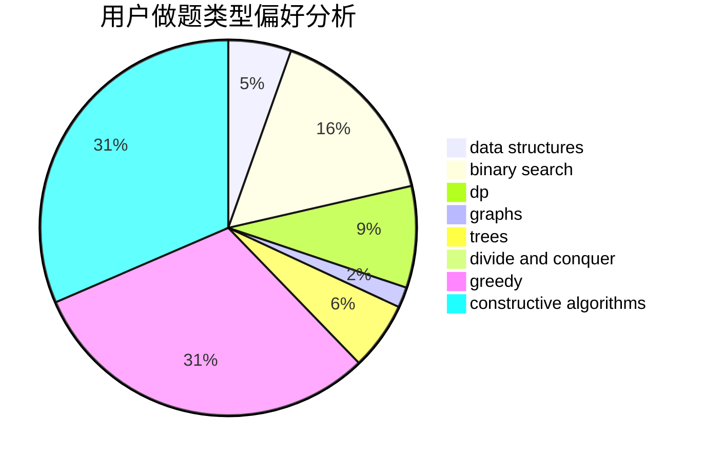

# Noumi_kudryavka

<!-- tabs:start -->

#### **用户提交结果分析**

#### **用户做题类型偏好分析**

#### **用户错题知识点分析**

<!-- tabs:end -->
# 推荐题目
[1295F](https://codeforces.com/contest/1295/problem/F)		combinatorics,
                        dp,
                        probabilities		  
[1100D](https://codeforces.com/contest/1100/problem/D)		constructive algorithms,
                        games,
                        interactive		  
[794G](https://codeforces.com/contest/794/problem/G)		combinatorics,
                        dp,
                        math		  
[1355D](https://codeforces.com/contest/1355/problem/D)		constructive algorithms,
                        math		  
[112A](https://codeforces.com/contest/112/problem/A)		implementation,
                        strings		  
[189B](https://codeforces.com/contest/189/problem/B)		brute force,
                        math		  
[628F](https://codeforces.com/contest/628/problem/F)		flows		  
[1017D](https://codeforces.com/contest/1017/problem/D)		bitmasks,
                        brute force,
                        data structures		  
[566C](https://codeforces.com/contest/566/problem/C)		dfs and similar,
                        divide and conquer,
                        trees		  
[672C](https://codeforces.com/contest/672/problem/C)		dsu,graphs,sortings,trees		  
