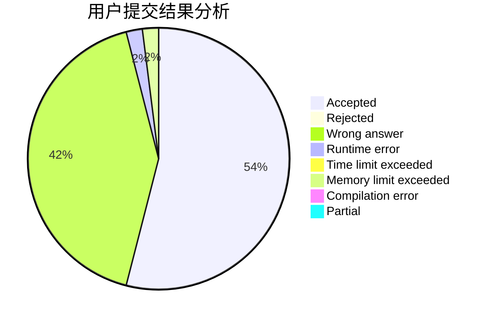
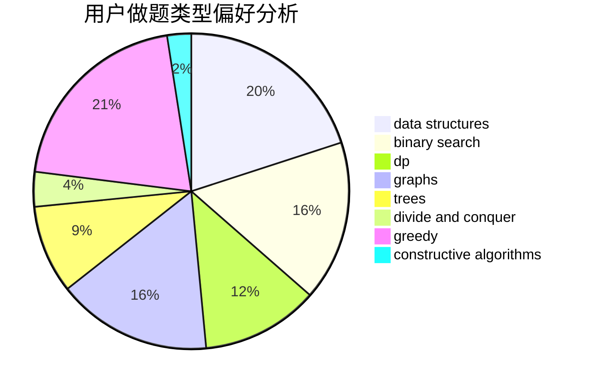

# Noumi_kudryavka

<!-- tabs:start -->

#### **用户提交结果分析**

#### **用户做题类型偏好分析**

#### **用户错题知识点分析**

<!-- tabs:end -->
# 推荐题目
[1303B](https://codeforces.com/contest/1303/problem/B)		math		  
[1101A](https://codeforces.com/contest/1101/problem/A)		math		  
[80A](https://codeforces.com/contest/80/problem/A)		brute force		  
[1362C](https://codeforces.com/contest/1362/problem/C)		bitmasks,
                        greedy,
                        math		  
[1131F](https://codeforces.com/contest/1131/problem/F)		constructive algorithms,
                        dsu		  
[213C](https://codeforces.com/contest/213/problem/C)		dp		  
[656F](https://codeforces.com/contest/656/problem/F)		*special problem		  
[1017G](https://codeforces.com/contest/1017/problem/G)		data structures		  
[585B](https://codeforces.com/contest/585/problem/B)		dfs and similar,
                        graphs,
                        shortest paths		  
[698D](https://codeforces.com/contest/698/problem/D)		brute force,
                        geometry,
                        math		  
