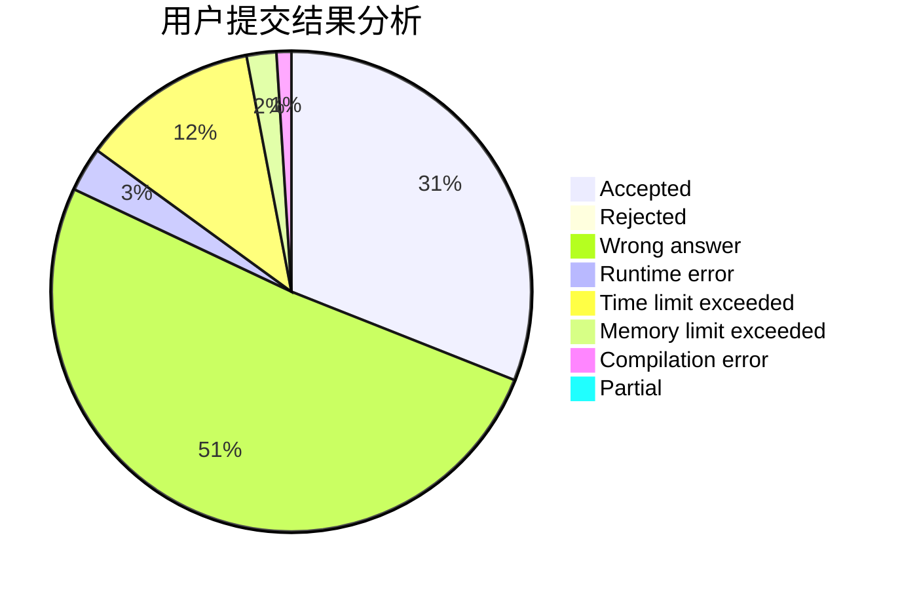
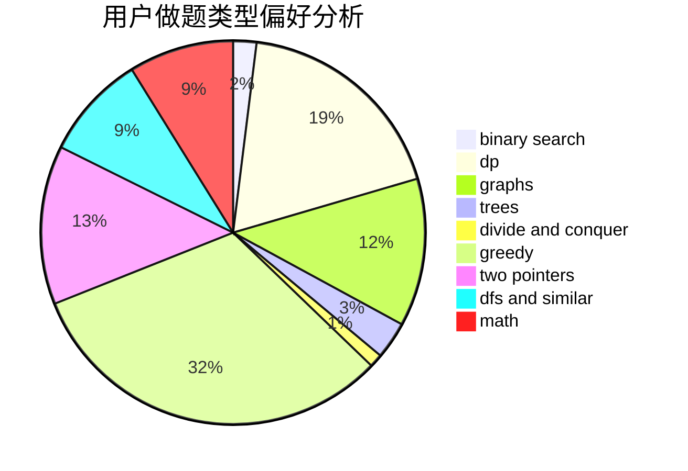

# Nova_Terra

<!-- tabs:start -->

#### **用户提交结果分析**

#### **用户做题类型偏好分析**

<!-- tabs:end -->
# 推荐题目
[1478A](https://codeforces.com/contest/1478/problem/A)
[1364C](https://codeforces.com/contest/1364/problem/C)
[312A](https://codeforces.com/contest/312/problem/A)
[730J](https://codeforces.com/contest/730/problem/J)
[706A](https://codeforces.com/contest/706/problem/A)
[567B](https://codeforces.com/contest/567/problem/B)
[496B](https://codeforces.com/contest/496/problem/B)
[339B](https://codeforces.com/contest/339/problem/B)
[979C](https://codeforces.com/contest/979/problem/C)
[1433G](https://codeforces.com/contest/1433/problem/G)
