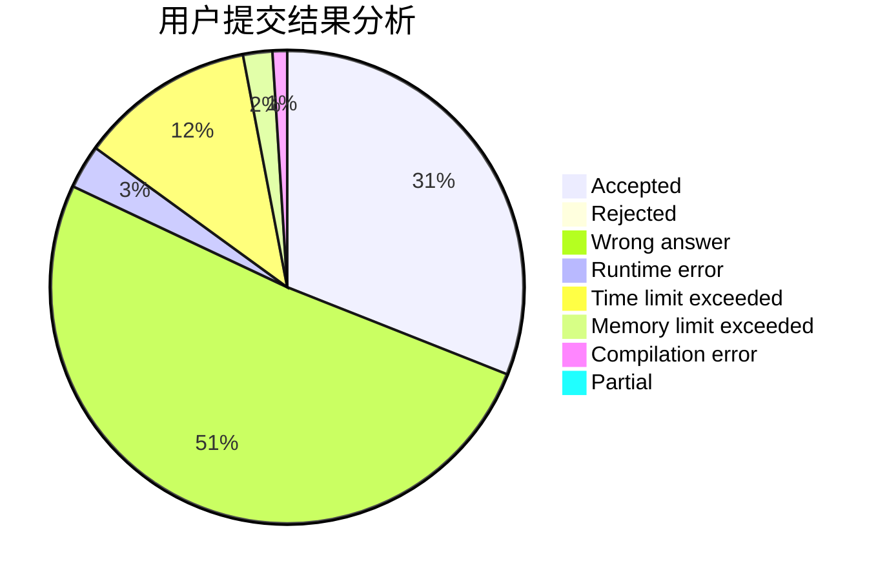
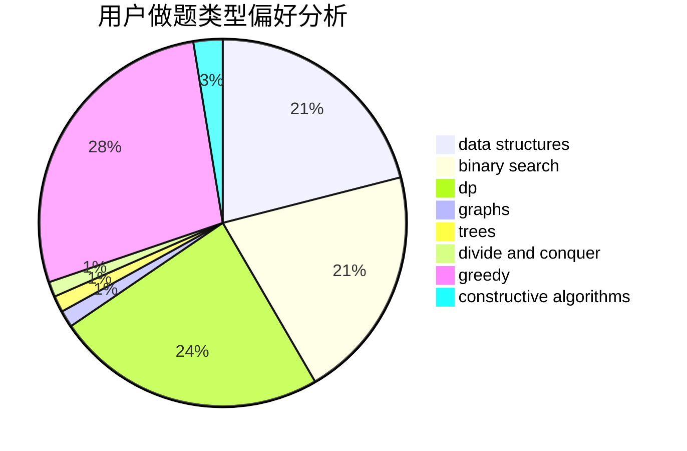
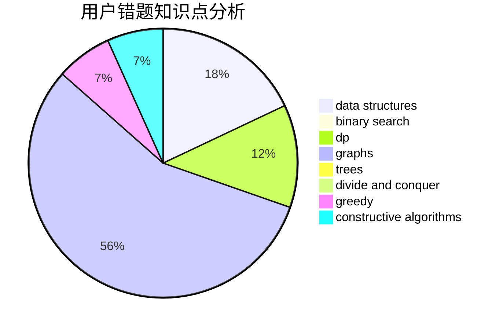

# Nova_Terra
<!-- tabs:start -->
#### **用户提交结果分析**

#### **用户做题类型偏好分析**

#### **用户错题知识点分析**

<!-- tabs:end -->
# 推荐题目
[Dreamoon and Sets](http://codeforces.com/problemset/problem/476/D)		constructive algorithms,
                        greedy,
                        math		  
[Power Sockets](http://codeforces.com/problemset/problem/1469/F)		binary search,
                        data structures,
                        greedy		  
[Greg and Friends](http://codeforces.com/problemset/problem/295/C)		combinatorics,
                        dp,
                        graphs,
                        shortest paths		  
[Death Stars (medium)](http://codeforces.com/problemset/problem/958/A2)		hashing,
                        strings		  
[XOR Equation](https://codeforces.com/contest/634/problem/B)		dp,
                        math		  
[String Set Queries](http://codeforces.com/problemset/problem/710/F)		brute force,
                        data structures,
                        hashing,
                        interactive,
                        string suffix structures,
                        strings		  
[Quest](http://codeforces.com/problemset/problem/542/F)		dp,
                        greedy		  
[Distinguish Y, XZ, -Y and -XZ](http://codeforces.com/problemset/problem/1357/A7)		nan		  
[Alyona and Numbers](http://codeforces.com/problemset/problem/682/A)		constructive algorithms,
                        math,
                        number theory		  
[Math Problem](http://codeforces.com/problemset/problem/1227/A)		math		  
<!-- tabs:start -->
#### **data structures**
[Dreamoon and Sets](http://codeforces.com/problemset/problem/1469/F)		binary search,
                        data structures,
                        greedy		  
[Power Sockets](http://codeforces.com/problemset/problem/710/F)		brute force,
                        data structures,
                        hashing,
                        interactive,
                        string suffix structures,
                        strings		  
[Greg and Friends](http://codeforces.com/problemset/problem/314/C)		data structures,
                        dp		  
[Death Stars (medium)](http://codeforces.com/problemset/problem/1253/E)		data structures,
                        dp,
                        greedy,
                        sortings		  
[XOR Equation](http://codeforces.com/problemset/problem/821/C)		data structures,
                        greedy,
                        trees		  
[String Set Queries](http://codeforces.com/problemset/problem/187/D)		data structures		  
[Quest](http://codeforces.com/problemset/problem/891/C)		data structures,
                        dsu,
                        graphs		  
[Distinguish Y, XZ, -Y and -XZ](https://codeforces.com/contest/947/problem/B)		binary search,
                        data structures		  
[Alyona and Numbers](http://codeforces.com/problemset/problem/1492/C)		binary search,
                        data structures,
                        dp,
                        greedy,
                        two pointers		  
[Math Problem](http://codeforces.com/problemset/problem/1490/G)		binary search,
                        data structures,
                        math		  
#### **binary search**
[Dreamoon and Sets](http://codeforces.com/problemset/problem/1469/F)		binary search,
                        data structures,
                        greedy		  
[Power Sockets](http://codeforces.com/problemset/problem/360/B)		binary search,
                        dp		  
[Greg and Friends](http://codeforces.com/problemset/problem/348/A)		binary search,
                        math,
                        sortings		  
[Death Stars (medium)](https://codeforces.com/contest/947/problem/B)		binary search,
                        data structures		  
[XOR Equation](http://codeforces.com/problemset/problem/1153/D)		binary search,
                        dfs and similar,
                        dp,
                        greedy,
                        trees		  
[String Set Queries](http://codeforces.com/problemset/problem/1326/D2)		binary search,
                        greedy,
                        hashing,
                        string suffix structures,
                        strings		  
[Quest](http://codeforces.com/problemset/problem/1492/C)		binary search,
                        data structures,
                        dp,
                        greedy,
                        two pointers		  
[Distinguish Y, XZ, -Y and -XZ](http://codeforces.com/problemset/problem/1463/D)		binary search,
                        constructive algorithms,
                        greedy,
                        two pointers		  
[Alyona and Numbers](http://codeforces.com/problemset/problem/1490/G)		binary search,
                        data structures,
                        math		  
[Math Problem](http://codeforces.com/problemset/problem/1479/D)		binary search,
                        bitmasks,
                        brute force,
                        data structures,
                        probabilities,
                        trees		  
#### **dp**
[Dreamoon and Sets](http://codeforces.com/problemset/problem/295/C)		combinatorics,
                        dp,
                        graphs,
                        shortest paths		  
[Power Sockets](https://codeforces.com/contest/634/problem/B)		dp,
                        math		  
[Greg and Friends](http://codeforces.com/problemset/problem/542/F)		dp,
                        greedy		  
[Death Stars (medium)](http://codeforces.com/problemset/problem/238/E)		dp,
                        graphs,
                        shortest paths		  
[XOR Equation](https://codeforces.com/contest/1078/problem/B)		dp,
                        math		  
[String Set Queries](http://codeforces.com/problemset/problem/314/C)		data structures,
                        dp		  
[Quest](http://codeforces.com/problemset/problem/360/B)		binary search,
                        dp		  
[Distinguish Y, XZ, -Y and -XZ](http://codeforces.com/problemset/problem/1253/E)		data structures,
                        dp,
                        greedy,
                        sortings		  
[Alyona and Numbers](https://codeforces.com/contest/918/problem/D)		dfs and similar,
                        dp,
                        games,
                        graphs		  
[Math Problem](http://codeforces.com/problemset/problem/301/E)		dp		  
#### **graph**
[Dreamoon and Sets](http://codeforces.com/problemset/problem/295/C)		combinatorics,
                        dp,
                        graphs,
                        shortest paths		  
[Power Sockets](http://codeforces.com/problemset/problem/238/E)		dp,
                        graphs,
                        shortest paths		  
[Greg and Friends](http://codeforces.com/problemset/problem/842/C)		dfs and similar,
                        graphs,
                        math,
                        number theory,
                        trees		  
[Death Stars (medium)](http://codeforces.com/problemset/problem/1089/M)		constructive algorithms,
                        graphs		  
[XOR Equation](http://codeforces.com/problemset/problem/1063/B)		graphs,
                        shortest paths		  
[String Set Queries](https://codeforces.com/contest/918/problem/D)		dfs and similar,
                        dp,
                        games,
                        graphs		  
[Quest](http://codeforces.com/problemset/problem/152/E)		bitmasks,
                        dp,
                        graphs,
                        trees		  
[Distinguish Y, XZ, -Y and -XZ](http://codeforces.com/problemset/problem/1105/D)		dfs and similar,
                        graphs,
                        implementation,
                        shortest paths		  
[Alyona and Numbers](http://codeforces.com/problemset/problem/891/C)		data structures,
                        dsu,
                        graphs		  
[Math Problem](http://codeforces.com/problemset/problem/1487/C)		brute force,
                        constructive algorithms,
                        dfs and similar,
                        graphs,
                        greedy,
                        implementation,
                        math		  
#### **trees**
[Dreamoon and Sets](http://codeforces.com/problemset/problem/842/C)		dfs and similar,
                        graphs,
                        math,
                        number theory,
                        trees		  
[Power Sockets](http://codeforces.com/problemset/problem/821/C)		data structures,
                        greedy,
                        trees		  
[Greg and Friends](http://codeforces.com/problemset/problem/152/E)		bitmasks,
                        dp,
                        graphs,
                        trees		  
[Death Stars (medium)](http://codeforces.com/problemset/problem/1153/D)		binary search,
                        dfs and similar,
                        dp,
                        greedy,
                        trees		  
[XOR Equation](http://codeforces.com/problemset/problem/1479/D)		binary search,
                        bitmasks,
                        brute force,
                        data structures,
                        probabilities,
                        trees		  
[String Set Queries](http://codeforces.com/problemset/problem/1511/C)		brute force,
                        data structures,
                        implementation,
                        trees		  
[Quest](http://codeforces.com/problemset/problem/1499/F)		combinatorics,
                        dfs and similar,
                        dp,
                        trees		  
[Distinguish Y, XZ, -Y and -XZ](http://codeforces.com/problemset/problem/1491/E)		brute force,
                        dfs and similar,
                        divide and conquer,
                        number theory,
                        trees		  
[Alyona and Numbers](http://codeforces.com/problemset/problem/1466/D)		data structures,
                        greedy,
                        sortings,
                        trees		  
[Math Problem](http://codeforces.com/problemset/problem/1495/D)		combinatorics,
                        dfs and similar,
                        graphs,
                        math,
                        shortest paths,
                        trees		  
#### **divide and conquer**
[Dreamoon and Sets](http://codeforces.com/problemset/problem/1461/D)		binary search,
                        brute force,
                        data structures,
                        divide and conquer,
                        implementation,
                        sortings		  
[Power Sockets](http://codeforces.com/problemset/problem/1466/G)		combinatorics,
                        divide and conquer,
                        hashing,
                        math,
                        string suffix structures,
                        strings		  
[Greg and Friends](http://codeforces.com/problemset/problem/1490/D)		dfs and similar,
                        divide and conquer,
                        implementation		  
[Death Stars (medium)](https://codeforces.com/contest/1483/problem/C)		data structures,
                        divide and conquer,
                        dp		  
[XOR Equation](http://codeforces.com/problemset/problem/1491/E)		brute force,
                        dfs and similar,
                        divide and conquer,
                        number theory,
                        trees		  
[String Set Queries](http://codeforces.com/problemset/problem/1303/G)		data structures,
                        divide and conquer,
                        geometry,
                        trees		  
[Quest](http://codeforces.com/problemset/problem/1494/D)		constructive algorithms,
                        data structures,
                        dfs and similar,
                        divide and conquer,
                        dsu,
                        greedy,
                        sortings,
                        trees		  
[Distinguish Y, XZ, -Y and -XZ](http://codeforces.com/problemset/problem/1482/E)		data structures,
                        divide and conquer,
                        dp		  
[Alyona and Numbers](http://codeforces.com/problemset/problem/566/C)		dfs and similar,
                        divide and conquer,
                        trees		  
[Math Problem](http://codeforces.com/problemset/problem/1428/F)		binary search,
                        data structures,
                        divide and conquer,
                        dp,
                        two pointers		  
#### **greedy**
[Dreamoon and Sets](http://codeforces.com/problemset/problem/476/D)		constructive algorithms,
                        greedy,
                        math		  
[Power Sockets](http://codeforces.com/problemset/problem/1469/F)		binary search,
                        data structures,
                        greedy		  
[Greg and Friends](http://codeforces.com/problemset/problem/542/F)		dp,
                        greedy		  
[Death Stars (medium)](http://codeforces.com/problemset/problem/1425/E)		greedy,
                        implementation		  
[XOR Equation](http://codeforces.com/problemset/problem/620/C)		greedy		  
[String Set Queries](http://codeforces.com/problemset/problem/379/C)		greedy,
                        sortings		  
[Quest](http://codeforces.com/problemset/problem/1253/E)		data structures,
                        dp,
                        greedy,
                        sortings		  
[Distinguish Y, XZ, -Y and -XZ](http://codeforces.com/problemset/problem/821/C)		data structures,
                        greedy,
                        trees		  
[Alyona and Numbers](http://codeforces.com/problemset/problem/1474/A)		greedy		  
[Math Problem](http://codeforces.com/problemset/problem/1509/C)		dp,
                        greedy		  
#### **constructive algorithms**
[Dreamoon and Sets](http://codeforces.com/problemset/problem/476/D)		constructive algorithms,
                        greedy,
                        math		  
[Power Sockets](http://codeforces.com/problemset/problem/682/A)		constructive algorithms,
                        math,
                        number theory		  
[Greg and Friends](http://codeforces.com/problemset/problem/1089/M)		constructive algorithms,
                        graphs		  
[Death Stars (medium)](http://codeforces.com/problemset/problem/441/C)		constructive algorithms,
                        dfs and similar,
                        implementation		  
[XOR Equation](https://codeforces.com/contest/1456/problem/C)		constructive algorithms,
                        greedy,
                        math		  
[String Set Queries](http://codeforces.com/problemset/problem/1365/F)		constructive algorithms,
                        implementation,
                        sortings		  
[Quest](http://codeforces.com/problemset/problem/1493/A)		constructive algorithms,
                        greedy		  
[Distinguish Y, XZ, -Y and -XZ](http://codeforces.com/problemset/problem/1463/D)		binary search,
                        constructive algorithms,
                        greedy,
                        two pointers		  
[Alyona and Numbers](https://codeforces.com/contest/1456/problem/B)		bitmasks,
                        brute force,
                        constructive algorithms		  
[Math Problem](http://codeforces.com/problemset/problem/1492/D)		bitmasks,
                        constructive algorithms,
                        greedy,
                        math		  
#### **sortings**
[Dreamoon and Sets](http://codeforces.com/problemset/problem/379/C)		greedy,
                        sortings		  
[Power Sockets](http://codeforces.com/problemset/problem/1253/E)		data structures,
                        dp,
                        greedy,
                        sortings		  
[Greg and Friends](http://codeforces.com/problemset/problem/348/A)		binary search,
                        math,
                        sortings		  
[Death Stars (medium)](http://codeforces.com/problemset/problem/1365/F)		constructive algorithms,
                        implementation,
                        sortings		  
[XOR Equation](https://codeforces.com/contest/1496/problem/C)		geometry,
                        greedy,
                        math,
                        sortings		  
[String Set Queries](http://codeforces.com/problemset/problem/1495/A)		geometry,
                        greedy,
                        math,
                        sortings		  
[Quest](http://codeforces.com/problemset/problem/1497/A)		brute force,
                        data structures,
                        greedy,
                        sortings		  
[Distinguish Y, XZ, -Y and -XZ](http://codeforces.com/problemset/problem/1427/A)		math,
                        sortings		  
[Alyona and Numbers](http://codeforces.com/problemset/problem/1461/D)		binary search,
                        brute force,
                        data structures,
                        divide and conquer,
                        implementation,
                        sortings		  
[Math Problem](http://codeforces.com/problemset/problem/1437/C)		dp,
                        flows,
                        graph matchings,
                        greedy,
                        math,
                        sortings		  
<!-- tabs:end -->
