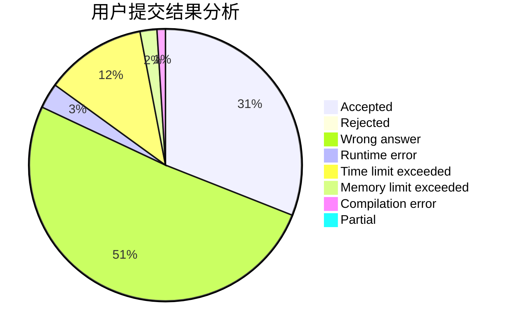
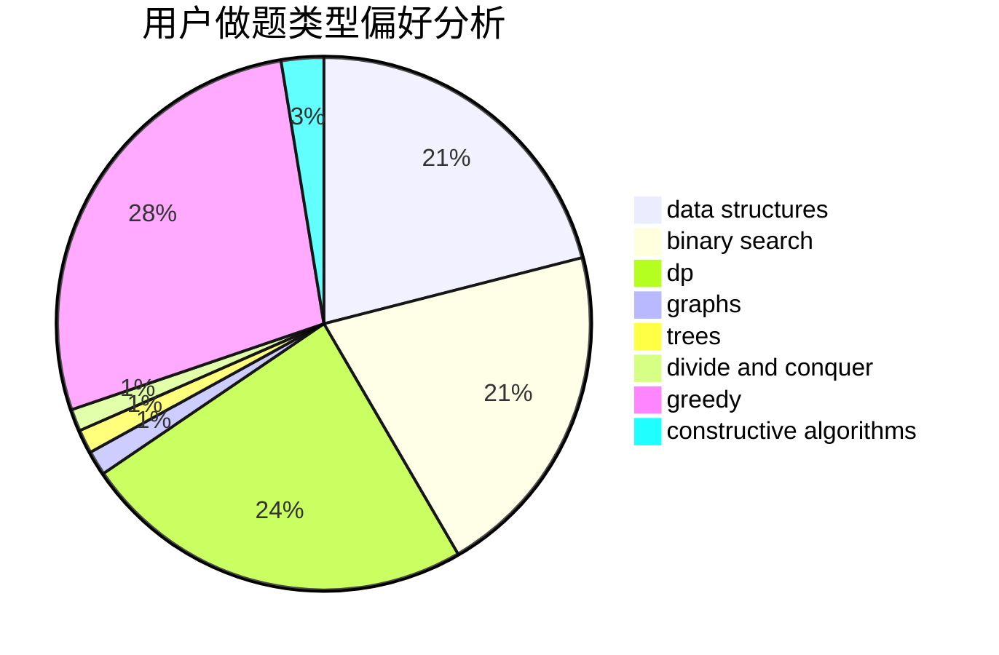
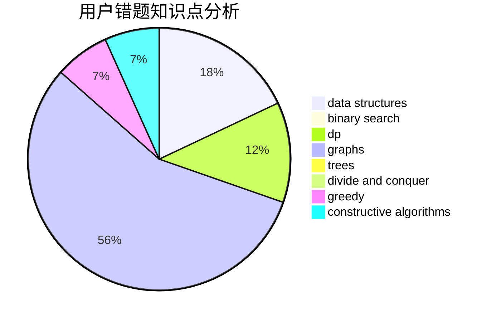

# Nova_Terra

<!-- tabs:start -->

#### **用户提交结果分析**

#### **用户做题类型偏好分析**

#### **用户错题知识点分析**

<!-- tabs:end -->
# 推荐题目
[1469F](https://codeforces.com/contest/1469/problem/F)		binary search,
                        data structures,
                        greedy		  
[1357A7](https://codeforces.com/contest/1357A/problem/7)		nan		  
[295C](https://codeforces.com/contest/295/problem/C)		combinatorics,
                        dp,
                        graphs,
                        shortest paths		  
[710F](https://codeforces.com/contest/710/problem/F)		brute force,
                        data structures,
                        hashing,
                        interactive,
                        string suffix structures,
                        strings		  
[682A](https://codeforces.com/contest/682/problem/A)		constructive algorithms,
                        math,
                        number theory		  
[542F](https://codeforces.com/contest/542/problem/F)		dp,
                        greedy		  
[476D](https://codeforces.com/contest/476/problem/D)		constructive algorithms,
                        greedy,
                        math		  
[314C](https://codeforces.com/contest/314/problem/C)		data structures,
                        dp		  
[958A2](https://codeforces.com/contest/958A/problem/2)		hashing,
                        strings		  
[1425E](https://codeforces.com/contest/1425/problem/E)		greedy,
                        implementation		  
