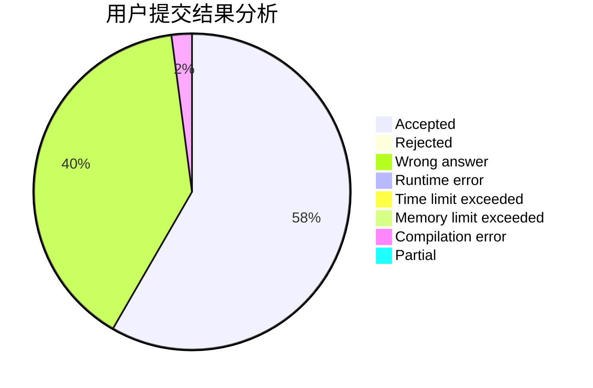
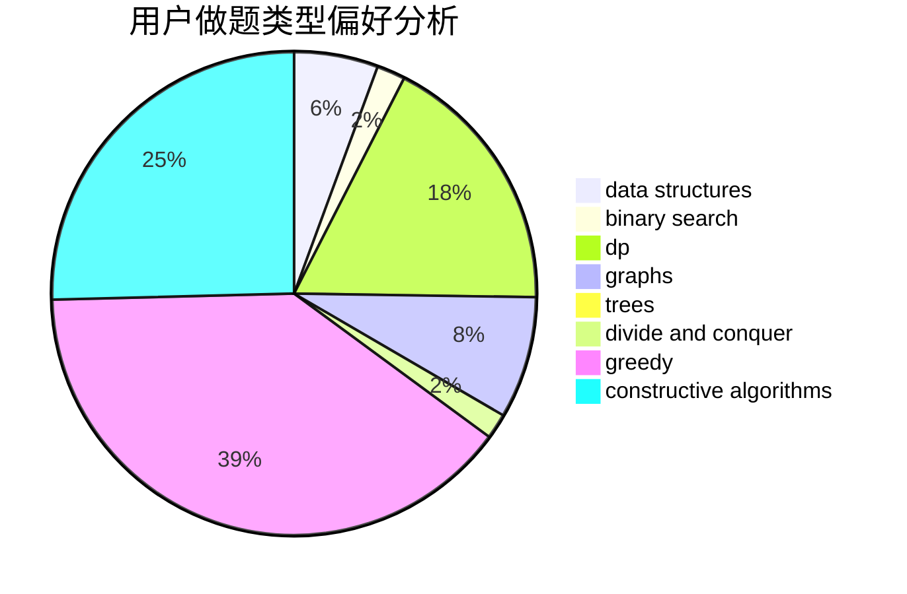

# NuoCarter

<!-- tabs:start -->

#### **用户提交结果分析**

#### **用户做题类型偏好分析**

#### **用户错题知识点分析**

<!-- tabs:end -->
# 推荐题目
[228D](https://codeforces.com/contest/228/problem/D)		data structures		  
[832D](https://codeforces.com/contest/832/problem/D)		dfs and similar,
                        graphs,
                        trees		  
[1150C](https://codeforces.com/contest/1150/problem/C)		dsu,graphs,sortings,trees		  
[1141B](https://codeforces.com/contest/1141/problem/B)		implementation		  
[1076A](https://codeforces.com/contest/1076/problem/A)		greedy,
                        strings		  
[1138F](https://codeforces.com/contest/1138/problem/F)		dsu,graphs,sortings,trees		  
[474F](https://codeforces.com/contest/474/problem/F)		data structures,
                        math,
                        number theory		  
[1413B](https://codeforces.com/contest/1413/problem/B)		implementation		  
[337B](https://codeforces.com/contest/337/problem/B)		greedy,
                        math,
                        number theory		  
[1176E](https://codeforces.com/contest/1176/problem/E)		dfs and similar,
                        dsu,
                        graphs,
                        shortest paths,
                        trees		  
